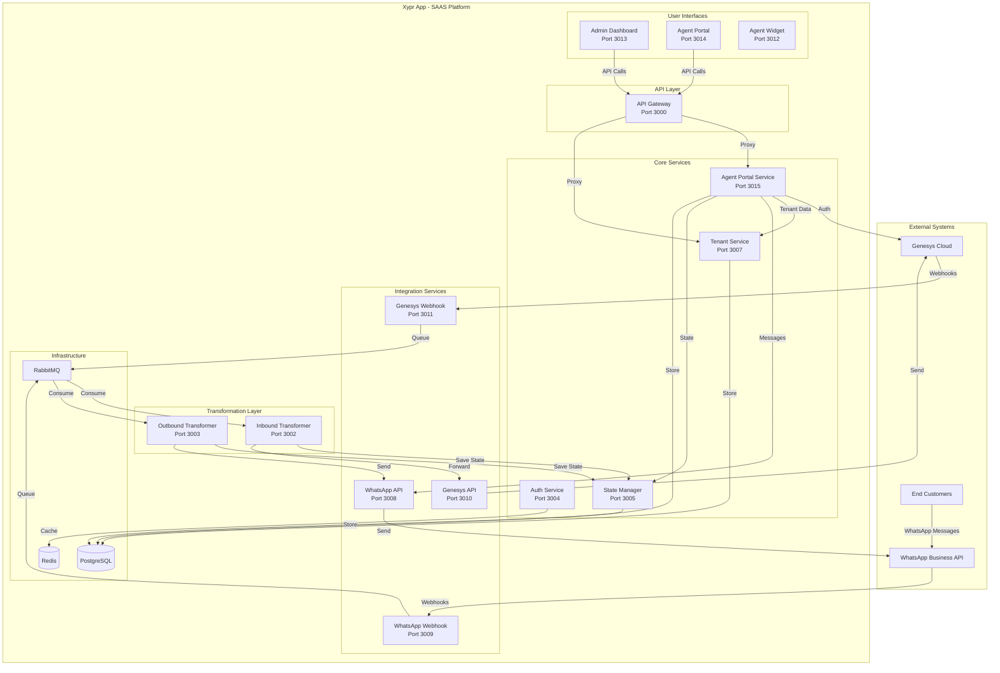
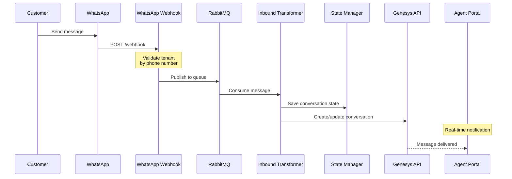
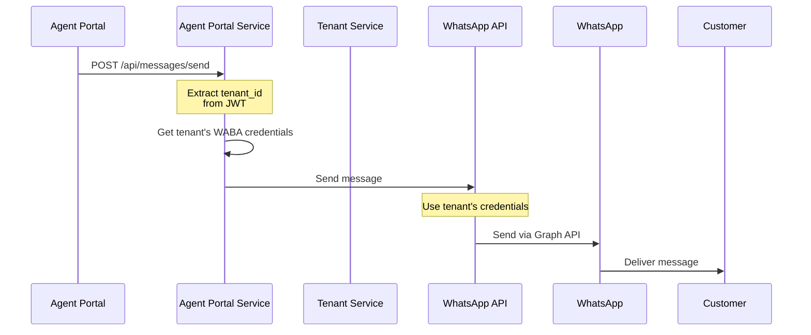

# Xypr App - Multi-Tenant Architecture

## Overview

The **Xypr App** is a SAAS middleware platform that bridges **Genesys Contact Management Software** and **WhatsApp Business API** using the Open Messaging Protocol. This document explains the multi-tenant architecture and how organizations, agents, and customers interact.

## System Architecture



## Multi-Tenancy Model

### Tenant Hierarchy

```
Xypr App (SAAS Platform)
├── Xypr Administrators
│   └── Manage all tenants via Admin Dashboard
│
├── Organization 1 (Tenant)
│   ├── Genesys Account (One per org)
│   ├── WhatsApp Business Account (One per org - SHARED)
│   └── Genesys Users
│       ├── Genesys Administrator(s)
│       ├── Genesys Supervisor(s)
│       └── Genesys Agent(s)
│
├── Organization 2 (Tenant)
│   ├── Genesys Account
│   ├── WhatsApp Business Account (SHARED)
│   └── Genesys Users
│       ├── Genesys Administrator(s)
│       ├── Genesys Supervisor(s)
│       └── Genesys Agent(s)
│
└── End Customers
    └── Personal WhatsApp accounts
```

### Key Principles

1. **Organization-Centric**: Everything is scoped to an organization (tenant)
2. **Shared WABA**: All agents within an organization share ONE WhatsApp Business Account
3. **Genesys Integration**: One Genesys account per organization
4. **Tenant Isolation**: Complete data isolation between organizations

## User Roles & Permissions

### 1. Xypr Administrators

**Portal**: Admin Dashboard

**Responsibilities**:
- Create and manage organizations (tenants)
- Configure WhatsApp embedded signup for tenants
- Monitor system health
- Manage platform-wide settings

**Key Operations**:
- Create tenant with Genesys org ID
- Complete WhatsApp signup flow for tenant
- Configure Genesys OAuth credentials
- View all tenants and their status

### 2. Genesys Administrators

**Portal**: Agent Portal (with elevated permissions)

**Responsibilities**:
- Manage organization settings
- View all conversations in organization
- Manage agent roles (assign supervisor/agent roles)
- Access organization reports

**Key Operations**:
- View organization's WhatsApp configuration (read-only)
- Transfer conversations between agents
- Access analytics and reports
- Manage user permissions within organization

### 3. Genesys Supervisors

**Portal**: Agent Portal

**Responsibilities**:
- Monitor agent performance
- Assign and transfer conversations
- View all organization conversations
- Access reports

**Key Operations**:
- View all conversations
- Transfer conversations between agents
- View conversation history
- Access team analytics

### 4. Genesys Agents

**Portal**: Agent Portal

**Responsibilities**:
- Handle customer conversations
- Send/receive WhatsApp messages
- Manage assigned conversations

**Key Operations**:
- View assigned conversations
- Send messages (using org's WABA)
- Assign conversations to self
- View conversation history

### 5. End Customers

**Interface**: Personal WhatsApp app

**Interaction**:
- Send messages to organization's WhatsApp number
- Receive responses from agents
- View conversation in WhatsApp

## Data Model

### Tenant Data

```sql
-- Organizations
CREATE TABLE tenants (
    tenant_id VARCHAR(255) PRIMARY KEY,
    tenant_name VARCHAR(255),
    genesys_org_id VARCHAR(255) UNIQUE,  -- Links to Genesys
    genesys_region VARCHAR(50),
    created_at TIMESTAMP,
    is_active BOOLEAN
);

-- WhatsApp Configuration (ONE per tenant)
CREATE TABLE tenant_whatsapp_config (
    config_id UUID PRIMARY KEY,
    tenant_id VARCHAR(255) REFERENCES tenants,
    waba_id VARCHAR(255),              -- Shared by all agents
    phone_number_id VARCHAR(255),
    display_phone_number VARCHAR(50),
    access_token TEXT,
    created_at TIMESTAMP
);
```

### User Data

```sql
-- Genesys Users (admins, supervisors, agents)
CREATE TABLE genesys_users (
    user_id UUID PRIMARY KEY,
    tenant_id VARCHAR(255) NOT NULL REFERENCES tenants,  -- Required
    genesys_user_id VARCHAR(255) UNIQUE NOT NULL,
    genesys_email VARCHAR(255),
    name VARCHAR(255),
    role VARCHAR(50),  -- 'admin', 'supervisor', 'agent'
    created_at TIMESTAMP,
    is_active BOOLEAN
);
```

### Conversation Data

```sql
-- Conversation Assignments
CREATE TABLE conversation_assignments (
    assignment_id UUID PRIMARY KEY,
    conversation_id VARCHAR(255),
    user_id UUID REFERENCES genesys_users,
    tenant_id VARCHAR(255) REFERENCES tenants,
    assigned_at TIMESTAMP,
    status VARCHAR(50)  -- 'active', 'closed', 'transferred'
);
```

## Message Flow

### Inbound (Customer → Agent)



**Tenant Isolation**:
- Webhook identifies tenant by phone number (`display_phone_number`)
- All subsequent operations tagged with `tenant_id`
- State manager stores conversation with tenant scope

### Outbound (Agent → Customer)



**Tenant Isolation**:
- JWT contains `tenant_id`
- Backend fetches WhatsApp credentials for user's tenant
- Message sent using organization's WABA (not agent's)

## Tenant Isolation Mechanisms

### 1. Authentication Layer

```javascript
// JWT contains tenant information
const token = jwt.sign({
  userId: user.user_id,
  tenantId: user.tenant_id,  // CRITICAL
  role: user.role
}, secret);

// Every authenticated request has tenant context
app.use(authenticate);  // Populates req.tenantId
```

### 2. Database Queries

```javascript
// ALWAYS filter by tenant
async function getConversations(userId, tenantId) {
  return await pool.query(`
    SELECT * FROM conversation_assignments
    WHERE user_id = $1 AND tenant_id = $2
  `, [userId, tenantId]);
}
```

### 3. API Calls

```javascript
// ALWAYS pass tenant ID in headers
await axios.post(whatsappAPI, data, {
  headers: {
    'X-Tenant-ID': tenantId,  // Enforces isolation
    'X-User-ID': userId
  }
});
```

### 4. Credential Management

```javascript
// Fetch credentials scoped to tenant
async function getWABACredentials(tenantId) {
  const result = await pool.query(`
    SELECT waba_id, phone_number_id, access_token
    FROM tenant_whatsapp_config
    WHERE tenant_id = $1
  `, [tenantId]);
  
  return result.rows[0];
}
```

## Scaling Considerations

### Horizontal Scaling

**Stateless Services** (can scale horizontally):
- API Gateway
- WhatsApp Webhook
- Genesys Webhook
- Transformers
- WhatsApp API Service
- Genesys API Service
- Agent Portal Service

**Stateful Services** (require coordination):
- State Manager (uses Redis for caching)
- Auth Service (uses Redis for tokens)
- Tenant Service (uses Redis for tenant data)

### Load Balancing

```yaml
# Example Kubernetes deployment
apiVersion: apps/v1
kind: Deployment
metadata:
  name: agent-portal-service
spec:
  replicas: 3  # Scale based on load
  selector:
    matchLabels:
      app: agent-portal-service
  template:
    spec:
      containers:
      - name: agent-portal-service
        image: agent-portal-service:latest
        resources:
          requests:
            cpu: "200m"
            memory: "256Mi"
          limits:
            cpu: "500m"
            memory: "512Mi"
```

### Database Partitioning

For very large deployments, consider partitioning by tenant:

```sql
-- Partition conversations by tenant
CREATE TABLE conversations (
    conversation_id VARCHAR(255),
    tenant_id VARCHAR(255),
    customer_phone VARCHAR(50),
    created_at TIMESTAMP,
    PRIMARY KEY (tenant_id, conversation_id)
) PARTITION BY LIST (tenant_id);

-- Create partition per major tenant
CREATE TABLE conversations_tenant1 PARTITION OF conversations
FOR VALUES IN ('tenant-1');

CREATE TABLE conversations_tenant2 PARTITION OF conversations
FOR VALUES IN ('tenant-2');
```

## Security Best Practices

### 1. Credential Storage

```javascript
// NEVER expose credentials in responses
async function getProfile(req, res) {
  const whatsappConfig = await getTenantWABA(req.tenantId);
  
  res.json({
    whatsapp: {
      connected: !!whatsappConfig,
      phone_number: whatsappConfig?.display_phone_number,
      // NEVER send: access_token, waba_id details
    }
  });
}
```

### 2. Cross-Tenant Access Prevention

```javascript
// ALWAYS verify resource belongs to user's tenant
async function getConversation(conversationId, userId) {
  const user = await getUserById(userId);
  const conversation = await getConversationById(conversationId);
  
  // CRITICAL: Check tenant ownership
  if (conversation.tenant_id !== user.tenant_id) {
    throw new Error('Unauthorized access');
  }
  
  return conversation;
}
```

### 3. API Key Scoping

```javascript
// API keys scoped to tenant
async function validateAPIKey(apiKey) {
  const tenantId = await getTenantByAPIKey(apiKey);
  
  if (!tenantId) {
    throw new Error('Invalid API key');
  }
  
  return { tenantId, permissions: ['read', 'write'] };
}
```

## Monitoring & Observability

### Key Metrics per Tenant

```javascript
// Track metrics per tenant
metrics.increment('messages.sent', 1, {
  tenant_id: tenantId,
  direction: 'outbound'
});

metrics.gauge('active_conversations', count, {
  tenant_id: tenantId
});

metrics.timing('api.response_time', duration, {
  tenant_id: tenantId,
  endpoint: '/api/messages/send'
});
```

### Logging

```javascript
// Structured logging with tenant context
logger.info('Message sent', {
  tenant_id: tenantId,
  user_id: userId,
  conversation_id: conversationId,
  message_id: messageId
});
```

## Summary

The Xypr App implements a **true multi-tenant SAAS architecture** where:

✅ **Organizations are isolated**: Complete data separation
✅ **Shared WABA per organization**: All agents use one WhatsApp account
✅ **Role-based access**: Admin, Supervisor, Agent permissions
✅ **Auto-provisioning**: Users created on first Genesys login
✅ **Scalable**: Stateless services can scale horizontally
✅ **Secure**: Multiple layers of tenant isolation

This architecture ensures:
- **Efficiency**: One WABA shared by many agents
- **Security**: No cross-tenant data access
- **Scalability**: Services can scale independently
- **Flexibility**: Organizations can have different configurations
