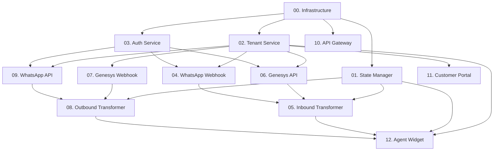

# README - MVP Implementation Guides

**Created:** 2026-02-05
**Updated:** 2026-02-09
**Status:** All 13 implementation guides completed ✅
**Purpose:** Step-by-step implementation guides for WABA-Genesys MVP

---

## 📋 Overview

This directory contains **13 completed implementation guides** (00-12) for the WABA-Genesys MVP demo. Each guide is self-contained with guard rails, anchors, and verification steps.

**✅ All guides created and ready for implementation!**

### Recent Updates (Feb 9, 2026)
- ✅ Completed remaining guides: 04, 07, 10, 11, 12
- ✅ All 13 guides now available (00 through 12)
- ✅ Updated INDEX.md with current status
- 🎯 **Ready for team implementation**

---

## 🎯 Execution Strategy

### Sequential Tasks (Must Complete First)
1. **00 - Infrastructure Setup** (2-3 hours)
   - PostgreSQL tables
   - Redis, MinIO, RabbitMQ setup
   - **Blocks:** Everything else

### Parallel Track A - Core Services (Can run simultaneously)
2. **01 - State Manager** (6-8 hours)
   - Mapping endpoints
   - Message tracking
   - **Blocks:** 05, 08

3. **02 - Tenant Service** (3-4 hours)
   - Generic credentials endpoint
   - Tenant resolution
   - **Blocks:** 03, 04, 06, 07, 09

4. **03 - Auth Service** (2-3 hours)
   - WhatsApp token support
   - **Blocks:** 04, 06, 09

5. **04 - WhatsApp Webhook Service** (2-3 hours)
   - Requires: 02
   - Webhook storage, media handling
   - **Blocks:** 05

### Parallel Track B - Message Flow (Requires Track A complete)
6. **05 - Inbound Transformer** (4-6 hours)
   - Requires: 01, 06
   - WhatsApp → Genesys transformation

7. **06 - Genesys API Service** (4-5 hours)
   - Requires: 02, 03
   - Send messages to Genesys

8. **07 - Genesys Webhook Service** (3-4 hours)
   - Requires: 02
   - Receive Genesys messages

9. **08 - Outbound Transformer** (5-7 hours)
   - Requires: 01, 07, 09
   - Genesys → WhatsApp transformation

10. **09 - WhatsApp API Service** (4-5 hours)
    - Requires: 02, 03
    - Send messages to WhatsApp

### Parallel Track C - Frontend & Gateway
11. **10 - API Gateway** (2-3 hours)
    - Routing configuration
    - Can run anytime

12. **11 - Customer Portal** (6-8 hours)
    - Onboarding flow
    - Requires: 02

13. **12 - Agent Widget** (8-10 hours)
    - Genesys widget integration
    - Requires: 02, Full message flow
    - **Optional** - Advanced feature

---

## 📊 Task Dependencies



---

## 🎨 Color Coding

| Status | Meaning |
|--------|---------|
| 🔴 **CRITICAL** | Must complete first, blocks others |
| 🟡 **HIGH** | Core functionality, needed for MVP |
| 🟢 **MEDIUM** | Important but not blocking |
| 🔵 **LOW** | Nice to have, can defer |

---

## 📁 File Structure

```
mvp_todo/
├── INDEX.md                         # Quick start guide (updated Feb 9)
├── README.md                        # This file (updated Feb 9)
├── 00_infrastructure_setup.md       # 🔴 CRITICAL - Start here ✅
├── 01_state_manager.md              # 🔴 CRITICAL ✅
├── 02_tenant_service.md             # 🟡 HIGH ✅
├── 03_auth_service.md               # 🟡 HIGH ✅
├── 04_whatsapp_webhook.md           # 🟢 MEDIUM ✅ (updated Feb 9)
├── 05_inbound_transformer.md        # 🟡 HIGH ✅
├── 06_genesys_api_service.md        # 🟡 HIGH ✅
├── 07_genesys_webhook.md            # 🟡 HIGH ✅ (updated Feb 9)
├── 08_outbound_transformer.md       # 🟡 HIGH ✅
├── 09_whatsapp_api_service.md       # 🟡 HIGH ✅
├── 10_api_gateway.md                # 🟢 MEDIUM ✅ (updated Feb 9)
├── 11_customer_portal.md            # 🔵 LOW ✅ (updated Feb 9)
└── 12_agent_widget.md               # 🔵 LOW ✅ (updated Feb 9)
```

---

## ⚡ Quick Start

### Day 1: Foundation
1. Complete **00 - Infrastructure Setup** (solo)
2. Parallelize: **01**, **02**, **03** (3 developers)

### Day 2-3: Core Services
1. Parallelize: **06**, **07**, **09** (3 developers)
2. Verify services can communicate

### Day 4: Transformers
1. Parallelize: **05**, **08** (2 developers)
2. End-to-end testing

### Day 5: Polish & Testing
1. Complete **10**, **11**
2. Integration testing
3. Bug fixes

---

## 🛡️ Guard Rails (Universal)

Before starting any task:
- [ ] Read the entire guide first
- [ ] Check prerequisites are met
- [ ] Verify dependencies are running
- [ ] Create a git branch: `feature/mvp/<task-name>`
- [ ] Set up `.env` file

---

## 📍 Anchors (How to Use)

Each guide has an **Anchors** section showing:
- **Existing Files to Modify:** What to change
- **New Files to Create:** What to add
- **File Paths:** Exact locations

---

## ✅ Verification Pattern

Every guide includes:
1. **Step-by-step tests** with curl commands
2. **Database queries** to verify data
3. **Log outputs** to check
4. **Integration tests** with other services

---

## 🚨 Common Issues

### Issue: Service Won't Start
**Solution:**
```bash
# Check logs
docker-compose logs <service-name>

# Verify dependencies
docker-compose ps

# Restart
docker-compose restart <service-name>
```

### Issue: Database Connection Failed
**Solution:**
```bash
# Test connection
psql -h localhost -U postgres -d waba_mvp -c "SELECT 1;"

# Check credentials in .env
cat .env | grep DB_
```

### Issue: Redis Not Connected
**Solution:**
```bash
redis-cli ping
# Should return PONG

# Check logs
docker logs <redis-container>
```

---

## 📦 Deliverables Checklist

By end of MVP:
- [ ] All 10 services running
- [ ] Inbound text message flow working
- [ ] Inbound media message flow working
- [ ] Outbound text message flow working
- [ ] Outbound media message flow working
- [ ] Database populated with test data
- [ ] Redis caching operational
- [ ] MinIO storing webhooks and media
- [ ] RabbitMQ processing messages
- [ ] Customer portal onboarding works

---

## 📞 Support

- **Slack:** #mvp-implementation
- **Docs:** /docs folder in root
- **Architecture:** /mvp_scope_plan.md
- **Pending Tasks:** /pending_tasks.md

---

## 🎓 Legend

| Symbol | Meaning |
|--------|---------|
| 🎯 | Objective |
| 🛡️ | Guard Rails (prerequisites) |
| 📍 | Anchors (where to make changes) |
| 📝 | Implementation steps |
| ✅ | Verification |
| 🚨 | Common issues |
| 📤 | Deliverables |
| 🔗 | Blocks/Dependencies |

---

**Next Step:** Start with `00_infrastructure_setup.md`
