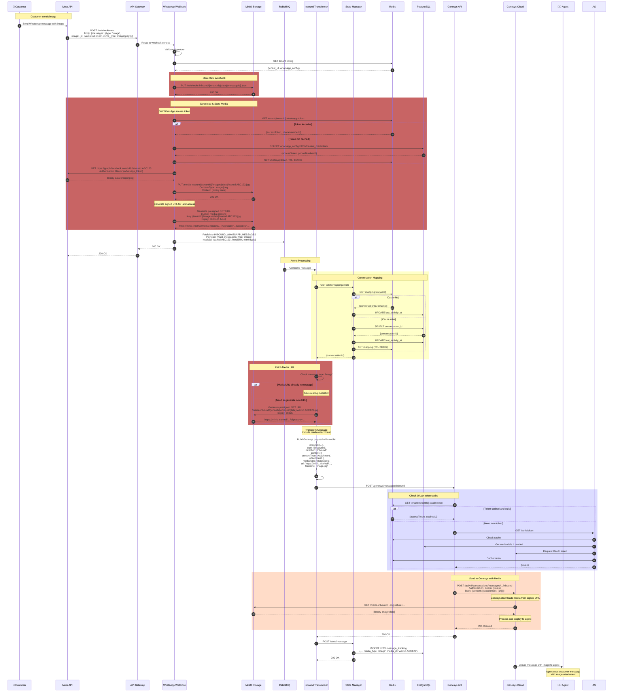
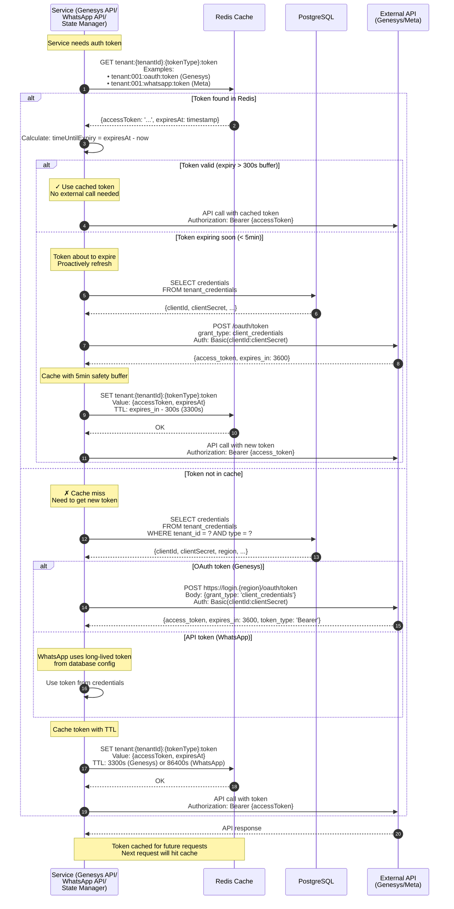
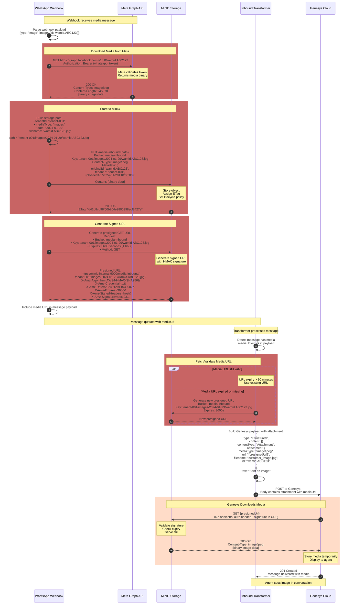

# Inbound Message Flow - Complete Sequence Diagram

This document contains detailed sequence diagrams for the inbound message flow from WhatsApp to Genesys, including all storage operations, caching strategies, and media handling.

## Complete Flow - Text Message

```mermaid
sequenceDiagram
    autonumber
    participant C as 👤 Customer
    participant M as Meta API
    participant AG as API Gateway
    participant WH as WhatsApp Webhook
    participant MinIO as MinIO Storage
    participant RMQ as RabbitMQ
    participant IT as Inbound Transformer
    participant SM as State Manager
    participant R as Redis
    participant DB as PostgreSQL
    participant AS as Auth Service
    participant GA as Genesys API
    participant GC as Genesys Cloud
    participant A as 👨‍💼 Agent

    %% Customer sends message
    Note over C,M: Customer initiates conversation
    C->>M: Send WhatsApp message<br/>"Hello, I need help"

    %% Meta processes and sends webhook
    Note over M: Meta processes message
    M->>AG: POST /webhook/meta<br/>Body: {object, entry: [{changes: [{value: {messages, metadata}}]}]}

    %% API Gateway routes to webhook service
    AG->>WH: Route to WhatsApp Webhook Service

    %% Webhook validation
    rect rgb(255, 240, 240)
        Note over WH: Webhook Validation & Storage
        WH->>WH: Validate X-Hub-Signature-256<br/>HMAC SHA256 verification

        WH->>R: GET tenant by phone_number_id<br/>Key: phone:{phone_number_id}

        alt Tenant config in Redis
            R-->>WH: {tenant_id, status: 'active', config}
        else Not in cache
            WH->>DB: SELECT * FROM tenants<br/>WHERE phone_number_id = ?
            DB-->>WH: {tenant_id, config}
            WH->>R: SET phone:{phone_number_id}<br/>TTL: 3600s
        end
    end

    %% Store raw webhook to MinIO
    rect rgb(200, 100, 100)
        Note over WH,MinIO: Store Raw Webhook Payload
        WH->>MinIO: PUT /webhooks-inbound/<br/>{tenantId}/{yyyy-MM-dd}/{timestamp}-{messageId}.json<br/>Content: Complete webhook payload
        MinIO-->>WH: 200 OK (Object stored)
    end

    %% Queue message to RabbitMQ
    WH->>RMQ: Publish message to queue<br/>Queue: INBOUND_WHATSAPP_MESSAGES<br/>Payload: {waId, messageId, type, content, tenantId}

    %% ACK back to Meta
    WH-->>AG: 200 OK
    AG-->>M: 200 OK (Webhook acknowledged)

    Note over RMQ,IT: Async Processing Begins

    %% Inbound Transformer consumes message
    RMQ->>IT: Consume message from queue

    %% State Manager - Conversation Mapping
    rect rgb(255, 255, 200)
        Note over IT,DB: Conversation Mapping Resolution
        IT->>SM: GET /state/mapping/:waId<br/>Path: /state/mapping/+919876543210

        Note over SM: Check Redis cache first
        SM->>R: GET mapping:wa:+919876543210

        alt Mapping found in Redis cache
            R-->>SM: {conversationId: 'abc-123', tenantId: 'tenant-001'}
            Note over SM: Cache hit - Update activity in DB
            SM->>DB: UPDATE conversation_mappings<br/>SET last_activity_at = NOW()<br/>WHERE wa_id = '+919876543210'
            DB-->>SM: 1 row updated
        else Mapping not in cache
            Note over SM: Cache miss - Query database
            SM->>DB: SELECT conversation_id, tenant_id, contact_name<br/>FROM conversation_mappings<br/>WHERE wa_id = '+919876543210'<br/>AND tenant_id = 'tenant-001'

            alt Mapping exists in database
                DB-->>SM: {conversation_id: 'abc-123', tenant_id: 'tenant-001'}

                SM->>DB: UPDATE conversation_mappings<br/>SET last_activity_at = NOW()<br/>WHERE wa_id = '+919876543210'
                DB-->>SM: 1 row updated

                Note over SM: Cache the mapping (bidirectional)
                SM->>R: SET mapping:wa:+919876543210<br/>Value: {conversationId, tenantId}<br/>TTL: 3600s
                SM->>R: SET mapping:conv:abc-123<br/>Value: {waId, tenantId}<br/>TTL: 3600s
            else No mapping exists - Create new
                Note over SM: New conversation - Generate ID
                SM->>SM: Generate UUID<br/>conversationId = uuid.v4()

                SM->>DB: INSERT INTO conversation_mappings<br/>(tenant_id, wa_id, conversation_id,<br/>contact_name, created_at, last_activity_at)<br/>VALUES (?, ?, ?, ?, NOW(), NOW())
                DB-->>SM: 1 row inserted

                SM->>R: SET mapping:wa:+919876543210<br/>TTL: 3600s
                SM->>R: SET mapping:conv:{conversationId}<br/>TTL: 3600s
            end
        end

        SM-->>IT: 200 OK<br/>{conversationId: 'abc-123', tenantId: 'tenant-001'}
    end

    %% Transform message
    Note over IT: Transform Message Format<br/>Meta JSON → Genesys Open Messaging

    IT->>IT: Build Genesys payload:<br/>{<br/>  channel: {platform: 'Open', from, to},<br/>  type: 'Text',<br/>  text: 'Hello, I need help',<br/>  direction: 'Inbound',<br/>  metadata: {tenantId, source: 'whatsapp'}<br/>}

    %% Send to Genesys API Service
    IT->>GA: POST /genesys/messages/inbound<br/>Body: {conversationId, message, tenantId}

    %% Genesys API - Token Management
    rect rgb(220, 220, 255)
        Note over GA,AS: OAuth Token Retrieval with Redis Caching

        Note over GA: Check Redis for cached token
        GA->>R: GET tenant:tenant-001:oauth:token

        alt Token found in Redis
            R-->>GA: {accessToken: 'eyJhbG...', expiresAt: 1706620800}
            GA->>GA: Validate token expiry<br/>if (expiresAt > now + 300s) use cache

            alt Token still valid (> 5min buffer)
                Note over GA: Use cached token
            else Token expiring soon (< 5min)
                Note over GA: Refresh token proactively
                GA->>AS: GET /auth/token<br/>Header: X-Tenant-ID: tenant-001
                AS->>AS: Generate new token
                AS-->>GA: {token: 'eyJhbG...', expiresIn: 3600}
                GA->>R: SET tenant:tenant-001:oauth:token<br/>TTL: 3300s (3600 - 300s buffer)
            end

        else Token not in cache or expired
            Note over GA: Cache miss - Request new token
            GA->>AS: GET /auth/token<br/>Header: X-Tenant-ID: tenant-001

            Note over AS: Auth Service checks own cache
            AS->>R: GET tenant:tenant-001:oauth:token

            alt Auth Service has cached token
                R-->>AS: {accessToken, expiresAt}
                Note over AS: Validate and return
            else Auth Service needs new token
                AS->>DB: SELECT credentials<br/>FROM tenant_credentials<br/>WHERE tenant_id = 'tenant-001'<br/>AND credential_type = 'genesys'
                DB-->>AS: {clientId, clientSecret, region: 'aps1.pure.cloud'}

                AS->>GC: POST https://login.aps1.pure.cloud/oauth/token<br/>Body: {grant_type: 'client_credentials'}<br/>Auth: Basic(clientId:clientSecret)
                GC-->>AS: {access_token: 'eyJhbG...', expires_in: 3600}

                Note over AS: Cache token with 5min buffer
                AS->>R: SET tenant:tenant-001:oauth:token<br/>Value: {accessToken, expiresAt}<br/>TTL: 3300s (expires_in - 300s)
            end

            AS-->>GA: {token: 'eyJhbG...', expiresIn: 3600}

            Note over GA: Cache token locally
            GA->>R: SET tenant:tenant-001:oauth:token<br/>TTL: 3300s
        end
    end

    %% Send message to Genesys Cloud
    rect rgb(255, 220, 200)
        Note over GA,GC: Send to Genesys Cloud Platform
        GA->>GC: POST https://api.aps1.pure.cloud<br/>/api/v2/conversations/messages/{integrationId}/inbound/open/message<br/>Authorization: Bearer eyJhbG...<br/>Body: {channel, type, text, direction, metadata}

        Note over GC: Genesys processes message<br/>Routes to agent queue based on rules
        GC-->>GA: 201 Created<br/>{id: 'genesys-msg-id', status: 'delivered'}
    end

    GA-->>IT: 200 OK<br/>{messageId: 'genesys-msg-id', status: 'delivered'}

    %% Track message in database
    rect rgb(200, 255, 200)
        Note over IT,DB: Message Tracking & Audit
        IT->>SM: POST /state/message<br/>Body: {metaMessageId, genesysMessageId, conversationId, direction, status}

        SM->>DB: INSERT INTO message_tracking<br/>(meta_message_id, genesys_message_id,<br/>conversation_id, tenant_id, direction,<br/>status, created_at)<br/>VALUES (?, ?, ?, ?, 'inbound', 'delivered', NOW())
        DB-->>SM: 1 row inserted

        SM-->>IT: 200 OK
    end

    %% Deliver to agent
    Note over GC,A: Message Routing & Delivery
    GC->>A: Deliver message to agent<br/>via Genesys Agent Desktop<br/>"Hello, I need help"

    Note over A: Agent sees message in queue<br/>with customer context

    %% Delivery receipt flow (async)
    rect rgb(230, 230, 230)
        Note over GC,DB: Delivery Receipt (Async)
        GC-->>WH: POST /webhook/genesys/receipt<br/>Body: {messageId, status: 'delivered', timestamp}
        WH->>SM: PATCH /state/message/{messageId}<br/>Body: {status: 'delivered'}
        SM->>DB: UPDATE message_tracking<br/>SET status = 'delivered', delivered_at = NOW()<br/>WHERE genesys_message_id = ?
        DB-->>SM: 1 row updated
    end
```

## Complete Flow - Message with Media (Image/Video/Document)

## Redis Token Caching - Detailed Flow

## State Manager Database Operations - Detailed

```mermaid
sequenceDiagram
    autonumber
    participant IT as Inbound Transformer
    participant SM as State Manager
    participant R as Redis
    participant DB as PostgreSQL

    Note over IT,SM: Request: GET /state/mapping/:waId

    IT->>SM: GET /state/mapping/+919876543210<br/>Header: X-Tenant-ID: tenant-001

    rect rgb(255, 200, 200)
        Note over SM: Step 1: Check Redis Cache
        SM->>R: GET mapping:wa:+919876543210

        alt Cache HIT
            R-->>SM: JSON: {"conversationId": "abc-123",<br/>"tenantId": "tenant-001",<br/>"contactName": "John Doe",<br/>"cachedAt": 1706534400}

            Note over SM: Cache hit! But still update activity
            rect rgb(200, 200, 255)
                SM->>DB: UPDATE conversation_mappings<br/>SET last_activity_at = NOW()<br/>WHERE wa_id = '+919876543210'<br/>AND tenant_id = 'tenant-001'

                Note over DB: Update operation<br/>Tracks last message time<br/>Used for conversation timeout

                DB-->>SM: UPDATE 1 (1 row affected)
            end

            SM-->>IT: 200 OK<br/>{"conversationId": "abc-123",<br/>"tenantId": "tenant-001"}

        else Cache MISS
            R-->>SM: null (key not found)

            Note over SM: Step 2: Query Database
            rect rgb(200, 200, 255)
                SM->>DB: SELECT conversation_id, tenant_id,<br/>contact_name, phone_number_id,<br/>display_phone_number, created_at<br/>FROM conversation_mappings<br/>WHERE wa_id = '+919876543210'<br/>AND tenant_id = 'tenant-001'<br/>LIMIT 1

                alt Mapping EXISTS in database
                    DB-->>SM: Row: {<br/>  conversation_id: "abc-123",<br/>  tenant_id: "tenant-001",<br/>  contact_name: "John Doe",<br/>  created_at: "2024-01-28 10:00:00"<br/>}

                    Note over SM: Step 3: Update activity timestamp
                    SM->>DB: UPDATE conversation_mappings<br/>SET last_activity_at = NOW()<br/>WHERE wa_id = '+919876543210'
                    DB-->>SM: UPDATE 1

                    Note over SM: Step 4: Cache in Redis (bidirectional)
                    SM->>R: SET mapping:wa:+919876543210<br/>Value: {"conversationId":"abc-123","tenantId":"tenant-001"}<br/>EX 3600
                    R-->>SM: OK

                    SM->>R: SET mapping:conv:abc-123<br/>Value: {"waId":"+919876543210","tenantId":"tenant-001"}<br/>EX 3600
                    R-->>SM: OK

                    SM-->>IT: 200 OK<br/>{"conversationId": "abc-123"}

                else Mapping NOT FOUND - New conversation
                    DB-->>SM: Empty result (0 rows)

                    Note over SM: Step 3: Create new mapping
                    SM->>SM: Generate new conversation ID<br/>conversationId = uuid.v4()<br/>→ "def-456"

                    rect rgb(200, 255, 200)
                        Note over SM: INSERT new mapping
                        SM->>DB: INSERT INTO conversation_mappings (<br/>  tenant_id, wa_id, conversation_id,<br/>  contact_name, phone_number_id,<br/>  display_phone_number,<br/>  created_at, last_activity_at<br/>) VALUES (<br/>  'tenant-001', '+919876543210', 'def-456',<br/>  'John Doe', '123456789', '+1234567890',<br/>  NOW(), NOW()<br/>)<br/>RETURNING *

                        DB-->>SM: INSERT 1<br/>Row: {conversation_id: "def-456", ...}
                    end

                    Note over SM: Step 4: Cache new mapping
                    SM->>R: SET mapping:wa:+919876543210<br/>EX 3600
                    SM->>R: SET mapping:conv:def-456<br/>EX 3600

                    SM-->>IT: 201 Created<br/>{"conversationId": "def-456",<br/>"isNewConversation": true}
                end
            end
        end
    end

    Note over IT,DB: Mapping retrieved and cached

    rect rgb(255, 255, 200)
        Note over IT,SM: Request: POST /state/message (Track)

        IT->>SM: POST /state/message<br/>Body: {<br/>  metaMessageId: "wamid.XYZ",<br/>  genesysMessageId: "gmsg-789",<br/>  conversationId: "abc-123",<br/>  tenantId: "tenant-001",<br/>  direction: "inbound",<br/>  status: "delivered"<br/>}

        Note over SM: Track message in database
        SM->>DB: INSERT INTO message_tracking (<br/>  meta_message_id, genesys_message_id,<br/>  conversation_id, tenant_id,<br/>  direction, status, created_at<br/>) VALUES (<br/>  'wamid.XYZ', 'gmsg-789',<br/>  'abc-123', 'tenant-001',<br/>  'inbound', 'delivered', NOW()<br/>)

        DB-->>SM: INSERT 1
        SM-->>IT: 201 Created
    end

    Note over IT,DB: Message tracked for audit trail
```

## MinIO Media Storage - Detailed Flow

## Performance Metrics - Timing Breakdown

```mermaid
gantt
    title Inbound Message Processing Timeline
    dateFormat  X
    axisFormat  %L ms

    section Webhook
    Receive & Validate          :0, 20
    Tenant Lookup (Redis)       :20, 50
    Store to MinIO              :50, 150
    Queue to RabbitMQ           :150, 200
    Return 200 OK               :200, 220

    section Async Processing
    RabbitMQ Delivery           :220, 270
    Mapping Check (Cache Hit)   :270, 320
    DB Update (Activity)        :320, 400
    Transform Message           :400, 500

    section Genesys Delivery
    Token Check (Cache Hit)     :500, 550
    POST to Genesys             :550, 1500
    Genesys Processing          :1500, 1800

    section Total
    End-to-End Latency         :0, 1800
```

### Latency Breakdown

| Operation | Best Case | Worst Case | Notes |
|-----------|-----------|------------|-------|
| Webhook validation | 20ms | 100ms | Signature check + tenant lookup |
| MinIO storage | 100ms | 500ms | Object storage write |
| RabbitMQ publish | 20ms | 100ms | Queue write |
| **Webhook ACK** | **150ms** | **700ms** | **Total sync time** |
| Mapping check (cache hit) | 10ms | 50ms | Redis GET |
| Mapping check (cache miss) | 100ms | 500ms | PostgreSQL query |
| DB activity update | 50ms | 200ms | PostgreSQL UPDATE |
| Message transform | 10ms | 100ms | JSON transformation |
| Token check (cache hit) | 10ms | 50ms | Redis GET |
| Token check (cache miss) | 200ms | 1000ms | OAuth token request |
| Genesys API call | 500ms | 2000ms | Network + Genesys processing |
| **Total (cache hit)** | **850ms** | **3000ms** | **End-to-end** |
| **Total (cache miss)** | **1500ms** | **5000ms** | **With DB/OAuth lookups** |

### Cache Hit Rates (Expected)

- **Token cache:** 95%+ (tokens valid for 1 hour)
- **Mapping cache:** 80%+ (active conversations)
- **Tenant config:** 99%+ (rarely changes)
- **Overall:** ~90% of requests hit Redis cache
