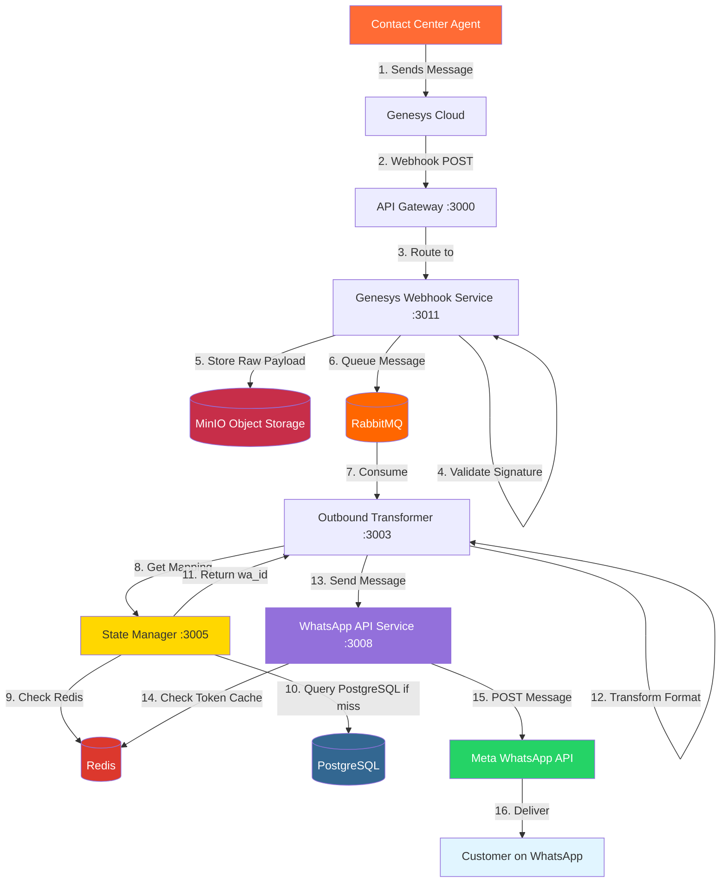
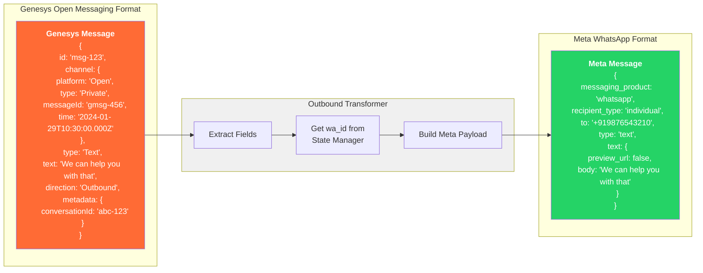
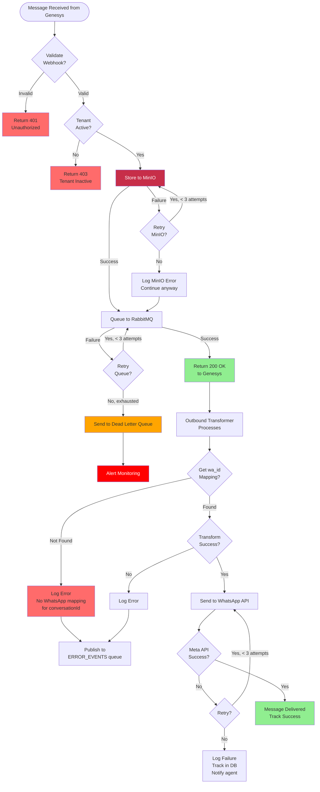
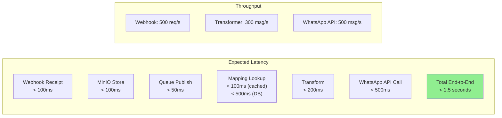

# Outbound Message Flow - Genesys to WhatsApp

This diagram shows the complete flow when an agent sends a message via Genesys to a WhatsApp customer.

## High-Level Flow



## Detailed Flow with Data Transformation

```mermaid
flowchart TB
    subgraph External["External Systems"]
        Agent[👨‍💼 Agent]
        GenesysCloud[Genesys Cloud Platform]
        MetaAPI[Meta WhatsApp Business API]
        Customer[👤 Customer]
    end

    subgraph Infrastructure["Infrastructure Layer"]
        Redis[(Redis Cache)]
        RabbitMQ[(RabbitMQ)]
        PostgreSQL[(PostgreSQL)]
        MinIO[(MinIO<br/>Object Storage)]
    end

    subgraph Services["Microservices"]
        APIGateway[API Gateway<br/>:3000]
        GWebhook[Genesys Webhook<br/>:3011]
        OutboundTransformer[Outbound Transformer<br/>:3003]
        StateManager[State Manager<br/>:3005]
        WhatsAppAPI[WhatsApp API Service<br/>:3008]
    end

    Agent -->|"1. Send: 'We can help you with that'"| GenesysCloud
    GenesysCloud -->|"2. POST /webhook/genesys<br/>{channel, text, conversationId}"| APIGateway
    APIGateway -->|"3. Route /webhook/genesys"| GWebhook

    GWebhook -->|"4a. Validate webhook signature"| GWebhook
    GWebhook -->|"4b. Check tenant by integrationId"| Redis
    GWebhook -->|"4c. Store raw webhook payload<br/>Bucket: webhooks-outbound<br/>Key: {tenantId}/{timestamp}/{convId}.json"| MinIO
    GWebhook -->|"4d. Publish to<br/>OUTBOUND_GENESYS_MESSAGES"| RabbitMQ

    RabbitMQ -->|"5. Consume message"| OutboundTransformer

    OutboundTransformer -->|"6a. Get wa_id from conversationId<br/>GET /state/conversation/:convId"| StateManager
    StateManager -->|"6b. Check Redis cache<br/>Key: mapping:conv:{convId}"| Redis
    Redis -->|"Cache hit"| StateManager
    StateManager -->|"6c. Query PostgreSQL if cache miss<br/>SELECT wa_id FROM conversation_mappings"| PostgreSQL
    PostgreSQL -->|"Return wa_id"| StateManager
    StateManager -->|"6d. UPDATE last_activity_at"| PostgreSQL
    StateManager -->|"6e. Cache in Redis (TTL: 3600s)"| Redis
    StateManager -->|"6f. Return {waId, tenantId}"| OutboundTransformer

    OutboundTransformer -->|"7a. Check if message has media"| OutboundTransformer
    OutboundTransformer -->|"7b. If media: Upload to MinIO<br/>PUT /media-outbound/{tenantId}/{mediaId}"| MinIO
    MinIO -->|"Return public URL"| OutboundTransformer
    OutboundTransformer -->|"7c. Transform message<br/>Genesys Format → Meta WhatsApp JSON<br/>Include media URL if present"| OutboundTransformer

    OutboundTransformer -->|"8. POST /whatsapp/send"| WhatsAppAPI

    WhatsAppAPI -->|"9a. Check Redis for WhatsApp token<br/>Key: tenant:{tenantId}:whatsapp:token"| Redis
    Redis -->|"Token cached & valid"| WhatsAppAPI
    WhatsAppAPI -->|"9b. If no cache: Get from PostgreSQL"| PostgreSQL
    PostgreSQL -->|"Return WhatsApp config"| WhatsAppAPI
    WhatsAppAPI -->|"9c. Cache token in Redis"| Redis

    WhatsAppAPI -->|"10. POST /{phone_number_id}/messages<br/>Authorization: Bearer {token}"| MetaAPI

    MetaAPI -->|"11. Deliver message"| Customer

    MetaAPI -.->|"12. Send status webhook"| GWebhook
    GWebhook -.->|"13. Update message status"| StateManager
    StateManager -.->|"14. Store status in PostgreSQL"| PostgreSQL

    style Agent fill:#ff6b35,color:#fff
    style Customer fill:#e1f5ff
    style MetaAPI fill:#25D366,color:#fff
    style GenesysCloud fill:#ff6b35,color:#fff
    style RabbitMQ fill:#ff6600,color:#fff
    style Redis fill:#dc382d,color:#fff
    style PostgreSQL fill:#336791,color:#fff
    style MinIO fill:#C72E49,color:#fff
    style StateManager fill:#ffd700
    style WhatsAppAPI fill:#9370db,color:#fff
```



## Sequence Diagram with Timing

```mermaid
sequenceDiagram
    autonumber
    participant A as Agent
    participant GC as Genesys Cloud
    participant AG as API Gateway
    participant GW as Genesys Webhook
    participant MinIO as MinIO
    participant RMQ as RabbitMQ
    participant OT as Outbound Transformer
    participant SM as State Manager
    participant R as Redis
    participant DB as PostgreSQL
    participant WA as WhatsApp API
    participant M as Meta API
    participant C as Customer

    A->>GC: Send message in Genesys<br/>"We can help you with that"

    Note over GC: Genesys processes message<br/>Triggers outbound webhook

    GC->>AG: POST /webhook/genesys<br/>{"channel": {...}, "text": "...", "conversationId": "abc-123"}
    AG->>GW: Route to webhook service

    GW->>GW: Validate webhook signature

    GW->>R: Get tenant by integrationId<br/>Key: integration:{integrationId}

    alt Tenant in cache
        R-->>GW: {tenant_id, config}
    else Not cached
        GW->>DB: SELECT * FROM tenants<br/>WHERE genesys_integration_id = ?
        DB-->>GW: {tenant_id, config}
        GW->>R: SET integration:{id}<br/>TTL: 3600s
    end

    GW->>MinIO: PUT /webhooks-outbound/<br/>{tenantId}/{timestamp}/{convId}.json<br/>Store raw webhook payload
    MinIO-->>GW: 200 OK (stored)

    GW->>RMQ: Publish to queue<br/>OUTBOUND_GENESYS_MESSAGES
    GW-->>AG: 200 OK
    AG-->>GC: 200 OK (ACK)

    Note over RMQ,OT: Async Processing Begins

    RMQ->>OT: Consume message from queue

    OT->>SM: GET /state/conversation/:conversationId<br/>conversationId: abc-123

    Note over SM: Check Redis cache first

    SM->>R: GET mapping:conv:abc-123

    alt Mapping in cache
        R-->>SM: {waId: '+919876543210', tenantId: 'tenant-001'}
        SM->>DB: UPDATE conversation_mappings<br/>SET last_activity_at = NOW()<br/>WHERE conversation_id = 'abc-123'
        DB-->>SM: 1 row updated
    else Cache miss
        SM->>DB: SELECT wa_id, tenant_id<br/>FROM conversation_mappings<br/>WHERE conversation_id = 'abc-123'
        DB-->>SM: {wa_id: '+919876543210', tenant_id: 'tenant-001'}

        SM->>DB: UPDATE conversation_mappings<br/>SET last_activity_at = NOW()
        DB-->>SM: 1 row updated

        SM->>R: SET mapping:conv:abc-123<br/>TTL: 3600s
        SM->>R: SET mapping:wa:+919876543210<br/>TTL: 3600s
    end

    SM-->>OT: {waId: '+919876543210', tenantId: 'tenant-001'}

    Note over OT: Transform Message<br/>Genesys Format → Meta Format

    OT->>OT: Build Meta WhatsApp payload:<br/>{<br/>  messaging_product: 'whatsapp',<br/>  to: '+919876543210',<br/>  type: 'text',<br/>  text: {body: '...'},<br/>}

    OT->>WA: POST /whatsapp/send<br/>{to, type, text, tenantId}

    Note over WA: Check WhatsApp token cache

    WA->>R: GET tenant:tenant-001:whatsapp:token

    alt Token in cache
        R-->>WA: {accessToken, phoneNumberId}
        Note over WA: Use cached token
    else Cache miss
        WA->>DB: SELECT whatsapp_config<br/>FROM tenant_credentials<br/>WHERE tenant_id = 'tenant-001'
        DB-->>WA: {access_token, phone_number_id, business_account_id}
        WA->>R: SET tenant:tenant-001:whatsapp:token<br/>TTL: 86400s (24 hours)
    end

    WA->>M: POST /{phone_number_id}/messages<br/>Authorization: Bearer {whatsapp_token}<br/>Body: {messaging_product, to, type, text}

    Note over M: Meta processes message<br/>Delivers to customer

    M-->>WA: 200 OK<br/>{messages: [{id: 'wamid.XYZ'}]}
    WA-->>OT: Success

    OT->>SM: POST /state/message<br/>Track message delivery
    SM->>DB: INSERT INTO message_tracking<br/>(meta_message_id, genesys_message_id, direction)
    SM-->>OT: Success

    M->>C: Deliver WhatsApp message<br/>"We can help you with that"

    Note over C: Customer receives message<br/>on WhatsApp

    Note over M,DB: Status Updates (Async)

    M->>GW: POST /webhook/meta (status)<br/>{statuses: [{status: 'delivered'}]}
    GW->>SM: PATCH /state/message/{messageId}<br/>Update status
    SM->>DB: UPDATE message_tracking<br/>SET status = 'delivered', delivered_at = NOW()
```



## Data Transformation Detail



## State Manager Reverse Mapping Logic

```mermaid
flowchart TD
    Start([Receive conversationId<br/>abc-123]) --> CheckCache{Check Redis<br/>Key: mapping:conv:abc-123}

    CheckCache -->|Found in cache| ValidateCache{Is mapping<br/>still valid?<br/>TTL > 0}
    ValidateCache -->|Yes| UpdateActivity1[UPDATE PostgreSQL<br/>last_activity_at = NOW()]
    UpdateActivity1 --> ReturnCached[Return cached<br/>wa_id]
    ValidateCache -->|Expired| QueryDB

    CheckCache -->|Not Found| QueryDB[Query PostgreSQL<br/>SELECT wa_id FROM conversation_mappings<br/>WHERE conversation_id = 'abc-123']

    QueryDB --> ExistsDB{Mapping<br/>exists in DB?}

    ExistsDB -->|Yes| UpdateActivity2[UPDATE PostgreSQL<br/>SET last_activity_at = NOW()]
    UpdateActivity2 --> CacheMapping[SET Redis cache<br/>Key: mapping:conv:abc-123<br/>Value: wa_id<br/>TTL: 3600s]
    CacheMapping --> CacheBidirectional[SET Redis cache<br/>Key: mapping:wa:{waId}<br/>Value: conversationId<br/>TTL: 3600s]
    CacheBidirectional --> ReturnDB[Return wa_id]

    ExistsDB -->|No| Error[Return 404<br/>Conversation not found<br/>No WhatsApp mapping]

    ReturnCached --> End([wa_id<br/>+919876543210])
    ReturnDB --> End
    Error --> EndError([Error: No mapping])

    style Start fill:#e1f5ff
    style End fill:#90EE90
    style EndError fill:#ff6b6b,color:#fff
    style CheckCache fill:#DDA0DD
    style QueryDB fill:#87CEEB
    style UpdateActivity1 fill:#FFA07A
    style UpdateActivity2 fill:#FFA07A
```

## WhatsApp API Token Caching

```mermaid
flowchart TB
    subgraph Request["WhatsApp API Service Request"]
        Receive[Receive send request<br/>from Outbound Transformer]
        ExtractTenant[Extract tenant_id<br/>from request]
    end

    subgraph Cache["Redis Token Cache Check"]
        CheckRedis{Check Redis<br/>tenant:{tenantId}:whatsapp:token}
        CacheHit[Use cached token:<br/>- access_token<br/>- phone_number_id<br/>- business_account_id]
        CacheMiss[Cache miss]
    end

    subgraph DB["PostgreSQL Lookup"]
        QueryCreds[SELECT whatsapp_config<br/>FROM tenant_credentials<br/>WHERE tenant_id = ?<br/>AND credential_type = 'whatsapp']
        GetCreds[Extract credentials:<br/>- access_token<br/>- phone_number_id<br/>- business_account_id]
    end

    subgraph CacheStore["Cache to Redis"]
        SetCache[SET tenant:{tenantId}:whatsapp:token<br/>Value: JSON credentials<br/>TTL: 86400s (24 hours)]
    end

    subgraph Send["Send to Meta API"]
        BuildRequest[Build POST request:<br/>POST /{phone_number_id}/messages<br/>Authorization: Bearer {access_token}]
        SendMeta[Send to Meta WhatsApp API]
    end

    Receive --> ExtractTenant --> CheckRedis

    CheckRedis -->|Found & Valid| CacheHit
    CheckRedis -->|Not Found| CacheMiss

    CacheHit --> BuildRequest
    CacheMiss --> QueryCreds --> GetCreds --> SetCache --> BuildRequest

    BuildRequest --> SendMeta

    style CacheHit fill:#90EE90
    style CacheMiss fill:#FFD700
    style SetCache fill:#dc382d,color:#fff
    style QueryCreds fill:#336791,color:#fff
    style SendMeta fill:#25D366,color:#fff
```

## Error Handling Flow



## MinIO Media Handling (Outbound)

```mermaid
flowchart TB
    subgraph Receive["Genesys Message with Attachment"]
        GenesysWebhook[Genesys Webhook<br/>Attachment URL received]
        CheckMedia{Message has<br/>attachment?}
    end

    subgraph Download["Download from Genesys"]
        GetGenesysToken[Get Genesys OAuth token<br/>from Redis/Auth Service]
        DownloadMedia[Download attachment<br/>GET {attachment.url}<br/>Authorization: Bearer {token}]
    end

    subgraph Store["Store to MinIO"]
        GenerateKey[Generate storage key:<br/>{tenantId}/outbound/{mediaType}/<br>{yyyy-MM-dd}/{uuid}.{ext}]
        UploadMinIO[PUT /media-outbound/{key}<br/>Content-Type: {mediaType}<br/>Metadata: {originalUrl, tenantId}]
        GetPublicURL[Generate presigned URL<br/>Expires: 24 hours]
    end

    subgraph Transform["Message Transformation"]
        BuildMeta[Build Meta WhatsApp payload<br/>with media]
    end

    subgraph Send["Send to WhatsApp"]
        SendToMeta[POST to Meta API<br/>with media link]
        MetaDownload[Meta downloads from<br/>MinIO signed URL]
        Deliver[Deliver to customer]
    end

    GenesysWebhook --> CheckMedia

    CheckMedia -->|Yes| GetGenesysToken
    CheckMedia -->|No Text Only| BuildMeta

    GetGenesysToken --> DownloadMedia
    DownloadMedia --> GenerateKey
    GenerateKey --> UploadMinIO
    UploadMinIO --> GetPublicURL
    GetPublicURL --> BuildMeta

    BuildMeta --> SendToMeta
    SendToMeta --> MetaDownload
    MetaDownload --> Deliver

    style UploadMinIO fill:#C72E49,color:#fff
    style GetPublicURL fill:#C72E49,color:#fff
    style DownloadMedia fill:#ff6b35,color:#fff
    style SendToMeta fill:#25D366,color:#fff
    style Deliver fill:#90EE90
```

## Complete Data Flow Architecture

```mermaid
flowchart TB
    subgraph External["External Systems"]
        Agent[👨‍💼 Agent]
        GenesysCloud[Genesys Cloud]
        MetaAPI[Meta WhatsApp API]
        Customer[👤 Customer]
    end

    subgraph Services["Microservices Layer"]
        GWebhook[Genesys Webhook :3011]
        OutboundTrans[Outbound Transformer :3003]
        StateManager[State Manager :3005]
        WhatsAppAPI[WhatsApp API :3008]
    end

    subgraph Storage["Data Storage Layer"]
        direction TB

        subgraph Redis["Redis Cache 🔴"]
            RedisTokens["Token Cache<br/>• WhatsApp tokens<br/>• Genesys OAuth (if needed)<br/>TTL: 86400s / 3300s"]
            RedisMappings["Mapping Cache<br/>• conv_id → wa_id<br/>• wa_id → conv_id<br/>TTL: 3600s"]
            RedisConfig["Config Cache<br/>• Tenant settings<br/>TTL: 3600s"]
        end

        subgraph PostgreSQL["PostgreSQL Database 🟦"]
            DBMappings["conversation_mappings<br/>• conversation_id<br/>• wa_id<br/>• last_activity_at<br/><br/>Operations:<br/>✓ SELECT (read)<br/>✓ UPDATE (activity)"]
            DBMessages["message_tracking<br/>• message_id<br/>• status<br/>• direction: 'outbound'<br/><br/>Operations:<br/>✓ INSERT (track)<br/>✓ UPDATE (status)"]
            DBCreds["tenant_credentials<br/>• WhatsApp tokens<br/>• Genesys config<br/><br/>Operations:<br/>✓ SELECT (read)"]
        end

        subgraph MinIO["MinIO Object Storage 🟥"]
            MinIOWebhooks["webhooks-outbound/<br/>Raw Genesys webhooks<br/><br/>Operations:<br/>✓ PUT (store)<br/>✓ GET (replay)"]
            MinIOMediaOut["media-outbound/<br/>Attachments to send<br/><br/>Operations:<br/>✓ PUT (store)<br/>✓ GET (presigned URL)"]
        end
    end

    Agent -->|"1. Send message"| GenesysCloud
    GenesysCloud -->|"2. Webhook POST"| GWebhook

    GWebhook -->|"3. Store raw payload"| MinIOWebhooks
    GWebhook -->|"4. Check tenant config"| RedisConfig
    GWebhook -->|"5. Queue message"| OutboundTrans

    OutboundTrans -->|"6a. Check reverse mapping"| RedisMappings
    OutboundTrans -->|"6b. If cache miss"| StateManager

    StateManager -->|"7a. Query wa_id"| DBMappings
    StateManager -->|"7b. Update activity"| DBMappings
    StateManager -->|"7c. Cache result"| RedisMappings

    OutboundTrans -->|"8a. If media present"| MinIOMediaOut
    OutboundTrans -->|"8b. Send message"| WhatsAppAPI

    WhatsAppAPI -->|"9a. Check token"| RedisTokens
    WhatsAppAPI -->|"9b. If cache miss"| DBCreds
    WhatsAppAPI -->|"9c. Cache token"| RedisTokens

    WhatsAppAPI -->|"10. POST message"| MetaAPI
    MetaAPI -->|"11. Deliver"| Customer

    OutboundTrans -->|"12. Track message"| DBMessages

    style RedisTokens fill:#dc382d,color:#fff
    style RedisMappings fill:#dc382d,color:#fff
    style RedisConfig fill:#dc382d,color:#fff
    style DBMappings fill:#336791,color:#fff
    style DBMessages fill:#336791,color:#fff
    style DBCreds fill:#336791,color:#fff
    style MinIOWebhooks fill:#C72E49,color:#fff
    style MinIOMediaOut fill:#C72E49,color:#fff
```



## Performance Metrics



---

## Key Components

### Services Involved
1. **Genesys Webhook Service (3011)** - Receives Genesys webhooks
2. **Outbound Transformer (3003)** - Message format conversion
3. **State Manager (3005)** - Reverse conversation mapping (conversationId → wa_id)
4. **WhatsApp API Service (3008)** - Sends to Meta WhatsApp API

### Message Queue
- **Queue:** `OUTBOUND_GENESYS_MESSAGES`
- **Purpose:** Decouple webhook from transformation
- **Benefits:** Async processing, retry logic, scalability

### Data Stores

#### Redis Cache
- **Mapping Cache:**
  - `mapping:conv:{conversationId}` → wa_id (TTL: 3600s)
  - `mapping:wa:{waId}` → conversationId (TTL: 3600s)
- **Token Cache:**
  - `tenant:{tenantId}:whatsapp:token` → WhatsApp credentials (TTL: 86400s)
  - `tenant:{tenantId}:oauth:token` → Genesys OAuth (if needed) (TTL: 3300s)
- **Config Cache:**
  - `integration:{integrationId}` → Tenant mapping (TTL: 3600s)

#### PostgreSQL Database
- **conversation_mappings:**
  - SELECT: Get wa_id from conversation_id
  - UPDATE: Update last_activity_at on every message
- **message_tracking:**
  - INSERT: Track outbound messages
  - UPDATE: Update delivery status
- **tenant_credentials:**
  - SELECT: Get WhatsApp access token and phone_number_id

#### MinIO Object Storage
- **webhooks-outbound:**
  - Stores raw Genesys webhook payloads
  - Path: `{tenantId}/{yyyy-MM-dd}/{timestamp}-{convId}.json`
  - Retention: 30 days
- **media-outbound:**
  - Stores attachments to send via WhatsApp
  - Path: `{tenantId}/{mediaType}/{yyyy-MM-dd}/{uuid}.{ext}`
  - Generates presigned URLs (24-hour expiry)
  - Retention: 30 days

### External APIs
- **Genesys Cloud API:** Source of outbound messages
- **Meta WhatsApp API:** Destination for transformed messages

## Cache-First Pattern

### Reverse Mapping Lookup (conversationId → wa_id)
```
Request → Check Redis (mapping:conv:{id})
       → Cache Hit? → Use Cache + UPDATE PostgreSQL
       → Cache Miss → Query PostgreSQL
                   → UPDATE last_activity_at
                   → Cache in Redis
                   → Return wa_id
```

### WhatsApp Token Retrieval
```
Request → Check Redis (tenant:{id}:whatsapp:token)
       → Cache Hit? → Use Token
       → Cache Miss → Query PostgreSQL
                   → Cache in Redis (TTL: 24h)
                   → Return Token
```

## Message Flow Summary

**Agent → Genesys → Webhook → MinIO (store) → Queue → Transform → Reverse Mapping → WhatsApp API → Meta → Customer**

Key differences from inbound:
- Reverse mapping: conversationId → wa_id (instead of wa_id → conversationId)
- WhatsApp token cache (24h TTL) instead of Genesys OAuth
- Media uploaded to MinIO first, then sent to Meta as link
- Genesys webhook instead of WhatsApp webhook
