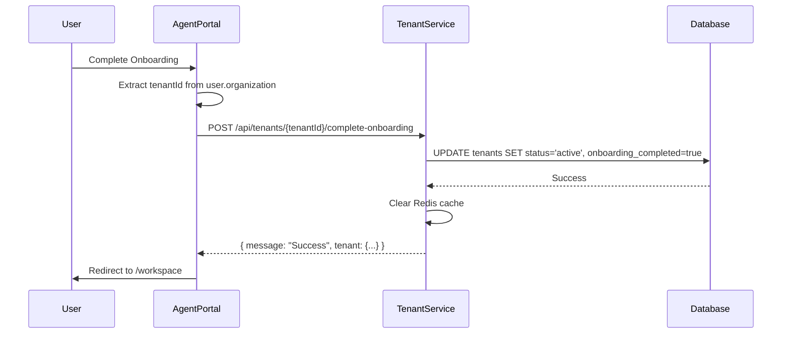

# Phase 1 Onboarding Integration - Fixed ✅

## Issue Identified

The Agent Portal's onboarding workflow called a **missing endpoint** that didn't exist in tenant-service:

**Missing**: `POST /api/organization/complete-onboarding`

This caused the final step of onboarding to fail, preventing users from completing setup.

---

## Root Cause

**Integration gap** between frontend and backend:
- Frontend: Agent Portal expected organization-level endpoint
- Backend: Tenant-service had no onboarding completion endpoint

---

## Files Changed

### 1. [tenantService.js](file:///Users/admin/code/WABA/v1/waba-xypr/services/tenant-service/src/services/tenantService.js)
Added `completeOnboarding` service function:
- Updates tenant status to `active`
- Marks `onboarding_completed = true`
- Tracks WhatsApp configuration status
- Invalidates cache

### 2. [tenantController.js](file:///Users/admin/code/WABA/v1/waba-xypr/services/tenant-service/src/controllers/tenantController.js)
Added `completeOnboarding` controller:
- Validates tenant exists
- Handles errors gracefully
- Returns structured response

### 3. [tenantRoutes.js](file:///Users/admin/code/WABA/v1/waba-xypr/services/tenant-service/src/routes/tenantRoutes.js)
Added route: `POST /:tenantId/complete-onboarding`

### 4. [tenantService.js (Frontend)](file:///Users/admin/code/WABA/v1/waba-xypr/services/agent-portal/src/services/tenantService.js)
Updated endpoint call:
- Changed to `/api/tenants/:tenantId/complete-onboarding`
- Added `tenantId` parameter

### 5. [Onboarding.jsx](file:///Users/admin/code/WABA/v1/waba-xypr/services/agent-portal/src/pages/Onboarding.jsx)
Fixed to extract tenant ID from user profile:
- Gets `user.organization.tenant_id`
- Passes to `completeOnboarding` call
- Added error handling for missing tenant ID

---

## Integration Flow (Now Working)



---

## Verification Checklist

| Component | Status | Details |
|-----------|--------|---------|
| Backend Endpoint | ✅ | `POST /api/tenants/:tenantId/complete-onboarding` |
| Service Logic | ✅ | Database update + cache invalidation |
| Frontend Integration | ✅ | Tenant ID extraction + correct API call |
| Error Handling | ✅ | Tenant not found, missing tenant ID |
| Database Schema | ✅ | **Migration created** - see below |

---

## Database Schema Updates ✅

**Status**: Schema updated, migration created

### Files Modified:
1. [init.sql](file:///Users/admin/code/WABA/v1/waba-xypr/docker/postgres/init.sql) - Added columns to schema
2. [schemaService.js](file:///Users/admin/code/WABA/v1/waba-xypr/services/tenant-service/src/services/schemaService.js) - Updated CREATE TABLE
3. [001_add_onboarding_columns.sql](file:///Users/admin/code/WABA/v1/waba-xypr/docker/postgres/migrations/001_add_onboarding_columns.sql) - Migration for existing DBs

### Columns Added:
- `onboarding_completed` (BOOLEAN, default: false)
- `onboarding_completed_at` (TIMESTAMP, nullable)
- `whatsapp_configured` (BOOLEAN, default: false)

### Apply Migration

> [!IMPORTANT]
> **If you have an existing database**, run the migration:

```bash
# Via Docker
docker cp docker/postgres/migrations/001_add_onboarding_columns.sql postgres-container:/tmp/
docker exec -it postgres-container psql -U postgres -d whatsapp_genesys -f /tmp/001_add_onboarding_columns.sql

# Or direct SQL
psql -U postgres -h localhost -d whatsapp_genesys -f docker/postgres/migrations/001_add_onboarding_columns.sql
```

**For new databases**: No action needed - schema already updated.

---

## Next Steps

**To verify the fix**:
1. Apply database migration (if existing DB)
2. Start required services (see below)
3. Complete onboarding flow end-to-end
4. Verify tenant status updates to `active`

**Services Required**:

| Service | Port | Purpose |
|---------|------|---------|
| **tenant-service** | 3007 | Tenant management & onboarding endpoint |
| **auth-service** | 3004 | Genesys OAuth authentication |
| **agent-portal-service** | ? | Backend API for agent portal |
| **agent-portal** | 5173 | Frontend UI (React/Vite) |

**To test manually**:
```bash
# Terminal 1: Tenant Service
cd services/tenant-service
npm run dev

# Terminal 2: Auth Service
cd services/auth-service
npm run dev

# Terminal 3: Agent Portal Service (Backend)
cd services/agent-portal-service
npm run dev

# Terminal 4: Agent Portal (Frontend)
cd services/agent-portal
npm run dev
```

**API Gateway**: If using the API gateway, start it instead of individual services.
