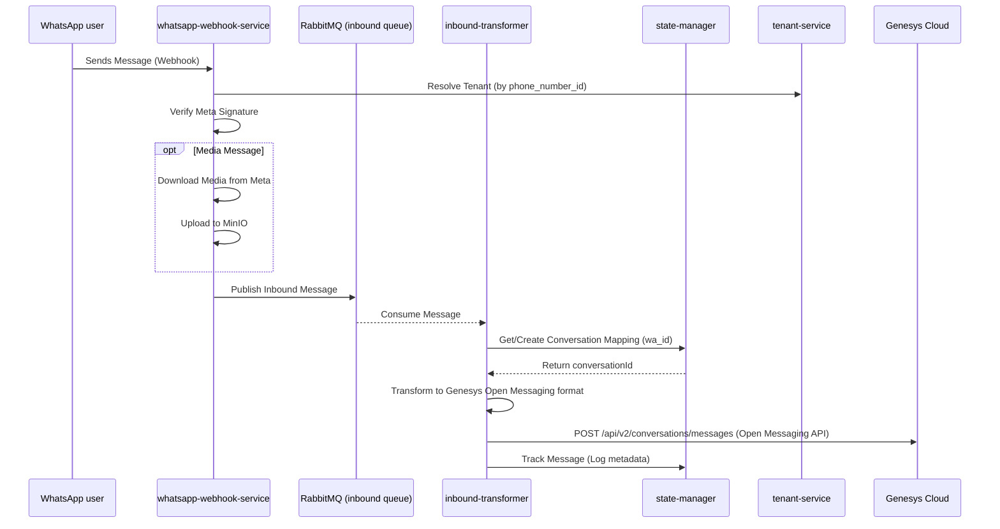
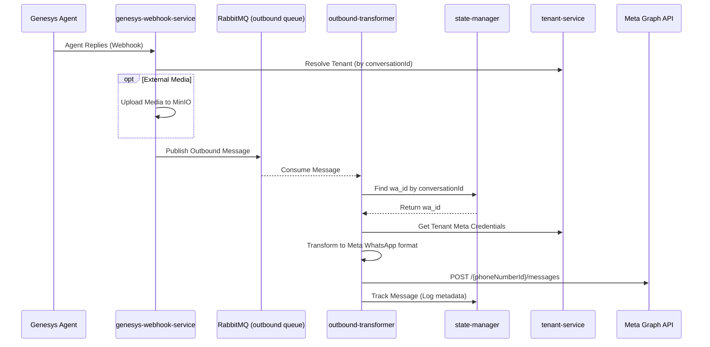

# Xypr Application Architecture & Message Flow Analysis

## Overview
Xypr is a middleware/SaaS application bridging **WhatsApp Business API (WABA)** and **Genesys Contact Management (Cloud)** using the **Open Messaging Protocol**.

## Core Components
- **whatsapp-webhook-service**: Entry point for incoming WhatsApp events.
- **genesys-webhook-service**: Entry point for outgoing Genesys events.
- **inbound-transformer**: Transforms WhatsApp data -> Genesys format.
- **outbound-transformer**: Transforms Genesys data -> WhatsApp format.
- **state-manager**: Centralizes conversation mappings and message history.
- **tenant-service**: Manages tenant-specific configurations and credentials.
- **minio**: Centralized object storage for media files.
- **rabbitmq**: Message broker for asynchronous service communication.

---

## 1. Inbound Message Flow (WhatsApp → Genesys)
This flow handles messages sent by the **End Customer** on WhatsApp to the **Agent** in Genesys.

### Detailed Steps:
1.  **Ingestion**: `whatsapp-webhook-service` receives the Meta webhook. It must use the `phone_number_id` from the payload to identify the tenant.
2.  **Security**: It pulls the tenant's `appSecret` from `tenant-service` to verify the `x-hub-signature-256`.
3.  **Media Handling**: If the message contains media (image, video, etc.), the service downloads it using the WhatsApp media ID and pushes it to local **MinIO** storage. The payload published to RabbitMQ contains the internal MinIO URL.
4.  **Asynchronous Processing**: The message is placed on the `inbound` RabbitMQ queue.
5.  **Transformation**: `inbound-transformer` picks up the message. It first contacts the `state-manager` to find an existing mapping between the `wa_id` (sender's phone) and a Genesys `conversationId`. If none exists, it signals it's a "new" conversation.
6.  **Delivery**: The transformer converts the message into Genesys's **Open Messaging** JSON format and POSTs it to Genesys.
7.  **Logging**: Finally, it updates the `state-manager` with the successful delivery status and message IDs for tracking.

---

## 2. Outbound Message Flow (Genesys → WhatsApp)
This flow handles replies sent by the **Agent** in Genesys to the **End Customer** on WhatsApp.

### Detailed Steps:
1.  **Ingestion**: When an agent replies in Genesys, Genesys triggers a webhook to `genesys-webhook-service`.
2.  **Routing**: The service resolves the tenant context based on the `conversationId` provided by Genesys.
3.  **Queueing**: The message is published to the `outbound` RabbitMQ queue.
4.  **Resolution**: `outbound-transformer` consumes the message and queries `state-manager` to find the original `wa_id` (recipient's WhatsApp ID) associated with that specific Genesys `conversationId`.
5.  **Credentialing**: It fetches the tenant's WhatsApp Access Token from `tenant-service`.
6.  **Delivery**: It transforms the Genesys message into Meta's structure (supporting text and media URLs) and interacts directly with the **Meta Graph API**.
7.  **Persistence**: The outcome and message IDs are logged back to the `state-manager`.

---

## 3. State Management & Persistence
The **state-manager** is the brain of the system, responsible for:
- **Conversation Mapping**: Maintaining the link between `wa_id` (social identity) and `conversationId` (orchestration identity).
- **Message Tracking**: Storing the audit trail for all inbound and outbound messages, including mapping internal IDs to external IDs (Genesys Message ID <-> Meta Message ID).
- **Context**: (Planned) Storing the history and context of active conversations.

---

## 4. Key Implementation Details
- **Error Handling**: Both transformers implement a retry mechanism via RabbitMQ `nack` with delay to handle transient API failures (Meta rate limits or Genesys downtime).
- **Media Optimization**: The system uses MinIO as a centralized bridge. This ensures that media URLs sent to Genesys remain accessible even if Meta's temporary media links expire, and vice versa.
- **Tenant Isolation**: All services are tenant-aware. Credentials and configurations are never hardcoded but fetched dynamically via the `tenant-service` based on the context (phone number or conversation ID).
- **API Services**: While `whatsapp-api-service` and `genesys-api-service` exist as wrappers, the core message transmission is optimized within the **Transformer** services to minimize latency in the RabbitMQ pipeline.
