# Inbound Message Flow - WhatsApp to Genesys

This diagram shows the complete flow when a customer sends a message via WhatsApp to a Genesys agent.

## High-Level Flow


## Detailed Flow with Data Transformation


## Sequence Diagram with Timing


## Data Transformation Detail


## State Manager Mapping Logic

```mermaid
flowchart TD
    Start([Receive wa_id<br/>+919876543210]) --> CheckCache{Check Redis<br/>Key: mapping:wa:+919876543210}

    CheckCache -->|Found in cache| ValidateCache{Is mapping<br/>still valid?<br/>TTL > 0}
    ValidateCache -->|Yes| UpdateActivity1[UPDATE PostgreSQL<br/>last_activity_at = NOW()]
    UpdateActivity1 --> ReturnCached[Return cached<br/>conversationId]
    ValidateCache -->|Expired| QueryDB

    CheckCache -->|Not Found| QueryDB[Query PostgreSQL<br/>SELECT * FROM conversation_mappings<br/>WHERE wa_id = '+919876543210']

    QueryDB --> ExistsDB{Mapping<br/>exists in DB?}

    ExistsDB -->|Yes| UpdateActivity2[UPDATE PostgreSQL<br/>last_activity_at = NOW()]
    UpdateActivity2 --> CacheMapping[SET Redis cache<br/>Key: mapping:wa:+919876543210<br/>Value: conversationId<br/>TTL: 3600s]
    CacheMapping --> CacheBidirectional[SET Redis cache<br/>Key: mapping:conv:conversationId<br/>Value: wa_id<br/>TTL: 3600s]
    CacheBidirectional --> ReturnDB[Return conversationId]

    ExistsDB -->|No| CreateNew[Create new mapping]
    CreateNew --> GenID[Generate new<br/>conversationId<br/>uuid.v4()]
    GenID --> InsertDB[INSERT INTO conversation_mappings<br/>wa_id, conversation_id, tenant_id,<br/>created_at, last_activity_at]
    InsertDB --> CacheNew[Cache in Redis<br/>Both directions<br/>TTL: 3600s]
    CacheNew --> ReturnNew[Return new<br/>conversationId]

    ReturnCached --> End([conversationId<br/>abc-123])
    ReturnDB --> End
    ReturnNew --> End

    style Start fill:#e1f5ff
    style End fill:#90EE90
    style CreateNew fill:#FFD700
    style CheckCache fill:#DDA0DD
    style QueryDB fill:#87CEEB
    style UpdateActivity1 fill:#FFA07A
    style UpdateActivity2 fill:#FFA07A
    style InsertDB fill:#98FB98
```

## State Manager Database Operations

### PostgreSQL Schema
```sql
CREATE TABLE conversation_mappings (
    id SERIAL PRIMARY KEY,
    tenant_id VARCHAR(255) NOT NULL,
    wa_id VARCHAR(50) NOT NULL,
    conversation_id UUID NOT NULL,
    contact_name VARCHAR(255),
    phone_number_id VARCHAR(50),
    display_phone_number VARCHAR(50),
    created_at TIMESTAMP DEFAULT NOW(),
    last_activity_at TIMESTAMP DEFAULT NOW(),
    UNIQUE(tenant_id, wa_id),
    INDEX idx_wa_id (wa_id),
    INDEX idx_conversation_id (conversation_id),
    INDEX idx_tenant_id (tenant_id)
);
```

### State Manager Operations

**1. Check Mapping (GET /state/mapping/:waId)**
```sql
-- Check Redis first
GET mapping:wa:+919876543210

-- If cache miss, query PostgreSQL
SELECT conversation_id, tenant_id, contact_name
FROM conversation_mappings
WHERE wa_id = '+919876543210'
AND tenant_id = 'tenant-001';

-- Update last activity
UPDATE conversation_mappings
SET last_activity_at = NOW()
WHERE wa_id = '+919876543210';

-- Cache result in Redis
SET mapping:wa:+919876543210 '{"conversationId":"abc-123","tenantId":"tenant-001"}' EX 3600
SET mapping:conv:abc-123 '{"waId":"+919876543210","tenantId":"tenant-001"}' EX 3600
```

**2. Create Mapping (POST /state/mapping)**
```sql
INSERT INTO conversation_mappings (
    tenant_id, wa_id, conversation_id, contact_name,
    phone_number_id, display_phone_number
) VALUES (
    'tenant-001', '+919876543210', 'abc-123', 'John Doe',
    '123456789', '+1234567890'
) ON CONFLICT (tenant_id, wa_id)
DO UPDATE SET last_activity_at = NOW()
RETURNING *;
```

**3. Track Message (POST /state/message)**
```sql
INSERT INTO message_tracking (
    message_id, conversation_id, tenant_id, direction,
    status, created_at
) VALUES (
    'wamid.ABC123', 'abc-123', 'tenant-001', 'inbound',
    'received', NOW()
);
```

## Error Handling Flow


## Redis Token Caching Strategy

```mermaid
flowchart TB
    subgraph Services["Services Requiring Auth Tokens"]
        WA[WhatsApp API Service<br/>:3008]
        GA[Genesys API Service<br/>:3010]
        SM[State Manager<br/>:3005]
    end

    subgraph Cache["Redis Token Cache"]
        TokenKeys["Token Cache Keys:<br/><br/>tenant:{tenantId}:oauth:token<br/>└─ Genesys OAuth tokens<br/><br/>tenant:{tenantId}:whatsapp:token<br/>└─ WhatsApp API tokens<br/><br/>TTL: expires_in - 300s (5min buffer)"]
    end

    subgraph Flow["Token Retrieval Flow"]
        Check{Check Redis<br/>for token}
        Valid{Token valid?<br/>expires_at > now + 300s}
        UseCache[Use cached token]
        FetchNew[Fetch new token<br/>from Auth Service]
        CacheNew[Cache in Redis<br/>with TTL]

        Check -->|Found| Valid
        Check -->|Not found| FetchNew
        Valid -->|Yes| UseCache
        Valid -->|No| FetchNew
        FetchNew --> CacheNew
    end

    WA -->|1. Check token| Check
    GA -->|1. Check token| Check
    SM -->|1. Check token| Check

    UseCache --> WA
    UseCache --> GA
    UseCache --> SM

    CacheNew --> TokenKeys

    style TokenKeys fill:#dc382d,color:#fff
    style UseCache fill:#90EE90
    style Check fill:#DDA0DD
    style CacheNew fill:#FFA07A
```



## Service-Specific Token Usage

### 1. Genesys API Service (:3010)


### 2. WhatsApp API Service (:3008)


### 3. State Manager (:3005)


## Redis Cache Keys Reference

| Service | Cache Key | TTL | Purpose |
|---------|-----------|-----|---------|
| Genesys API | `tenant:{tenantId}:oauth:token` | expires_in - 300s | Genesys OAuth access token |
| WhatsApp API | `tenant:{tenantId}:whatsapp:token` | 86400s (24h) | WhatsApp API access token |
| State Manager | `mapping:wa:{waId}` | 3600s (1h) | WhatsApp ID → Conversation ID |
| State Manager | `mapping:conv:{conversationId}` | 3600s (1h) | Conversation ID → WhatsApp ID |
| State Manager | `tenant:{tenantId}:config` | 3600s (1h) | Tenant configuration |
| All Services | `ratelimit:{tenantId}:{minute}` | 60s | Rate limiting counter |

## Media Handling with MinIO

```mermaid
flowchart TB
    subgraph Inbound["Inbound Message with Media"]
        MetaWebhook[Meta Webhook<br/>Contains media_id]
        Download[Download media from Meta<br/>GET /{version}/{media_id}]
        StoreMedia[Store to MinIO<br/>Bucket: media-inbound<br/>Key: {tenantId}/{mediaId}.{ext}]
        GenerateURL[Generate signed URL<br/>Expires: 1 hour]
    end

    subgraph Transform["Message Transformation"]
        CheckMedia{Message<br/>has media?}
        FetchURL[Fetch signed URL<br/>from MinIO]
        BuildPayload[Build Genesys payload<br/>with media URL]
    end

    subgraph Delivery["Deliver to Genesys"]
        SendGenesys[POST to Genesys<br/>with attachment URL]
        GenesysDownload[Genesys downloads<br/>from signed URL]
    end

    MetaWebhook --> Download
    Download --> StoreMedia
    StoreMedia --> GenerateURL
    GenerateURL --> CheckMedia

    CheckMedia -->|Yes| FetchURL
    CheckMedia -->|No| BuildPayload
    FetchURL --> BuildPayload
    BuildPayload --> SendGenesys
    SendGenesys --> GenesysDownload

    style StoreMedia fill:#C72E49,color:#fff
    style FetchURL fill:#C72E49,color:#fff
    style GenerateURL fill:#FFD700
```

## Media Storage Structure

### MinIO Buckets
```
media-inbound/              # Incoming media from WhatsApp
├── tenant-001/
│   ├── images/
│   │   ├── 2024-01-29/
│   │   │   ├── wamid.ABC123.jpg
│   │   │   └── wamid.ABC124.png
│   ├── videos/
│   │   └── 2024-01-29/
│   │       └── wamid.ABC125.mp4
│   └── documents/
│       └── 2024-01-29/
│           └── wamid.ABC126.pdf
└── tenant-002/
    └── ...

media-outbound/             # Outgoing media to WhatsApp
├── tenant-001/
│   └── ...
```

### Media Flow Details

**1. WhatsApp → System (Inbound)**
```javascript
// Webhook receives media_id
{
  "type": "image",
  "image": {
    "id": "wamid.ABC123",
    "mime_type": "image/jpeg",
    "sha256": "..."
  }
}

// Download from Meta
GET https://graph.facebook.com/v18.0/wamid.ABC123
Authorization: Bearer {whatsapp_token}

// Store to MinIO
PUT /media-inbound/{tenantId}/images/2024-01-29/wamid.ABC123.jpg
Content-Type: image/jpeg

// Generate signed URL (1 hour expiry)
presignedUrl = minioClient.presignedGetObject(
  'media-inbound',
  '{tenantId}/images/2024-01-29/wamid.ABC123.jpg',
  3600
)

// Include in Genesys payload
{
  "type": "Structured",
  "content": [{
    "contentType": "Attachment",
    "attachment": {
      "mediaType": "image/jpeg",
      "url": presignedUrl
    }
  }]
}
```

**2. System → WhatsApp (Outbound)**
```javascript
// Store media to MinIO first
PUT /media-outbound/{tenantId}/images/{uuid}.jpg

// Get public URL
const mediaUrl = minioClient.presignedGetObject(
  'media-outbound',
  '{tenantId}/images/{uuid}.jpg',
  86400  // 24 hours
)

// Send to WhatsApp
POST https://graph.facebook.com/v18.0/{phone_number_id}/messages
{
  "type": "image",
  "image": {
    "link": mediaUrl
  }
}
```

## MinIO Storage Pattern

```mermaid
flowchart TB
    subgraph Webhook["WhatsApp Webhook Service"]
        Receive[Receive Webhook<br/>from Meta]
        Validate[Validate Signature]
        ExtractMeta[Extract Metadata:<br/>- tenant_id<br/>- message_id<br/>- timestamp]
        BuildKey[Build MinIO Key:<br/>{tenantId}/{date}/{timestamp}-{messageId}.json]
        Store[Store to MinIO]
    end

    subgraph MinIO["MinIO Object Storage"]
        Bucket[Bucket: webhooks-inbound]
        Objects[Objects Structure:<br/>├─ tenant-001/<br/>│  ├─ 2024-01-29/<br/>│  │  ├─ 1706534400-wamid.ABC123.json<br/>│  │  ├─ 1706534401-wamid.ABC124.json<br/>│  │  └─ ...<br/>│  └─ 2024-01-30/<br/>├─ tenant-002/<br/>└─ ...]
    end

    subgraph Benefits["Storage Benefits"]
        Audit[📋 Audit Trail<br/>Complete history of<br/>all incoming webhooks]
        Replay[🔄 Replay Capability<br/>Re-process messages<br/>if needed]
        Debug[🐛 Debugging<br/>Troubleshoot issues<br/>with raw data]
        Compliance[✓ Compliance<br/>Meet data retention<br/>requirements]
        Analytics[📊 Analytics<br/>Historical analysis<br/>and reporting]
    end

    Receive --> Validate --> ExtractMeta --> BuildKey --> Store
    Store --> Bucket
    Bucket --> Objects
    Objects --> Audit
    Objects --> Replay
    Objects --> Debug
    Objects --> Compliance
    Objects --> Analytics

    style Bucket fill:#C72E49,color:#fff
    style Store fill:#C72E49,color:#fff
    style Objects fill:#f0f0f0
    style Audit fill:#90EE90
    style Replay fill:#90EE90
    style Debug fill:#90EE90
    style Compliance fill:#90EE90
    style Analytics fill:#90EE90
```

## MinIO Storage Details

### Object Metadata
Each stored webhook includes:

```json
{
  "object": "whatsapp_business_account",
  "entry": [...],
  "metadata": {
    "stored_at": "2024-01-29T10:30:00.000Z",
    "tenant_id": "tenant-001",
    "webhook_signature": "sha256=...",
    "source_ip": "31.13.84.51",
    "user_agent": "WhatsApp/1.0"
  }
}
```

### Bucket Lifecycle Policy
- **Transition to Cold Storage:** After 7 days
- **Delete:** After 30 days (configurable)
- **Versioning:** Enabled (for accidental deletion recovery)

### Access Patterns
1. **Write:** Webhook service stores immediately after validation
2. **Read (Replay):** Admin dashboard or CLI tools can fetch and replay
3. **Read (Debug):** Support team retrieves for troubleshooting
4. **Bulk Read:** Analytics jobs for reporting

## Complete Data Flow Architecture


## Data Access Patterns Summary

### 1. Token Management (Redis First)
```
┌─────────────────────────────────────────┐
│ Service needs auth token                │
└────────────┬────────────────────────────┘
             │
             ▼
      ┌──────────────┐
      │ Check Redis  │ ← Key: tenant:{id}:oauth:token
      └──────┬───────┘
             │
        ┌────┴────┐
        │         │
     Found     Not Found
        │         │
        ▼         ▼
   Use Cache  Query Auth Service
        │         │
        │         ├─→ Check PostgreSQL
        │         ├─→ Request from OAuth provider
        │         └─→ Cache in Redis (TTL: 3300s)
        │         │
        └────┬────┘
             │
             ▼
        Use Token
```

### 2. Conversation Mapping (Redis + PostgreSQL)
```
┌─────────────────────────────────────────┐
│ Need conversationId for wa_id           │
└────────────┬────────────────────────────┘
             │
             ▼
      ┌──────────────┐
      │ Check Redis  │ ← Key: mapping:wa:{waId}
      └──────┬───────┘
             │
        ┌────┴────┐
        │         │
     Found     Not Found
        │         │
        ▼         ▼
   Return    Query PostgreSQL
    Value    (SELECT from conversation_mappings)
        │         │
        │         ├─→ UPDATE last_activity_at
        │         └─→ Cache in Redis (TTL: 3600s)
        │         │
        └────┬────┘
             │
             ▼
    Return conversationId
```

### 3. Media Handling (MinIO)
```
┌─────────────────────────────────────────┐
│ Message contains media (image/video)    │
└────────────┬────────────────────────────┘
             │
             ▼
      ┌──────────────┐
      │ Download from│
      │  Meta API    │
      └──────┬───────┘
             │
             ▼
      ┌──────────────┐
      │ Store to     │ ← Bucket: media-inbound
      │   MinIO      │   Key: {tenant}/{date}/{id}.ext
      └──────┬───────┘
             │
             ▼
      ┌──────────────┐
      │ Generate     │
      │ Signed URL   │ ← Expires: 1 hour
      └──────┬───────┘
             │
             ▼
      ┌──────────────┐
      │ Append URL   │
      │ to Genesys   │
      │  payload     │
      └──────────────┘
```

## Performance Metrics


---

## Key Components

### Services Involved
1. **API Gateway (3000)** - Entry point and routing
2. **WhatsApp Webhook Service (3009)** - Receives Meta webhooks
3. **Inbound Transformer (3002)** - Message format conversion
4. **State Manager (3005)** - Conversation mapping
5. **Auth Service (3004)** - OAuth token management
6. **Genesys API Service (3010)** - Sends to Genesys Cloud

### Message Queue
- **Queue:** `INBOUND_WHATSAPP_MESSAGES`
- **Purpose:** Decouple webhook from transformation
- **Benefits:** Async processing, retry logic, scalability

### Data Stores

#### Redis Cache
Used by: All services
- **Token Cache:**
  - `tenant:{tenantId}:oauth:token` - Genesys OAuth tokens (TTL: ~3300s)
  - `tenant:{tenantId}:whatsapp:token` - WhatsApp API tokens (TTL: 24h)
- **Conversation Mappings:**
  - `mapping:wa:{waId}` - WhatsApp ID → Conversation ID (TTL: 3600s)
  - `mapping:conv:{conversationId}` - Conversation ID → WhatsApp ID (TTL: 3600s)
- **Tenant Config:**
  - `tenant:{tenantId}:config` - Tenant configuration cache (TTL: 3600s)
- **Rate Limiting:**
  - `ratelimit:{tenantId}:{minute}` - Per-tenant rate limit counters (TTL: 60s)

#### PostgreSQL Database
Used by: State Manager, Auth Service, Tenant Service

**Tables:**
1. **conversation_mappings**
   - Stores wa_id ↔ conversationId mappings
   - Tracks last_activity_at for active conversations
   - Indexed on wa_id, conversation_id, tenant_id

2. **message_tracking**
   - Tracks all messages (inbound/outbound)
   - Stores message status (received, delivered, read, failed)
   - Links meta_message_id ↔ genesys_message_id

3. **tenant_credentials**
   - Stores Genesys and WhatsApp credentials per tenant
   - JSONB format for flexible credential storage

**Operations:**
- **State Manager queries PostgreSQL** for conversation mappings (cache miss)
- **State Manager updates PostgreSQL** on every message activity (last_activity_at)
- **State Manager inserts into PostgreSQL** for new conversation creation
- **Auth Service queries PostgreSQL** for tenant credentials
- **Message tracking inserts** for audit trail

#### MinIO Object Storage
Used by: WhatsApp Webhook, Inbound Transformer, Outbound Transformer

**Buckets:**

1. **webhooks-inbound**
   - **Key Pattern:** `{tenantId}/{yyyy-MM-dd}/{timestamp}-{messageId}.json`
   - **Content:** Complete raw webhook payload from Meta
   - **Purpose:**
     - Audit trail and compliance
     - Replay capability for debugging
     - Data recovery if processing fails
     - Analytics and troubleshooting
   - **Retention:** 30 days (configurable)
   - **Lifecycle:** Transition to cold storage after 7 days

2. **media-inbound**
   - **Key Pattern:** `{tenantId}/{mediaType}/{yyyy-MM-dd}/{messageId}.{ext}`
   - **Content:** Media files from WhatsApp (images, videos, documents, audio)
   - **Purpose:**
     - Store downloaded media from Meta
     - Generate signed URLs for Genesys access
     - Media archival
   - **Retention:** 90 days (compliance)
   - **Access:** Signed URLs with 1-hour expiry

3. **media-outbound**
   - **Key Pattern:** `{tenantId}/{mediaType}/{yyyy-MM-dd}/{uuid}.{ext}`
   - **Content:** Media files to be sent via WhatsApp
   - **Purpose:**
     - Store media before sending to Meta
     - Generate public URLs for Meta access
   - **Retention:** 30 days
   - **Access:** Signed URLs with 24-hour expiry

### External APIs
- **Meta WhatsApp API:** Source of inbound messages
- **Genesys Cloud API:** Destination for transformed messages
