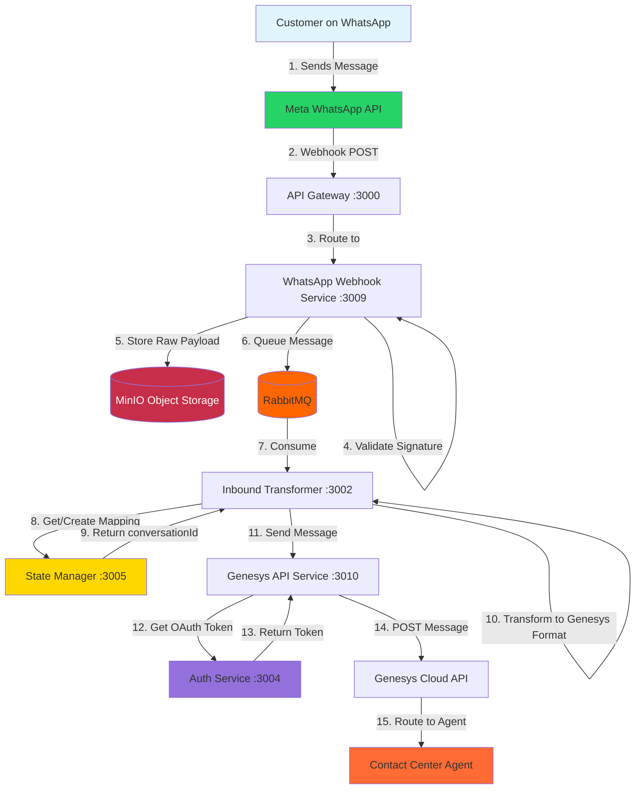

# Inbound Message Handling: WhatsApp to Genesys

This document details the complete technical flow of an inbound message traveling from a customer on WhatsApp to a Genesys Contact Center agent. It covers the architecture, data transformation, state management, and media handling involved in the process.

## 1. High-Level Overview

The system acts as a bridge between the **Meta WhatsApp Business API** and **Genesys Cloud**, transforming data formats and managing conversation state.

### Core Services
- **API Gateway (:3000)**: Entry point for all external webhooks.
- **WhatsApp Webhook Service (:3009)**: Validates and queues incoming payloads.
- **Inbound Transformer (:3002)**: Converts Meta JSON to Genesys Open Messaging format.
- **State Manager (:3005)**: Maps WhatsApp IDs to Genesys Conversation IDs.
- **Auth Service (:3004)**: Manages OAuth tokens for Genesys.
- **Genesys API Service (:3010)**: Handles the final delivery to Genesys Cloud.

## 2. Detailed Process Flow

### Step 1: Webhook Reception & Validation
The flow begins when a customer sends a message. Meta POSTs a webhook to our API Gateway.

1.  **Reception**: `API Gateway` routes `/webhook/meta` traffic to `WhatsApp Webhook Service`.
2.  **Validation**: The service calculates the HMAC SHA-256 signature of the payload using the App Secret and compares it with `X-Hub-Signature-256` header.
3.  **Tenant Check**: Retrieves tenant configuration from Redis using `phone_number_id`.
4.  **Raw Archival**: The raw JSON payload is stored in **MinIO** (`webhooks-inbound` bucket) for audit and replay purposes.
5.  **Queuing**: The message is published to the `INBOUND_WHATSAPP_MESSAGES` RabbitMQ queue for asynchronous processing.

### Step 2: Message Transformation
The `Inbound Transformer` consumes messages from RabbitMQ.

1.  **Extraction**: key fields (`from`, `text`, `timestamp`, `message_id`) are extracted from the Meta payload.
2.  **Mapping Lookup**: calls `State Manager` to find the Genesys `conversationId` associated with the sender's mobile number (`waId`).
3.  **Media Handling**: If the message contains media (image, video, document), a presigned URL is fetched from MinIO (see Section 4).
4.  **Enrichment**: The message is reformatted into the **Genesys Open Messaging** JSON structure.

### Step 3: State Management
The `State Manager` maintains the link between WhatsApp users and Genesys conversations.

-   **Check Cache**: Look up `mapping:wa:{waId}` in Redis.
-   **DB Lookup**: If not in cache, query `conversation_mappings` table in PostgreSQL.
-   **Create New**: If no mapping exists, generate a new UUID `conversationId` and insert into DB.
-   **Update Activity**: Update `last_activity_at` timestamp in DB to keep the session active.

### Step 4: Delivery to Genesys
The transformed message is sent to `Genesys API Service`.

1.  **Auth Check**: Checks Redis for a valid Genesys OAuth token (`tenant:{id}:oauth:token`).
2.  **Token Refresh**: If missing or expired, requests a new token from `Auth Service`, which performs the Client Credentials Grant flow with Genesys.
3.  **API Call**: POSTs the message to Genesys Cloud Open Messaging endpoint.
4.  **Routing**: Genesys Cloud routes the interaction to the appropriate agent queue.

## 3. Data & State Architecture

### Redis Caching Strategy
Redis is the primary speed layer, reducing DB load.

| Key Pattern | TTL | Purpose |
| :--- | :--- | :--- |
| `tenant:{id}:oauth:token` | Expires - 300s | Genesys OAuth access token |
| `tenant:{id}:whatsapp:token` | 24 hours | WhatsApp API access tokens |
| `mapping:wa:{waId}` | 1 hour | Maps Phone Number -> Conversation ID |
| `mapping:conv:{id}` | 1 hour | Maps Conversation ID -> Phone Number |
| `tenant:{id}:config` | 1 hour | Tenant configuration (credentials, secrets) |
| `ratelimit:{id}:{min}` | 60s | Rate limiting counters |

### PostgreSQL Schema
Persistent storage for critical data.

-   **`conversation_mappings`**: Stores the persistent relationship between a WhatsApp phone number and a Genesys Conversation UUID.
-   **`message_tracking`**: Audit trail of every message processed, including status and timestamps.
-   **`tenant_credentials`**: Encrypted storage for API keys and Client Secrets.

## 4. Media Handling (MinIO)

Media is not sent directly to Genesys as binary data. Instead, it is uploaded to object storage, and a signed URL is passed.

### Inbound Media Flow
1.  **Download**: Webhook service identifies media type and downloads content from Meta API.
2.  **Store**: Saves file to **MinIO** `media-inbound` bucket.
    -   Key: `{tenantId}/{mediaType}/{date}/{messageId}.{ext}`
3.  **Sign**: Generates a presigned URL valid for **1 hour**.
4.  **Payload**: The URL is added to the `content` array in the Genesys payload.
5.  **Access**: Genesys Cloud (and the agent's UI) uses the URL to download/display the media.

## 5. Error Handling & Reliability

-   **Validation Failures**: Invalid signatures result in `401 Unauthorized` immediately.
-   **MinIO Failure**: If raw storage fails, the system logs the error but attempts to proceed with queuing to prevent data loss (availability over consistency for raw logs).
-   **Queue Retries**: RabbitMQ is configured with Dead Letter Queues (DLQ) for failed messages after 3 retries.
-   **Genesys API Defects**: Failed delivery to Genesys is logged to `message_tracking` with status `failed`, enabling manual replay capability.
