# Admin Aggregation Service - Technical Specification

**Version:** 1.0 (Initial Draft)
**Service Name:** `admin-aggregation-service`
**Document Purpose:** Definition of the cross-tenant query layer for the Hybrid Database Model.

---

## 1. Service Overview

### Purpose
The **Admin Aggregation Service** is a read-only specialized service designed to solve the "Fragmented View" problem inherent in Physical Database Isolation. It acts as a **Federated Query Engine**, allowing Super Admins to perform global operations (e.g., "Find this message ID across all 500 tenants") without maintaining a centralized data warehouse.

### Key Characteristics
- **Read-Only**: Does not mutate state.
- **Fan-Out/Fan-In**: Distributes queries to multiple isolated databases and aggregates results.
- **Ephemeral**: Does not store business data; only caches routing information.
- **Privileged**: Only accessible by Super Admin roles.

---

## 2. Architecture Context

### The Problem: Physical Isolation
- **State Manager** uses a separate PostgreSQL database for each Tenant (Sequence: `db_tenant_01`, `db_tenant_02`...).
- **Admin Dashboard** needs to show a "Global Message Trace" but doesn't know which tenant a `wamid` belongs to.

### The Solution: Aggregation Layer

```mermaid
graph TD
    Dashboard[Admin Dashboard] -->|1. Trace wamid:X| Aggregator[Admin Aggregation Service]
    Aggregator -->|2. Get Active Tenants| TenantSVC[Tenant Service]
    Aggregator -->|3. Check Index| Redis[Global Redis Index]
    
    subgraph "Targeted Mode (Fast)"
    Redis -->|Hit: Tenant A| DB_A[(Tenant A DB)]
    end
    
    subgraph "Broadcast Mode (Fallback)"
    Redis -.->|Miss| Scheduler[Query Scheduler]
    Scheduler -->|Parallel Query| DB_A
    Scheduler -->|Parallel Query| DB_B[(Tenant B DB)]
    Scheduler -->|Parallel Query| DB_N[(Tenant N DB)]
    end
    
    DB_A -->|Result| Aggregator
    DB_B -->|Empty| Aggregator
    Aggregator -->|4. Unified Result| Dashboard
```


---

## 3. Core Capabilities

### 3.1 Tenant Registry Synchronization
- **Source**: `tenant-service` (Shared DB).
- **Behavior**: Periodically (every 1 min) fetches list of active tenants and their DB connection credentials (encrypted).
- **Storage**: In-memory connection pool cache (HikariCP or similar).

### 3.2 Global Trace (Targeted)
- **Input**: `wamid` or `genesysId` + `tenantId` (optional).
- **Logic**:
    - If `tenantId` is provided, route query DIRECTLY to that tenant's DB.
    - Latency Target: < 50ms.

### 3.3 Global Trace (Broadcast)
- **Input**: `wamid` only.
- **Logic**:
    1. Check **Global Redis Index** (`index:wamid:{id}` -> `tenantId`).
    2. If Hit: Perform Targeted Query.
    3. If Miss: 
        - Initiate **Broadcast**: Spawn N async coroutines (one per active tenant).
        - Execute: `SELECT * FROM message_tracking WHERE wamid = ?` with 500ms hard timeout.
        - **First Match Wins**: Cancel pending queries once a match is found.
        - **Aggregated Result**: Return the trace data + `tenantId`.

### 3.4 Aggregated Statistics
- **Input**: specific time range.
- **Logic**:
    - Scatter-Gather: Query `daily_stats` table on ALL tenants.
    - Reduce: Sum up `total_messages`, `total_errors` across all results.
    - Return global totals.

---

## 4. API Specification

### 4.1 Global Message Trace
`GET /admin/aggregate/trace/:messageId`

**Response**:
```json
{
  "found": true,
  "tenantId": "uuid-tenant-123",
  "tenantName": "Acme Corp",
  "source": "database_b",
  "data": {
    "wamid": "wamid.Hb...",
    "status": "delivered",
    "history": [...]
  }
}
```

### 4.2 Cross-Tenant Health
`GET /admin/aggregate/health`

**logic**: Pings all tenant DB connections.
**Response**:
```json
{
  "totalTenants": 50,
  "healthy": 48,
  "unhealthy": 2,
  "details": [
    {"tenantId": "t1", "status": "down", "error": "ConnectionRefused"}
  ]
}
```

---

## 5. Technology Stack
- **Language**: Go or Java (Strong concurrency support required for scatter-gather).
- **Database Driver**: Must support dynamic datasource switching at runtime.
- **Redis**: For Global Secondary Indexing (GSI).

---

## 6. Security Considerations
- **Credential Management**: Must decrypt Tenant DB credentials in memory only. Never log them.
- **Access Control**: Strict IP allowlist (internal only) or mTLS. Not exposed to public internet.
