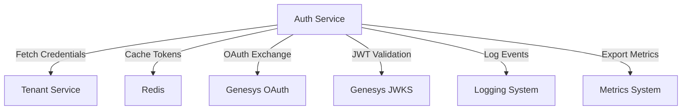
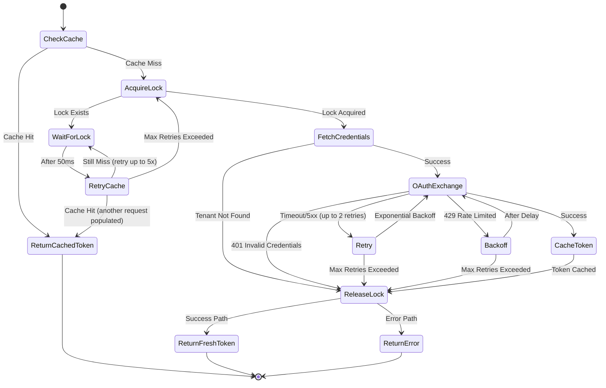

# Auth Service - Functional Requirements Document
## LLM-Optimized for Code Generation & Debugging

**Version:** 2.0 (LLM-Optimized)  
**Service Name:** `auth-service`  
**Purpose:** Centralized token authority and OAuth lifecycle manager  
**Parent Document:** System Design Document  

---

## Table of Contents

1. [System Overview](#1-system-overview)
2. [Architecture Patterns](#2-architecture-patterns)
3. [Data Models](#3-data-models)
4. [API Specifications](#4-api-specifications)
5. [Core Flows](#5-core-flows)
6. [Error Handling](#6-error-handling)
7. [Security Requirements](#7-security-requirements)
8. [Performance Requirements](#8-performance-requirements)
9. [Implementation Guide](#9-implementation-guide)
10. [Test Scenarios](#10-test-scenarios)
11. [Configuration](#11-configuration)
12. [Monitoring & Observability](#12-monitoring--observability)

---

## 1. System Overview

### 1.1 Service Description

The Auth Service is the **single source of truth** for authentication tokens across the middleware ecosystem. It manages OAuth flows, token lifecycle, credential security, and SSO validation for external integrations.

**Critical Context:** This is not a helper service - it is the security backbone. System-wide failure occurs if this service fails.

### 1.2 Supported Identity Providers

| Provider | Integration Type | OAuth Flow | Token Type |
|----------|-----------------|------------|------------|
| Genesys Cloud | OAuth 2.0 | Client Credentials | Access Token (JWT) |
| WhatsApp Business Platform | System User Token | Static Token | Long-lived Token |

### 1.3 Primary Capabilities

**REQ-AUTH-01: Token Vending**
- Provide valid access tokens on-demand to internal services
- Support multiple tenant isolation
- Cache tokens with intelligent TTL management
- Prevent token stampede via request collapsing

**REQ-AUTH-02: OAuth Lifecycle Management**
- Handle full OAuth 2.0 Client Credentials flow
- Manage token refresh before expiration
- Handle provider-specific OAuth endpoints per region

**REQ-AUTH-03: Credential Isolation**
- Never store credentials in auth-service
- Fetch encrypted credentials from Tenant Service on-demand
- Decrypt in-memory only, zero logging
- Memory zeroization after use

**REQ-AUTH-04: SSO JWT Validation**
- Validate Genesys SSO JWTs for portal authentication
- Cache JWKS keys for performance
- Extract user context (userId, orgId, roles)

**REQ-AUTH-05: Rate Protection**
- Request collapsing during cache misses
- Exponential backoff on provider rate limits
- Per-tenant rate limiting in Redis failure scenarios

### 1.4 Service Dependencies



**Dependency Table:**

| Service | Purpose | Criticality | Fallback Behavior |
|---------|---------|-------------|-------------------|
| Tenant Service | Encrypted credential source | HIGH | Fail fast (no credentials = no auth) |
| Redis | Token cache & distributed locks | CRITICAL | Degraded mode: direct IdP, rate-limited |
| Genesys OAuth Endpoint | Token issuance | HIGH | Retry with backoff, fail after 3 attempts |
| Genesys JWKS Endpoint | JWT signature validation | MEDIUM | Use cached keys, fail after cache expiry |
| Logging System | Audit trail | MEDIUM | Buffer logs locally, async flush |
| Metrics System | Observability | LOW | Continue operation, metrics lost |

---

## 2. Architecture Patterns

### 2.1 Layered Architecture

```
┌─────────────────────────────────────┐
│   API Layer (HTTP/REST Endpoints)   │
├─────────────────────────────────────┤
│   Service Layer (Business Logic)    │
├─────────────────────────────────────┤
│   Repository Layer (Data Access)    │
├─────────────────────────────────────┤
│   Infrastructure (Redis, HTTP)      │
└─────────────────────────────────────┘
```

### 2.2 Key Design Patterns

**Pattern 1: Cache-Aside with Distributed Locking**
- Check cache → if miss, acquire lock → fetch from source → populate cache
- Prevents thundering herd problem

**Pattern 2: Decorator Pattern for Token Operations**
- Base token provider interface
- Decorators: Caching, Logging, Metrics, Retry logic

**Pattern 3: Strategy Pattern for OAuth Providers**
- Different strategies for Genesys vs WhatsApp
- Pluggable provider implementations

**Pattern 4: Circuit Breaker for External Services**
- Track failure rates for OAuth endpoints
- Open circuit after threshold, half-open for health checks

### 2.3 Component Structure

```typescript
// Recommended project structure
src/
├── api/
│   ├── routes/
│   │   ├── token.routes.ts          // GET /token/:type
│   │   ├── validate.routes.ts       // POST /validate/jwt
│   │   └── health.routes.ts         // GET /health
│   └── middleware/
│       ├── auth.middleware.ts       // Internal service auth
│       ├── validation.middleware.ts // Request validation
│       └── error.middleware.ts      // Error handling
├── services/
│   ├── token/
│   │   ├── token.service.ts         // Main token orchestration
│   │   ├── genesys-token.service.ts // Genesys-specific logic
│   │   └── whatsapp-token.service.ts// WhatsApp-specific logic
│   ├── oauth/
│   │   ├── oauth.service.ts         // OAuth 2.0 client
│   │   └── oauth-client-factory.ts  // Provider-specific clients
│   ├── jwt/
│   │   ├── jwt-validator.service.ts // JWT validation
│   │   └── jwks-cache.service.ts    // JWKS key caching
│   └── credentials/
│       └── credential-fetcher.service.ts // Tenant Service client
├── repositories/
│   ├── token-cache.repository.ts    // Redis token operations
│   └── lock.repository.ts           // Distributed lock operations
├── models/
│   ├── token.model.ts               // Token data structures
│   ├── credentials.model.ts         // Credential structures
│   └── errors.model.ts              // Custom error types
├── config/
│   ├── app.config.ts                // Application config
│   ├── redis.config.ts              // Redis config
│   └── providers.config.ts          // OAuth provider config
└── utils/
    ├── crypto.util.ts               // Encryption/decryption
    ├── logger.util.ts               // Structured logging
    └── metrics.util.ts              // Metrics helpers
```

---

## 3. Data Models

### 3.1 TypeScript Interfaces

```typescript
/**
 * Supported identity provider types
 */
export enum ProviderType {
  GENESYS = 'genesys',
  WHATSAPP = 'whatsapp'
}

/**
 * Genesys Cloud regions
 */
export enum GenesysRegion {
  US_EAST_1 = 'us-east-1',
  US_EAST_2 = 'us-east-2',
  US_WEST_2 = 'us-west-2',
  CA_CENTRAL_1 = 'ca-central-1',
  EU_WEST_1 = 'eu-west-1',
  EU_WEST_2 = 'eu-west-2',
  EU_CENTRAL_1 = 'eu-central-1',
  AP_SOUTHEAST_2 = 'ap-southeast-2',
  AP_NORTHEAST_1 = 'ap-northeast-1',
  AP_NORTHEAST_2 = 'ap-northeast-2',
  AP_SOUTH_1 = 'ap-south-1'
}

/**
 * Internal token request payload
 */
export interface TokenRequest {
  tenantId: string;           // UUID v4 format
  type: ProviderType;         // 'genesys' | 'whatsapp'
  forceRefresh?: boolean;     // Optional: bypass cache
  correlationId?: string;     // Optional: request tracing
}

/**
 * Internal token response
 */
export interface TokenResponse {
  accessToken: string;        // The actual token (never log this)
  expiresIn: number;          // Seconds until expiration
  tokenType: string;          // 'Bearer' for OAuth 2.0
  source: 'cache' | 'fresh';  // Whether from cache or newly fetched
  cachedAt?: Date;            // When cached (if from cache)
  expiresAt: Date;            // Absolute expiration time
}

/**
 * Genesys OAuth credentials
 */
export interface GenesysCredentials {
  clientId: string;           // OAuth client ID
  clientSecret: string;       // OAuth client secret (NEVER LOG)
  region: GenesysRegion;      // Genesys region for endpoint
}

/**
 * WhatsApp credentials
 */
export interface WhatsAppCredentials {
  systemUserToken: string;    // Long-lived token (NEVER LOG)
  expiresAt?: Date;           // Optional expiration
}

/**
 * Unified credentials response from Tenant Service
 */
export interface TenantCredentials {
  tenantId: string;
  type: ProviderType;
  genesys?: GenesysCredentials;
  whatsapp?: WhatsAppCredentials;
}

/**
 * OAuth token response from Genesys
 */
export interface GenesysOAuthResponse {
  access_token: string;
  token_type: string;
  expires_in: number;
}

/**
 * JWT validation request
 */
export interface JWTValidationRequest {
  token: string;              // The JWT to validate (NEVER LOG)
  region: GenesysRegion;      // Genesys region for JWKS endpoint
}

/**
 * JWT validation response
 */
export interface JWTValidationResponse {
  isValid: boolean;
  userId?: string;            // Subject claim (sub)
  orgId?: string;             // Organization ID
  roles?: string[];           // User roles (if present in token)
  expiresAt?: Date;           // Token expiration
  error?: string;             // Error message if invalid
}

/**
 * JWKS key
 */
export interface JWK {
  kid: string;                // Key ID
  kty: string;                // Key type
  use: string;                // Public key use
  n: string;                  // RSA modulus
  e: string;                  // RSA exponent
  alg: string;                // Algorithm
}

/**
 * JWKS response
 */
export interface JWKSResponse {
  keys: JWK[];
}

/**
 * Redis cache entry for tokens
 */
export interface CachedToken {
  token: string;
  expiresAt: number;          // Unix timestamp
  cachedAt: number;           // Unix timestamp
}

/**
 * Distributed lock
 */
export interface DistributedLock {
  key: string;
  value: string;              // Random token to identify lock owner
  ttl: number;                // Seconds
  acquiredAt: Date;
}
```

### 3.2 Error Models

```typescript
/**
 * Custom error types
 */
export enum ErrorCode {
  // Credential errors
  TENANT_NOT_FOUND = 'TENANT_NOT_FOUND',
  CREDENTIALS_NOT_FOUND = 'CREDENTIALS_NOT_FOUND',
  CREDENTIALS_INVALID = 'CREDENTIALS_INVALID',
  CREDENTIALS_DECRYPT_FAILED = 'CREDENTIALS_DECRYPT_FAILED',
  
  // OAuth errors
  OAUTH_EXCHANGE_FAILED = 'OAUTH_EXCHANGE_FAILED',
  OAUTH_INVALID_GRANT = 'OAUTH_INVALID_GRANT',
  OAUTH_TIMEOUT = 'OAUTH_TIMEOUT',
  OAUTH_RATE_LIMITED = 'OAUTH_RATE_LIMITED',
  
  // Cache errors
  CACHE_UNAVAILABLE = 'CACHE_UNAVAILABLE',
  LOCK_TIMEOUT = 'LOCK_TIMEOUT',
  LOCK_ACQUISITION_FAILED = 'LOCK_ACQUISITION_FAILED',
  
  // JWT errors
  JWT_INVALID_SIGNATURE = 'JWT_INVALID_SIGNATURE',
  JWT_EXPIRED = 'JWT_EXPIRED',
  JWT_INVALID_FORMAT = 'JWT_INVALID_FORMAT',
  JWT_MISSING_CLAIMS = 'JWT_MISSING_CLAIMS',
  JWKS_FETCH_FAILED = 'JWKS_FETCH_FAILED',
  
  // Generic errors
  INTERNAL_ERROR = 'INTERNAL_ERROR',
  INVALID_REQUEST = 'INVALID_REQUEST'
}

/**
 * Base error class
 */
export class AuthServiceError extends Error {
  constructor(
    public code: ErrorCode,
    message: string,
    public statusCode: number = 500,
    public tenantId?: string,
    public correlationId?: string
  ) {
    super(message);
    this.name = 'AuthServiceError';
  }
}

/**
 * OAuth-specific error
 */
export class OAuthError extends AuthServiceError {
  constructor(
    code: ErrorCode,
    message: string,
    public provider: ProviderType,
    public providerError?: string,
    tenantId?: string,
    correlationId?: string
  ) {
    super(code, message, 401, tenantId, correlationId);
    this.name = 'OAuthError';
  }
}

/**
 * Cache error
 */
export class CacheError extends AuthServiceError {
  constructor(
    code: ErrorCode,
    message: string,
    public operation: string,
    tenantId?: string,
    correlationId?: string
  ) {
    super(code, message, 503, tenantId, correlationId);
    this.name = 'CacheError';
  }
}
```

### 3.3 Redis Key Schema

```typescript
/**
 * Redis key patterns
 */
export class RedisKeys {
  /**
   * Token cache key
   * Pattern: auth:token:{provider}:{tenantId}
   * Example: auth:token:genesys:550e8400-e29b-41d4-a716-446655440000
   */
  static token(provider: ProviderType, tenantId: string): string {
    return `auth:token:${provider}:${tenantId}`;
  }

  /**
   * Distributed lock key for token fetching
   * Pattern: auth:lock:{provider}:{tenantId}
   * Example: auth:lock:genesys:550e8400-e29b-41d4-a716-446655440000
   */
  static lock(provider: ProviderType, tenantId: string): string {
    return `auth:lock:${provider}:${tenantId}`;
  }

  /**
   * JWKS cache key
   * Pattern: auth:jwks:{region}
   * Example: auth:jwks:us-east-1
   */
  static jwks(region: GenesysRegion): string {
    return `auth:jwks:${region}`;
  }

  /**
   * Rate limit key (used in Redis failure fallback)
   * Pattern: auth:ratelimit:{provider}:{tenantId}:{minute}
   * Example: auth:ratelimit:genesys:550e8400-e29b-41d4-a716-446655440000:202502121430
   */
  static rateLimit(provider: ProviderType, tenantId: string): string {
    const minute = new Date().toISOString().slice(0, 16).replace(/[-:T]/g, '');
    return `auth:ratelimit:${provider}:${tenantId}:${minute}`;
  }
}

/**
 * Redis TTL constants
 */
export const RedisTTL = {
  TOKEN_SAFETY_BUFFER: 60,      // Subtract 60s from token expiry for safety
  LOCK_TTL: 30,                  // Lock expires after 30s
  JWKS_TTL: 21600,               // Cache JWKS for 6 hours (21600s)
  WHATSAPP_DEFAULT_TTL: 86400,   // Default 24h for WhatsApp tokens
  WHATSAPP_SAFETY_BUFFER: 3600   // 1 hour buffer for WhatsApp tokens
};
```

---

## 4. API Specifications

### 4.1 Internal REST API

**Base Path:** `/api/v1`

#### 4.1.1 Get Access Token

**Endpoint:** `POST /token`

**Purpose:** Retrieve a valid access token for a tenant and provider.

**Request:**
```json
{
  "tenantId": "550e8400-e29b-41d4-a716-446655440000",
  "type": "genesys",
  "forceRefresh": false,
  "correlationId": "req-abc-123"
}
```

**Request Schema:**
```typescript
{
  tenantId: string;     // Required, must be valid UUID v4
  type: 'genesys' | 'whatsapp';  // Required
  forceRefresh?: boolean;        // Optional, default false
  correlationId?: string;        // Optional, for tracing
}
```

**Response (200 OK):**
```json
{
  "accessToken": "eyJhbGciOiJSUzI1NiIsInR5cCI6IkpXVCJ9...",
  "expiresIn": 86399,
  "tokenType": "Bearer",
  "source": "cache",
  "expiresAt": "2026-02-13T12:00:00Z"
}
```

**Error Responses:**

| Status | Code | Description |
|--------|------|-------------|
| 400 | INVALID_REQUEST | Invalid tenantId or type |
| 401 | CREDENTIALS_INVALID | OAuth credentials rejected by IdP |
| 404 | TENANT_NOT_FOUND | Tenant does not exist |
| 404 | CREDENTIALS_NOT_FOUND | No credentials configured for tenant |
| 429 | OAUTH_RATE_LIMITED | Provider rate limit exceeded |
| 503 | OAUTH_EXCHANGE_FAILED | OAuth endpoint unavailable |
| 503 | CACHE_UNAVAILABLE | Redis down, degraded mode active |

**Example Error Response (401):**
```json
{
  "error": {
    "code": "CREDENTIALS_INVALID",
    "message": "OAuth credentials were rejected by Genesys",
    "statusCode": 401,
    "tenantId": "550e8400-e29b-41d4-a716-446655440000",
    "correlationId": "req-abc-123"
  }
}
```

#### 4.1.2 Validate JWT

**Endpoint:** `POST /validate/jwt`

**Purpose:** Validate a Genesys SSO JWT and extract user context.

**Request:**
```json
{
  "token": "eyJhbGciOiJSUzI1NiIsInR5cCI6IkpXVCJ9...",
  "region": "us-east-1"
}
```

**Request Schema:**
```typescript
{
  token: string;        // Required, must be non-empty
  region: GenesysRegion; // Required, must be valid region
}
```

**Response (200 OK - Valid Token):**
```json
{
  "isValid": true,
  "userId": "abc-123-def-456",
  "orgId": "org-789",
  "roles": ["admin", "supervisor"],
  "expiresAt": "2026-02-12T14:00:00Z"
}
```

**Response (200 OK - Invalid Token):**
```json
{
  "isValid": false,
  "error": "JWT signature verification failed"
}
```

**Error Responses:**

| Status | Code | Description |
|--------|------|-------------|
| 400 | INVALID_REQUEST | Missing or empty token/region |
| 503 | JWKS_FETCH_FAILED | Cannot fetch JWKS keys |

#### 4.1.3 Health Check

**Endpoint:** `GET /health`

**Purpose:** Service health and dependency status.

**Response (200 OK):**
```json
{
  "status": "healthy",
  "timestamp": "2026-02-12T12:00:00Z",
  "dependencies": {
    "redis": {
      "status": "healthy",
      "latency": 2
    },
    "tenantService": {
      "status": "healthy",
      "latency": 15
    }
  }
}
```

**Response (503 Service Unavailable):**
```json
{
  "status": "unhealthy",
  "timestamp": "2026-02-12T12:00:00Z",
  "dependencies": {
    "redis": {
      "status": "unhealthy",
      "error": "Connection timeout"
    },
    "tenantService": {
      "status": "healthy",
      "latency": 18
    }
  }
}
```

### 4.2 External API Dependencies

#### 4.2.1 Tenant Service

**Endpoint:** `GET /tenants/{tenantId}/credentials`

**Query Parameters:**
- `type`: `genesys` or `whatsapp`

**Expected Response:**
```json
{
  "tenantId": "550e8400-e29b-41d4-a716-446655440000",
  "type": "genesys",
  "genesys": {
    "clientId": "abc123def456",
    "clientSecret": "encrypted:AES256:...",
    "region": "us-east-1"
  }
}
```

#### 4.2.2 Genesys OAuth Endpoint

**Endpoint:** `POST https://login.{region}.genesys.cloud/oauth/token`

**Headers:**
```
Authorization: Basic {base64(clientId:clientSecret)}
Content-Type: application/x-www-form-urlencoded
```

**Body:**
```
grant_type=client_credentials
```

**Expected Response:**
```json
{
  "access_token": "eyJhbGciOiJSUzI1NiIsInR5cCI6IkpXVCJ9...",
  "token_type": "bearer",
  "expires_in": 86400
}
```

**Error Response (401):**
```json
{
  "error": "invalid_client",
  "error_description": "Client authentication failed"
}
```

**Error Response (429):**
```json
{
  "error": "rate_limit_exceeded",
  "error_description": "Too many requests"
}
```

#### 4.2.3 Genesys JWKS Endpoint

**Endpoint:** `GET https://login.{region}.genesys.cloud/.well-known/jwks.json`

**Expected Response:**
```json
{
  "keys": [
    {
      "kid": "key-1",
      "kty": "RSA",
      "use": "sig",
      "n": "0vx7agoebGcQSuuPiLJXZptN9nndrQmbXEps2aiAFbWhM78LhWx...",
      "e": "AQAB",
      "alg": "RS256"
    }
  ]
}
```

---

## 5. Core Flows

### 5.1 Genesys Token Retrieval Flow

**Requirement ID:** REQ-AUTH-02



**Implementation Steps:**

**Step 1: Cache Check**
```typescript
async function checkCache(
  provider: ProviderType,
  tenantId: string
): Promise<TokenResponse | null> {
  const cacheKey = RedisKeys.token(provider, tenantId);
  
  try {
    const cached = await redis.get(cacheKey);
    if (!cached) return null;
    
    const token: CachedToken = JSON.parse(cached);
    
    return {
      accessToken: token.token,
      expiresIn: Math.floor((token.expiresAt - Date.now()) / 1000),
      tokenType: 'Bearer',
      source: 'cache',
      cachedAt: new Date(token.cachedAt),
      expiresAt: new Date(token.expiresAt)
    };
  } catch (error) {
    // Redis error - log and continue to fresh fetch
    logger.warn('Cache check failed', { error, tenantId, provider });
    return null;
  }
}
```

**Step 2: Distributed Lock (Request Collapsing)**
```typescript
async function acquireLock(
  provider: ProviderType,
  tenantId: string,
  lockValue: string
): Promise<boolean> {
  const lockKey = RedisKeys.lock(provider, tenantId);
  
  try {
    // SET NX EX - atomic operation
    const result = await redis.set(
      lockKey,
      lockValue,
      'NX',  // Only set if not exists
      'EX',  // Set expiry
      RedisTTL.LOCK_TTL
    );
    
    return result === 'OK';
  } catch (error) {
    logger.error('Lock acquisition failed', { error, tenantId, provider });
    return false;
  }
}

async function releaseLock(
  provider: ProviderType,
  tenantId: string,
  lockValue: string
): Promise<void> {
  const lockKey = RedisKeys.lock(provider, tenantId);
  
  try {
    // Lua script to ensure we only delete our own lock
    const script = `
      if redis.call("get", KEYS[1]) == ARGV[1] then
        return redis.call("del", KEYS[1])
      else
        return 0
      end
    `;
    
    await redis.eval(script, 1, lockKey, lockValue);
  } catch (error) {
    logger.error('Lock release failed', { error, tenantId, provider });
    // Non-critical - lock will expire automatically
  }
}
```

**Step 3: Wait and Retry Pattern**
```typescript
async function waitForCachePopulation(
  provider: ProviderType,
  tenantId: string,
  maxRetries: number = 5
): Promise<TokenResponse | null> {
  for (let i = 0; i < maxRetries; i++) {
    // Wait 50ms
    await new Promise(resolve => setTimeout(resolve, 50));
    
    // Check cache again
    const token = await checkCache(provider, tenantId);
    if (token) {
      logger.info('Cache populated by another request', { 
        tenantId, 
        provider, 
        attempt: i + 1 
      });
      return token;
    }
  }
  
  logger.warn('Cache wait timeout', { tenantId, provider, maxRetries });
  return null;
}
```

**Step 4: Fetch Credentials from Tenant Service**
```typescript
async function fetchCredentials(
  tenantId: string,
  type: ProviderType
): Promise<TenantCredentials> {
  const url = `${config.tenantServiceUrl}/tenants/${tenantId}/credentials?type=${type}`;
  
  try {
    const response = await httpClient.get(url, {
      timeout: 3000,
      headers: {
        'Authorization': `Bearer ${config.internalServiceToken}`,
        'X-Service-Name': 'auth-service'
      }
    });
    
    if (response.status === 404) {
      throw new AuthServiceError(
        ErrorCode.TENANT_NOT_FOUND,
        `Tenant ${tenantId} not found`,
        404,
        tenantId
      );
    }
    
    const credentials: TenantCredentials = response.data;
    
    // Decrypt secrets in-memory
    if (credentials.genesys?.clientSecret) {
      credentials.genesys.clientSecret = decryptSecret(
        credentials.genesys.clientSecret
      );
    }
    
    if (credentials.whatsapp?.systemUserToken) {
      credentials.whatsapp.systemUserToken = decryptSecret(
        credentials.whatsapp.systemUserToken
      );
    }
    
    return credentials;
  } catch (error) {
    if (error instanceof AuthServiceError) throw error;
    
    logger.error('Credential fetch failed', { error, tenantId, type });
    throw new AuthServiceError(
      ErrorCode.CREDENTIALS_NOT_FOUND,
      `Failed to fetch credentials for tenant ${tenantId}`,
      503,
      tenantId
    );
  }
}

// Decrypt using AWS KMS or similar
function decryptSecret(encrypted: string): string {
  // Implementation depends on encryption method
  // Example: AWS KMS, HashiCorp Vault, etc.
  // CRITICAL: Never log decrypted values
  try {
    return cryptoUtil.decrypt(encrypted);
  } catch (error) {
    throw new AuthServiceError(
      ErrorCode.CREDENTIALS_DECRYPT_FAILED,
      'Failed to decrypt credentials',
      500
    );
  }
}
```

**Step 5: OAuth Exchange**
```typescript
async function performOAuthExchange(
  credentials: GenesysCredentials,
  tenantId: string
): Promise<GenesysOAuthResponse> {
  const url = `https://login.${credentials.region}.genesys.cloud/oauth/token`;
  const auth = Buffer.from(
    `${credentials.clientId}:${credentials.clientSecret}`
  ).toString('base64');
  
  const maxRetries = 2;
  let lastError: any;
  
  for (let attempt = 0; attempt <= maxRetries; attempt++) {
    try {
      const response = await httpClient.post(
        url,
        'grant_type=client_credentials',
        {
          timeout: 3000,
          headers: {
            'Authorization': `Basic ${auth}`,
            'Content-Type': 'application/x-www-form-urlencoded'
          }
        }
      );
      
      metrics.increment('auth_oauth_success_total', { 
        provider: 'genesys',
        region: credentials.region 
      });
      
      return response.data;
    } catch (error: any) {
      lastError = error;
      
      // Handle specific error codes
      if (error.response?.status === 401) {
        // Invalid credentials - don't retry
        logger.error('OAuth credentials invalid', { 
          tenantId, 
          region: credentials.region,
          // DO NOT log clientId or clientSecret
        });
        
        metrics.increment('auth_oauth_failures_total', {
          provider: 'genesys',
          reason: 'invalid_credentials'
        });
        
        throw new OAuthError(
          ErrorCode.OAUTH_INVALID_GRANT,
          'OAuth credentials were rejected by Genesys',
          ProviderType.GENESYS,
          error.response.data?.error_description,
          tenantId
        );
      }
      
      if (error.response?.status === 429) {
        // Rate limited - exponential backoff
        const delay = Math.min(1000 * Math.pow(2, attempt), 8000);
        logger.warn('OAuth rate limited, retrying', { 
          tenantId, 
          attempt, 
          delay 
        });
        
        metrics.increment('auth_rate_limit_events_total', {
          provider: 'genesys'
        });
        
        await new Promise(resolve => setTimeout(resolve, delay));
        continue;
      }
      
      // Timeout or 5xx - retry with backoff
      if (error.code === 'ETIMEDOUT' || 
          (error.response?.status >= 500 && error.response?.status < 600)) {
        const delay = Math.min(500 * Math.pow(2, attempt), 4000);
        logger.warn('OAuth request failed, retrying', { 
          tenantId, 
          attempt, 
          delay,
          status: error.response?.status,
          code: error.code
        });
        
        await new Promise(resolve => setTimeout(resolve, delay));
        continue;
      }
      
      // Unknown error - don't retry
      break;
    }
  }
  
  // Max retries exceeded
  logger.error('OAuth exchange failed after retries', { 
    tenantId, 
    maxRetries,
    lastError: lastError.message
  });
  
  metrics.increment('auth_oauth_failures_total', {
    provider: 'genesys',
    reason: 'max_retries_exceeded'
  });
  
  throw new OAuthError(
    ErrorCode.OAUTH_EXCHANGE_FAILED,
    'Failed to exchange OAuth credentials after retries',
    ProviderType.GENESYS,
    undefined,
    tenantId
  );
}
```

**Step 6: Cache Token**
```typescript
async function cacheToken(
  provider: ProviderType,
  tenantId: string,
  token: string,
  expiresIn: number
): Promise<void> {
  const cacheKey = RedisKeys.token(provider, tenantId);
  const now = Date.now();
  
  // Calculate TTL with safety buffer
  const ttl = expiresIn - RedisTTL.TOKEN_SAFETY_BUFFER;
  
  if (ttl <= 0) {
    logger.warn('Token TTL too short, not caching', { 
      tenantId, 
      provider, 
      expiresIn 
    });
    return;
  }
  
  const cachedToken: CachedToken = {
    token,
    expiresAt: now + (expiresIn * 1000),
    cachedAt: now
  };
  
  try {
    await redis.setex(
      cacheKey,
      ttl,
      JSON.stringify(cachedToken)
    );
    
    logger.info('Token cached', { 
      tenantId, 
      provider, 
      ttl,
      expiresAt: new Date(cachedToken.expiresAt).toISOString()
    });
    
    metrics.increment('auth_cache_writes_total', { provider });
  } catch (error) {
    // Non-critical error - token still valid
    logger.error('Failed to cache token', { error, tenantId, provider });
  }
}
```

**Step 7: Complete Flow Orchestration**
```typescript
async function getGenesysToken(
  tenantId: string,
  forceRefresh: boolean = false,
  correlationId?: string
): Promise<TokenResponse> {
  const provider = ProviderType.GENESYS;
  const lockValue = `${Date.now()}-${Math.random()}`;
  
  try {
    // Step 1: Check cache (unless force refresh)
    if (!forceRefresh) {
      const cached = await checkCache(provider, tenantId);
      if (cached) {
        metrics.increment('auth_cache_hits_total', { provider });
        logger.debug('Token cache hit', { tenantId, correlationId });
        return cached;
      }
      
      metrics.increment('auth_cache_misses_total', { provider });
    }
    
    // Step 2: Try to acquire lock
    const lockAcquired = await acquireLock(provider, tenantId, lockValue);
    
    if (!lockAcquired) {
      // Step 3: Wait for another request to populate cache
      logger.debug('Lock not acquired, waiting for cache', { 
        tenantId, 
        correlationId 
      });
      
      const token = await waitForCachePopulation(provider, tenantId);
      if (token) {
        metrics.increment('auth_request_collapsed_total', { provider });
        return token;
      }
      
      // Timeout waiting - try to acquire lock again
      const retryLock = await acquireLock(provider, tenantId, lockValue);
      if (!retryLock) {
        throw new CacheError(
          ErrorCode.LOCK_ACQUISITION_FAILED,
          'Failed to acquire lock after timeout',
          'token_fetch',
          tenantId,
          correlationId
        );
      }
    }
    
    try {
      // Step 4: Fetch credentials
      const credentials = await fetchCredentials(tenantId, provider);
      if (!credentials.genesys) {
        throw new AuthServiceError(
          ErrorCode.CREDENTIALS_NOT_FOUND,
          `No Genesys credentials configured for tenant ${tenantId}`,
          404,
          tenantId,
          correlationId
        );
      }
      
      // Step 5: Perform OAuth exchange
      const oauthResponse = await performOAuthExchange(
        credentials.genesys,
        tenantId
      );
      
      // Step 6: Cache the token
      await cacheToken(
        provider,
        tenantId,
        oauthResponse.access_token,
        oauthResponse.expires_in
      );
      
      // Step 7: Return fresh token
      return {
        accessToken: oauthResponse.access_token,
        expiresIn: oauthResponse.expires_in,
        tokenType: oauthResponse.token_type,
        source: 'fresh',
        expiresAt: new Date(Date.now() + oauthResponse.expires_in * 1000)
      };
    } finally {
      // Always release lock
      await releaseLock(provider, tenantId, lockValue);
    }
  } catch (error) {
    logger.error('Token retrieval failed', { 
      error, 
      tenantId, 
      provider, 
      correlationId 
    });
    throw error;
  }
}
```

### 5.2 WhatsApp Token Retrieval Flow

**Requirement ID:** REQ-AUTH-03

**Flow Diagram:**
```
┌─────────────┐
│ Check Cache │
└──────┬──────┘
       │
    ┌──▼──┐
    │ Hit? │
    └─┬─┬─┘
      │ └─No──┐
     Yes      │
      │       ▼
      │  ┌────────────────────┐
      │  │ Fetch Credentials  │
      │  │ (from Tenant Svc)  │
      │  └─────────┬──────────┘
      │            │
      │            ▼
      │  ┌────────────────────┐
      │  │ Cache Token        │
      │  │ (configurable TTL) │
      │  └─────────┬──────────┘
      │            │
      └────────────┤
                   ▼
         ┌─────────────────┐
         │ Return Token    │
         └─────────────────┘
```

**Implementation:**
```typescript
async function getWhatsAppToken(
  tenantId: string,
  forceRefresh: boolean = false,
  correlationId?: string
): Promise<TokenResponse> {
  const provider = ProviderType.WHATSAPP;
  
  try {
    // Step 1: Check cache
    if (!forceRefresh) {
      const cached = await checkCache(provider, tenantId);
      if (cached) {
        metrics.increment('auth_cache_hits_total', { provider });
        logger.debug('WhatsApp token cache hit', { tenantId, correlationId });
        return cached;
      }
      
      metrics.increment('auth_cache_misses_total', { provider });
    }
    
    // Step 2: Fetch credentials (no lock needed - static token)
    const credentials = await fetchCredentials(tenantId, provider);
    if (!credentials.whatsapp) {
      throw new AuthServiceError(
        ErrorCode.CREDENTIALS_NOT_FOUND,
        `No WhatsApp credentials configured for tenant ${tenantId}`,
        404,
        tenantId,
        correlationId
      );
    }
    
    // Step 3: Determine TTL
    let ttl: number;
    if (credentials.whatsapp.expiresAt) {
      // Use actual expiration with buffer
      const expiresIn = Math.floor(
        (credentials.whatsapp.expiresAt.getTime() - Date.now()) / 1000
      );
      ttl = expiresIn - RedisTTL.WHATSAPP_SAFETY_BUFFER;
    } else {
      // Use default TTL
      ttl = RedisTTL.WHATSAPP_DEFAULT_TTL;
    }
    
    // Step 4: Cache token
    if (ttl > 0) {
      await cacheToken(
        provider,
        tenantId,
        credentials.whatsapp.systemUserToken,
        ttl
      );
    }
    
    // Step 5: Return token
    return {
      accessToken: credentials.whatsapp.systemUserToken,
      expiresIn: ttl,
      tokenType: 'Bearer',
      source: 'fresh',
      expiresAt: credentials.whatsapp.expiresAt || 
                 new Date(Date.now() + ttl * 1000)
    };
  } catch (error) {
    logger.error('WhatsApp token retrieval failed', { 
      error, 
      tenantId, 
      correlationId 
    });
    throw error;
  }
}
```

### 5.3 JWT Validation Flow

**Requirement ID:** REQ-PORTAL-01

**Flow Diagram:**
```
┌──────────────────┐
│ Receive JWT      │
└────────┬─────────┘
         │
         ▼
┌──────────────────┐      ┌─────────────┐
│ Check JWKS Cache │─Yes──│ Use Cached  │
└────────┬─────────┘      └──────┬──────┘
         │                       │
        No                       │
         │                       │
         ▼                       │
┌──────────────────┐             │
│ Fetch JWKS       │             │
│ (from Genesys)   │             │
└────────┬─────────┘             │
         │                       │
         ▼                       │
┌──────────────────┐             │
│ Cache JWKS       │             │
│ (6 hour TTL)     │             │
└────────┬─────────┘             │
         │                       │
         └───────────────────────┤
                                 ▼
                      ┌──────────────────┐
                      │ Verify Signature │
                      └────────┬─────────┘
                               │
                       ┌───────▼───────┐
                       │ Valid?        │
                       └───┬───────┬───┘
                          Yes     No
                           │       │
                           ▼       ▼
                    ┌──────────┐ ┌──────────┐
                    │ Validate │ │ Return   │
                    │ Claims   │ │ Invalid  │
                    └─────┬────┘ └──────────┘
                          │
                    ┌─────▼─────┐
                    │ Extract   │
                    │ User Info │
                    └─────┬─────┘
                          │
                          ▼
                    ┌──────────────┐
                    │ Return Valid │
                    └──────────────┘
```

**Implementation:**
```typescript
import * as jwt from 'jsonwebtoken';
import * as jwksClient from 'jwks-rsa';

/**
 * JWKS client with caching
 */
class JWKSCache {
  private clients: Map<GenesysRegion, jwksClient.JwksClient> = new Map();
  
  getClient(region: GenesysRegion): jwksClient.JwksClient {
    if (!this.clients.has(region)) {
      const client = jwksClient({
        jwksUri: `https://login.${region}.genesys.cloud/.well-known/jwks.json`,
        cache: true,
        cacheMaxAge: RedisTTL.JWKS_TTL * 1000,
        rateLimit: true,
        jwksRequestsPerMinute: 10
      });
      
      this.clients.set(region, client);
    }
    
    return this.clients.get(region)!;
  }
  
  async getSigningKey(region: GenesysRegion, kid: string): Promise<string> {
    try {
      const client = this.getClient(region);
      const key = await client.getSigningKey(kid);
      return key.getPublicKey();
    } catch (error) {
      logger.error('Failed to fetch signing key', { error, region, kid });
      throw new AuthServiceError(
        ErrorCode.JWKS_FETCH_FAILED,
        'Failed to fetch JWKS signing key',
        503
      );
    }
  }
}

const jwksCache = new JWKSCache();

/**
 * Validate JWT
 */
async function validateJWT(
  token: string,
  region: GenesysRegion
): Promise<JWTValidationResponse> {
  try {
    // Step 1: Decode to get header (kid)
    const decoded = jwt.decode(token, { complete: true });
    
    if (!decoded || typeof decoded === 'string') {
      return {
        isValid: false,
        error: 'Invalid JWT format'
      };
    }
    
    const { header, payload } = decoded;
    
    // Step 2: Get signing key
    if (!header.kid) {
      return {
        isValid: false,
        error: 'Missing kid in JWT header'
      };
    }
    
    const signingKey = await jwksCache.getSigningKey(region, header.kid);
    
    // Step 3: Verify signature and claims
    const verified = jwt.verify(token, signingKey, {
      algorithms: ['RS256'],
      clockTolerance: 30  // Allow 30s clock skew
    });
    
    if (typeof verified === 'string') {
      return {
        isValid: false,
        error: 'Invalid JWT payload'
      };
    }
    
    // Step 4: Extract claims
    const userId = verified.sub;
    const orgId = verified.org_id || verified.organization_id;
    const roles = verified.roles || [];
    const expiresAt = verified.exp ? new Date(verified.exp * 1000) : undefined;
    
    if (!userId) {
      return {
        isValid: false,
        error: 'Missing required claim: sub'
      };
    }
    
    // Step 5: Return validation result
    metrics.increment('auth_jwt_validation_success_total', { region });
    
    return {
      isValid: true,
      userId,
      orgId,
      roles: Array.isArray(roles) ? roles : [],
      expiresAt
    };
  } catch (error: any) {
    // Handle specific JWT errors
    if (error.name === 'TokenExpiredError') {
      metrics.increment('auth_jwt_validation_failures_total', {
        region,
        reason: 'expired'
      });
      
      return {
        isValid: false,
        error: 'JWT has expired'
      };
    }
    
    if (error.name === 'JsonWebTokenError') {
      metrics.increment('auth_jwt_validation_failures_total', {
        region,
        reason: 'invalid_signature'
      });
      
      return {
        isValid: false,
        error: 'JWT signature verification failed'
      };
    }
    
    // Generic error
    logger.error('JWT validation error', { error, region });
    metrics.increment('auth_jwt_validation_failures_total', {
      region,
      reason: 'unknown'
    });
    
    return {
      isValid: false,
      error: error.message || 'JWT validation failed'
    };
  }
}
```

---

## 6. Error Handling

### 6.1 Error Classification

| Category | HTTP Status | Retry Strategy | Client Action |
|----------|-------------|----------------|---------------|
| Invalid Request | 400 | No retry | Fix request |
| Unauthorized | 401 | No retry | Update credentials |
| Not Found | 404 | No retry | Verify tenant exists |
| Rate Limited | 429 | Exponential backoff | Reduce request rate |
| Service Unavailable | 503 | Retry with backoff | Wait and retry |
| Internal Error | 500 | No retry | Contact support |

### 6.2 Redis Failure Handling

**Scenario:** Redis becomes unavailable

**Behavior:**
1. Detect Redis failure (connection timeout, connection refused)
2. Switch to degraded mode:
   - Skip cache checks
   - Skip distributed locks
   - Fetch tokens directly from IdP
   - Apply per-tenant rate limiting (in-memory)
3. Emit critical alert metric
4. Log degraded mode activation
5. Periodically check Redis health
6. Automatically exit degraded mode when Redis recovers

**Implementation:**
```typescript
class RedisHealthMonitor {
  private isHealthy: boolean = true;
  private lastCheck: Date = new Date();
  private checkInterval: number = 5000; // 5 seconds
  
  async checkHealth(): Promise<boolean> {
    try {
      await redis.ping();
      
      if (!this.isHealthy) {
        logger.info('Redis recovered');
        metrics.gauge('redis_health', 1);
      }
      
      this.isHealthy = true;
      this.lastCheck = new Date();
      return true;
    } catch (error) {
      if (this.isHealthy) {
        logger.error('Redis unhealthy', { error });
        metrics.gauge('redis_health', 0);
        metrics.increment('redis_failure_total');
      }
      
      this.isHealthy = false;
      this.lastCheck = new Date();
      return false;
    }
  }
  
  startMonitoring(): void {
    setInterval(() => this.checkHealth(), this.checkInterval);
  }
}

class DegradedModeRateLimiter {
  private requests: Map<string, number[]> = new Map();
  private maxRequestsPerMinute: number = 10;
  
  async checkLimit(provider: ProviderType, tenantId: string): Promise<boolean> {
    const key = `${provider}:${tenantId}`;
    const now = Date.now();
    const oneMinuteAgo = now - 60000;
    
    // Get existing timestamps
    const timestamps = this.requests.get(key) || [];
    
    // Filter to last minute
    const recentTimestamps = timestamps.filter(ts => ts > oneMinuteAgo);
    
    // Check limit
    if (recentTimestamps.length >= this.maxRequestsPerMinute) {
      logger.warn('Degraded mode rate limit exceeded', { 
        provider, 
        tenantId,
        requests: recentTimestamps.length
      });
      
      metrics.increment('degraded_mode_rate_limit_total', { provider });
      return false;
    }
    
    // Add current request
    recentTimestamps.push(now);
    this.requests.set(key, recentTimestamps);
    
    return true;
  }
}

const healthMonitor = new RedisHealthMonitor();
const degradedLimiter = new DegradedModeRateLimiter();

healthMonitor.startMonitoring();

// Updated token retrieval with degraded mode
async function getTokenWithFallback(
  tenantId: string,
  type: ProviderType,
  forceRefresh: boolean = false
): Promise<TokenResponse> {
  const isRedisHealthy = await healthMonitor.checkHealth();
  
  if (!isRedisHealthy) {
    // Degraded mode
    logger.warn('Operating in degraded mode (Redis unavailable)', {
      tenantId,
      type
    });
    
    metrics.increment('degraded_mode_requests_total', { provider: type });
    
    // Apply in-memory rate limiting
    const allowed = await degradedLimiter.checkLimit(type, tenantId);
    if (!allowed) {
      throw new CacheError(
        ErrorCode.CACHE_UNAVAILABLE,
        'Rate limit exceeded in degraded mode',
        'token_fetch',
        tenantId
      );
    }
    
    // Fetch directly from IdP (no cache, no lock)
    return await fetchTokenDirectly(tenantId, type);
  }
  
  // Normal mode
  if (type === ProviderType.GENESYS) {
    return await getGenesysToken(tenantId, forceRefresh);
  } else {
    return await getWhatsAppToken(tenantId, forceRefresh);
  }
}

async function fetchTokenDirectly(
  tenantId: string,
  type: ProviderType
): Promise<TokenResponse> {
  // Simplified direct fetch without caching
  const credentials = await fetchCredentials(tenantId, type);
  
  if (type === ProviderType.GENESYS && credentials.genesys) {
    const oauthResponse = await performOAuthExchange(
      credentials.genesys,
      tenantId
    );
    
    return {
      accessToken: oauthResponse.access_token,
      expiresIn: oauthResponse.expires_in,
      tokenType: oauthResponse.token_type,
      source: 'fresh',
      expiresAt: new Date(Date.now() + oauthResponse.expires_in * 1000)
    };
  } else if (type === ProviderType.WHATSAPP && credentials.whatsapp) {
    const expiresIn = credentials.whatsapp.expiresAt
      ? Math.floor((credentials.whatsapp.expiresAt.getTime() - Date.now()) / 1000)
      : RedisTTL.WHATSAPP_DEFAULT_TTL;
    
    return {
      accessToken: credentials.whatsapp.systemUserToken,
      expiresIn,
      tokenType: 'Bearer',
      source: 'fresh',
      expiresAt: credentials.whatsapp.expiresAt || 
                 new Date(Date.now() + expiresIn * 1000)
    };
  }
  
  throw new AuthServiceError(
    ErrorCode.CREDENTIALS_NOT_FOUND,
    `No ${type} credentials found for tenant`,
    404,
    tenantId
  );
}
```

### 6.3 Tenant Service Failure

**Scenario:** Tenant Service is unavailable or returns errors

**Behavior:**
- HTTP 404: Tenant not found → Return 404 to caller
- HTTP 5xx: Service error → Retry up to 2 times with exponential backoff
- Timeout: → Retry up to 2 times
- Network error: → Retry up to 2 times

**Implementation:**
```typescript
async function fetchCredentialsWithRetry(
  tenantId: string,
  type: ProviderType,
  maxRetries: number = 2
): Promise<TenantCredentials> {
  let lastError: any;
  
  for (let attempt = 0; attempt <= maxRetries; attempt++) {
    try {
      return await fetchCredentials(tenantId, type);
    } catch (error: any) {
      lastError = error;
      
      // Don't retry on 404 or 400
      if (error.statusCode === 404 || error.statusCode === 400) {
        throw error;
      }
      
      // Retry on 5xx or network errors
      if (attempt < maxRetries) {
        const delay = Math.min(500 * Math.pow(2, attempt), 4000);
        logger.warn('Tenant Service request failed, retrying', {
          tenantId,
          attempt,
          delay,
          error: error.message
        });
        
        await new Promise(resolve => setTimeout(resolve, delay));
        continue;
      }
    }
  }
  
  logger.error('Tenant Service request failed after retries', {
    tenantId,
    maxRetries,
    error: lastError.message
  });
  
  throw lastError;
}
```

---

## 7. Security Requirements

### 7.1 Secret Handling

**CRITICAL RULES:**

1. **Never log secrets:**
   - clientSecret
   - systemUserToken
   - accessToken (in logs)
   - Decrypted credentials

2. **Memory handling:**
```typescript
// Example: Secure credential handling
async function secureCredentialHandling(
  credentials: GenesysCredentials
): Promise<void> {
  try {
    // Use credentials
    await performOAuthExchange(credentials, 'tenant-123');
  } finally {
    // Zero out sensitive data
    if (credentials.clientSecret) {
      credentials.clientSecret = '\0'.repeat(credentials.clientSecret.length);
    }
  }
}
```

3. **Encryption at rest:**
   - All credentials encrypted in Tenant Service
   - Decryption only in auth-service memory
   - Use AWS KMS, HashiCorp Vault, or similar

4. **Transport security:**
   - TLS 1.2+ for all external communication
   - mTLS for internal service communication (recommended)

### 7.2 Logging Security

**Safe Logging Pattern:**
```typescript
// ❌ NEVER do this
logger.error('OAuth failed', { 
  clientSecret: credentials.clientSecret,  // VIOLATION
  accessToken: token                       // VIOLATION
});

// ✅ ALWAYS do this
logger.error('OAuth failed', {
  tenantId,
  provider: 'genesys',
  region: credentials.region,
  // NO secrets logged
});

// ✅ Safe to log
logger.info('Token cached', {
  tenantId,
  provider,
  ttl,
  expiresAt,
  source: 'fresh',
  tokenLength: token.length  // Length is safe
});
```

### 7.3 API Security

**Request Authentication:**
```typescript
// Internal service authentication middleware
function internalServiceAuth(
  req: Request,
  res: Response,
  next: NextFunction
): void {
  const authHeader = req.headers.authorization;
  
  if (!authHeader || !authHeader.startsWith('Bearer ')) {
    return res.status(401).json({
      error: {
        code: ErrorCode.INVALID_REQUEST,
        message: 'Missing or invalid Authorization header'
      }
    });
  }
  
  const token = authHeader.substring(7);
  
  try {
    // Verify internal service token
    const verified = jwt.verify(token, config.internalServiceSecret);
    req.context = { serviceName: verified.serviceName };
    next();
  } catch (error) {
    return res.status(401).json({
      error: {
        code: ErrorCode.INVALID_REQUEST,
        message: 'Invalid service token'
      }
    });
  }
}

// Apply to all routes
app.use('/api/v1', internalServiceAuth);
```

### 7.4 Input Validation

```typescript
import * as Joi from 'joi';

const tokenRequestSchema = Joi.object({
  tenantId: Joi.string().uuid().required(),
  type: Joi.string().valid('genesys', 'whatsapp').required(),
  forceRefresh: Joi.boolean().optional().default(false),
  correlationId: Joi.string().max(100).optional()
});

const jwtValidationRequestSchema = Joi.object({
  token: Joi.string().required().min(1),
  region: Joi.string().valid(...Object.values(GenesysRegion)).required()
});

function validateRequest<T>(
  schema: Joi.Schema,
  data: any
): T {
  const { error, value } = schema.validate(data, { 
    abortEarly: false,
    stripUnknown: true 
  });
  
  if (error) {
    throw new AuthServiceError(
      ErrorCode.INVALID_REQUEST,
      `Validation failed: ${error.message}`,
      400
    );
  }
  
  return value as T;
}
```

---

## 8. Performance Requirements

### 8.1 Latency Targets

| Operation | P50 | P95 | P99 | Description |
|-----------|-----|-----|-----|-------------|
| Token (cache hit) | < 3ms | < 5ms | < 10ms | Redis GET latency |
| Token (cache miss) | < 300ms | < 500ms | < 1000ms | Full OAuth flow |
| JWT validation | < 10ms | < 20ms | < 50ms | With JWKS cache |
| Health check | < 50ms | < 100ms | < 200ms | Dependency checks |

### 8.2 Throughput Targets

- **Sustained:** 100 requests/sec per instance
- **Peak:** 500 requests/sec per instance
- **Horizontal scaling:** 3-10 instances (based on load)

### 8.3 Cache Hit Rate

- **Target:** > 95% cache hit rate for tokens
- **Monitoring:** Track `auth_cache_hits_total / auth_token_requests_total`

### 8.4 Resource Limits

```typescript
// Example configuration
const config = {
  // Connection pools
  redis: {
    maxConnections: 50,
    minConnections: 10,
    connectionTimeout: 5000
  },
  
  http: {
    maxSockets: 100,
    maxFreeSockets: 10,
    timeout: 3000
  },
  
  // Rate limiting
  rateLimits: {
    perTenantPerMinute: 60,
    perServicePerMinute: 1000
  },
  
  // Memory
  maxMemoryMB: 512,
  
  // Workers (for Node.js cluster)
  workers: 4  // CPU cores
};
```

---

## 9. Implementation Guide

### 9.1 Technology Stack Recommendation

**Primary Stack:**
- **Runtime:** Node.js 20+ (TypeScript 5+)
- **Framework:** Express.js 4.x or Fastify 4.x
- **Redis Client:** ioredis 5.x
- **HTTP Client:** axios 1.x with retry logic
- **JWT:** jsonwebtoken 9.x + jwks-rsa 3.x
- **Validation:** Joi 17.x
- **Logging:** winston 3.x or pino 8.x
- **Metrics:** prom-client 15.x (Prometheus)

**Alternative Stack:**
- **Runtime:** Go 1.21+
- **Framework:** Gin or Fiber
- **Redis Client:** go-redis/redis v9
- **HTTP Client:** standard library with retries
- **JWT:** golang-jwt/jwt v5
- **Logging:** zap or zerolog
- **Metrics:** prometheus/client_golang

### 9.2 Folder Structure (Node.js/TypeScript)

```
auth-service/
├── src/
│   ├── api/
│   │   ├── controllers/
│   │   │   ├── token.controller.ts
│   │   │   ├── jwt.controller.ts
│   │   │   └── health.controller.ts
│   │   ├── routes/
│   │   │   ├── index.ts
│   │   │   ├── token.routes.ts
│   │   │   ├── jwt.routes.ts
│   │   │   └── health.routes.ts
│   │   ├── middleware/
│   │   │   ├── auth.middleware.ts
│   │   │   ├── validation.middleware.ts
│   │   │   ├── error.middleware.ts
│   │   │   ├── correlation.middleware.ts
│   │   │   └── metrics.middleware.ts
│   │   └── validators/
│   │       ├── token.validator.ts
│   │       └── jwt.validator.ts
│   ├── services/
│   │   ├── token/
│   │   │   ├── token.service.ts
│   │   │   ├── genesys-token.service.ts
│   │   │   ├── whatsapp-token.service.ts
│   │   │   └── token-cache.service.ts
│   │   ├── oauth/
│   │   │   ├── oauth.service.ts
│   │   │   ├── oauth-client.factory.ts
│   │   │   └── genesys-oauth.client.ts
│   │   ├── jwt/
│   │   │   ├── jwt-validator.service.ts
│   │   │   └── jwks-cache.service.ts
│   │   ├── credentials/
│   │   │   └── credential-fetcher.service.ts
│   │   └── health/
│   │       └── health-monitor.service.ts
│   ├── repositories/
│   │   ├── token-cache.repository.ts
│   │   ├── lock.repository.ts
│   │   └── redis.client.ts
│   ├── models/
│   │   ├── token.model.ts
│   │   ├── credentials.model.ts
│   │   ├── errors.model.ts
│   │   └── enums.ts
│   ├── config/
│   │   ├── index.ts
│   │   ├── app.config.ts
│   │   ├── redis.config.ts
│   │   ├── providers.config.ts
│   │   └── logging.config.ts
│   ├── utils/
│   │   ├── crypto.util.ts
│   │   ├── logger.util.ts
│   │   ├── metrics.util.ts
│   │   └── redis-keys.util.ts
│   ├── app.ts
│   └── server.ts
├── tests/
│   ├── unit/
│   ├── integration/
│   └── e2e/
├── scripts/
│   └── seed-test-data.ts
├── .env.example
├── package.json
├── tsconfig.json
├── Dockerfile
├── docker-compose.yml
└── README.md
```

### 9.3 Key Implementation Classes

**Token Service (Main Orchestrator):**
```typescript
// src/services/token/token.service.ts
export class TokenService {
  constructor(
    private genesysTokenService: GenesysTokenService,
    private whatsappTokenService: WhatsAppTokenService
  ) {}

  async getToken(request: TokenRequest): Promise<TokenResponse> {
    const { type, tenantId, forceRefresh, correlationId } = request;
    
    logger.info('Token request received', { 
      tenantId, 
      type, 
      forceRefresh,
      correlationId 
    });
    
    metrics.increment('auth_token_requests_total', { provider: type });
    
    const startTime = Date.now();
    
    try {
      let token: TokenResponse;
      
      if (type === ProviderType.GENESYS) {
        token = await this.genesysTokenService.getToken(
          tenantId,
          forceRefresh,
          correlationId
        );
      } else if (type === ProviderType.WHATSAPP) {
        token = await this.whatsappTokenService.getToken(
          tenantId,
          forceRefresh,
          correlationId
        );
      } else {
        throw new AuthServiceError(
          ErrorCode.INVALID_REQUEST,
          `Unsupported provider type: ${type}`,
          400,
          tenantId,
          correlationId
        );
      }
      
      const duration = Date.now() - startTime;
      metrics.histogram('auth_token_request_duration_ms', duration, {
        provider: type,
        source: token.source
      });
      
      logger.info('Token request completed', {
        tenantId,
        type,
        source: token.source,
        duration,
        correlationId
      });
      
      return token;
    } catch (error) {
      const duration = Date.now() - startTime;
      metrics.histogram('auth_token_request_duration_ms', duration, {
        provider: type,
        source: 'error'
      });
      
      throw error;
    }
  }
}
```

**Redis Client (Singleton):**
```typescript
// src/repositories/redis.client.ts
import Redis from 'ioredis';

class RedisClient {
  private static instance: Redis;
  
  static getInstance(): Redis {
    if (!RedisClient.instance) {
      RedisClient.instance = new Redis({
        host: config.redis.host,
        port: config.redis.port,
        password: config.redis.password,
        db: config.redis.db,
        maxRetriesPerRequest: 3,
        enableReadyCheck: true,
        retryStrategy: (times: number) => {
          if (times > 10) return null;
          return Math.min(times * 100, 3000);
        },
        reconnectOnError: (err: Error) => {
          logger.error('Redis error', { error: err.message });
          return true;
        }
      });
      
      RedisClient.instance.on('connect', () => {
        logger.info('Redis connected');
        metrics.gauge('redis_connection_status', 1);
      });
      
      RedisClient.instance.on('error', (error) => {
        logger.error('Redis connection error', { error: error.message });
        metrics.gauge('redis_connection_status', 0);
      });
      
      RedisClient.instance.on('close', () => {
        logger.warn('Redis connection closed');
        metrics.gauge('redis_connection_status', 0);
      });
    }
    
    return RedisClient.instance;
  }
}

export const redis = RedisClient.getInstance();
```

### 9.4 Dependency Injection Setup

```typescript
// src/app.ts
import { Container } from 'inversify';
import { TYPES } from './types';

const container = new Container();

// Repositories
container.bind(TYPES.TokenCacheRepository).to(TokenCacheRepository);
container.bind(TYPES.LockRepository).to(LockRepository);

// Services
container.bind(TYPES.CredentialFetcherService).to(CredentialFetcherService);
container.bind(TYPES.OAuthService).to(OAuthService);
container.bind(TYPES.JWTValidatorService).to(JWTValidatorService);
container.bind(TYPES.GenesysTokenService).to(GenesysTokenService);
container.bind(TYPES.WhatsAppTokenService).to(WhatsAppTokenService);
container.bind(TYPES.TokenService).to(TokenService);

// Controllers
container.bind(TYPES.TokenController).to(TokenController);
container.bind(TYPES.JWTController).to(JWTController);
container.bind(TYPES.HealthController).to(HealthController);

export { container };
```

---

## 10. Test Scenarios

### 10.1 Unit Tests

**Test: Token Cache Hit**
```typescript
describe('TokenService', () => {
  let tokenService: TokenService;
  let mockCache: jest.Mocked<TokenCacheRepository>;
  
  beforeEach(() => {
    mockCache = {
      get: jest.fn(),
      set: jest.fn()
    } as any;
    
    tokenService = new TokenService(/* inject mocks */);
  });
  
  it('should return cached token when cache hit', async () => {
    // Arrange
    const tenantId = '550e8400-e29b-41d4-a716-446655440000';
    const cachedToken: CachedToken = {
      token: 'cached-token-123',
      expiresAt: Date.now() + 3600000,
      cachedAt: Date.now()
    };
    
    mockCache.get.mockResolvedValue(cachedToken);
    
    // Act
    const result = await tokenService.getToken({
      tenantId,
      type: ProviderType.GENESYS
    });
    
    // Assert
    expect(result.accessToken).toBe('cached-token-123');
    expect(result.source).toBe('cache');
    expect(mockCache.get).toHaveBeenCalledWith(
      ProviderType.GENESYS,
      tenantId
    );
  });
});
```

**Test: OAuth Exchange Failure**
```typescript
it('should retry on OAuth timeout', async () => {
  // Arrange
  const tenantId = '550e8400-e29b-41d4-a716-446655440000';
  const credentials: GenesysCredentials = {
    clientId: 'client-123',
    clientSecret: 'secret-456',
    region: GenesysRegion.US_EAST_1
  };
  
  mockOAuthClient.exchange
    .mockRejectedValueOnce(new Error('ETIMEDOUT'))
    .mockResolvedValueOnce({
      access_token: 'token-123',
      token_type: 'Bearer',
      expires_in: 86400
    });
  
  // Act
  const result = await oauthService.performExchange(credentials, tenantId);
  
  // Assert
  expect(result.access_token).toBe('token-123');
  expect(mockOAuthClient.exchange).toHaveBeenCalledTimes(2);
});
```

### 10.2 Integration Tests

**Test: Full Token Flow with Redis**
```typescript
describe('Token Flow Integration', () => {
  let redis: Redis;
  
  beforeAll(async () => {
    // Use test Redis instance
    redis = new Redis(testConfig.redis);
    await redis.flushdb();
  });
  
  afterAll(async () => {
    await redis.quit();
  });
  
  it('should fetch, cache, and retrieve token', async () => {
    // Mock Tenant Service
    nock(config.tenantServiceUrl)
      .get('/tenants/test-tenant/credentials')
      .query({ type: 'genesys' })
      .reply(200, {
        tenantId: 'test-tenant',
        type: 'genesys',
        genesys: {
          clientId: 'test-client',
          clientSecret: 'test-secret',
          region: 'us-east-1'
        }
      });
    
    // Mock Genesys OAuth
    nock('https://login.us-east-1.genesys.cloud')
      .post('/oauth/token')
      .reply(200, {
        access_token: 'test-token-123',
        token_type: 'Bearer',
        expires_in: 86400
      });
    
    // First request - cache miss
    const token1 = await tokenService.getToken({
      tenantId: 'test-tenant',
      type: ProviderType.GENESYS
    });
    
    expect(token1.source).toBe('fresh');
    expect(token1.accessToken).toBe('test-token-123');
    
    // Second request - cache hit
    const token2 = await tokenService.getToken({
      tenantId: 'test-tenant',
      type: ProviderType.GENESYS
    });
    
    expect(token2.source).toBe('cache');
    expect(token2.accessToken).toBe('test-token-123');
  });
});
```

### 10.3 Load Tests

**Test: Request Collapsing Under Load**
```typescript
describe('Load Tests', () => {
  it('should handle concurrent requests with request collapsing', async () => {
    // Mock slow OAuth response
    nock('https://login.us-east-1.genesys.cloud')
      .post('/oauth/token')
      .delay(500)  // 500ms delay
      .reply(200, {
        access_token: 'token-123',
        token_type: 'Bearer',
        expires_in: 86400
      });
    
    // Fire 100 concurrent requests
    const requests = Array.from({ length: 100 }, () => 
      tokenService.getToken({
        tenantId: 'test-tenant',
        type: ProviderType.GENESYS
      })
    );
    
    const results = await Promise.all(requests);
    
    // All should succeed
    expect(results.every(r => r.accessToken === 'token-123')).toBe(true);
    
    // Only 1 or 2 OAuth calls should have been made
    // (1 if perfect collapsing, 2 if lock timeout occurred)
    expect(nock.pendingMocks().length).toBeLessThanOrEqual(2);
  });
});
```

### 10.4 Edge Case Tests

**Test: Clock Skew**
```typescript
it('should handle JWT with clock skew', async () => {
  // Create JWT that expires in 25 seconds
  const futureToken = jwt.sign(
    {
      sub: 'user-123',
      org_id: 'org-456',
      exp: Math.floor(Date.now() / 1000) + 25
    },
    privateKey,
    { algorithm: 'RS256', keyid: 'test-key' }
  );
  
  // Should be valid with 30s clock tolerance
  const result = await jwtValidator.validate(futureToken, 'us-east-1');
  expect(result.isValid).toBe(true);
});
```

**Test: Token Expiring During Request**
```typescript
it('should handle token expiring mid-request', async () => {
  // Cache token that expires in 1 second
  const shortLivedToken: CachedToken = {
    token: 'expires-soon',
    expiresAt: Date.now() + 1000,
    cachedAt: Date.now()
  };
  
  await redis.setex(
    'auth:token:genesys:test-tenant',
    1,
    JSON.stringify(shortLivedToken)
  );
  
  // Wait for expiration
  await new Promise(resolve => setTimeout(resolve, 1500));
  
  // Should fetch fresh token
  const result = await tokenService.getToken({
    tenantId: 'test-tenant',
    type: ProviderType.GENESYS
  });
  
  expect(result.source).toBe('fresh');
  expect(result.accessToken).not.toBe('expires-soon');
});
```

---

## 11. Configuration

### 11.1 Environment Variables

```bash
# App
NODE_ENV=production
PORT=3000
LOG_LEVEL=info

# Redis
REDIS_HOST=localhost
REDIS_PORT=6379
REDIS_PASSWORD=
REDIS_DB=0
REDIS_TLS_ENABLED=false

# Tenant Service
TENANT_SERVICE_URL=https://tenant-service.internal
TENANT_SERVICE_TIMEOUT=3000

# Internal Auth
INTERNAL_SERVICE_SECRET=your-secret-key-here

# Encryption
ENCRYPTION_KEY=your-encryption-key-here
ENCRYPTION_ALGORITHM=aes-256-gcm

# Rate Limiting
RATE_LIMIT_PER_TENANT_PER_MINUTE=60
RATE_LIMIT_PER_SERVICE_PER_MINUTE=1000

# Cache TTLs
TOKEN_SAFETY_BUFFER_SECONDS=60
LOCK_TTL_SECONDS=30
JWKS_TTL_SECONDS=21600
WHATSAPP_DEFAULT_TTL_SECONDS=86400

# OAuth
OAUTH_TIMEOUT_MS=3000
OAUTH_MAX_RETRIES=2

# Monitoring
METRICS_ENABLED=true
METRICS_PORT=9090
SENTRY_DSN=

# Health Check
HEALTH_CHECK_ENABLED=true
HEALTH_CHECK_INTERVAL_MS=5000
```

### 11.2 Configuration Schema

```typescript
// src/config/index.ts
import * as Joi from 'joi';

const configSchema = Joi.object({
  app: Joi.object({
    env: Joi.string().valid('development', 'staging', 'production').required(),
    port: Joi.number().port().default(3000),
    logLevel: Joi.string().valid('error', 'warn', 'info', 'debug').default('info')
  }),
  
  redis: Joi.object({
    host: Joi.string().required(),
    port: Joi.number().port().required(),
    password: Joi.string().allow('').optional(),
    db: Joi.number().integer().min(0).max(15).default(0),
    tlsEnabled: Joi.boolean().default(false)
  }),
  
  tenantService: Joi.object({
    url: Joi.string().uri().required(),
    timeout: Joi.number().integer().positive().default(3000)
  }),
  
  internalAuth: Joi.object({
    secret: Joi.string().min(32).required()
  }),
  
  encryption: Joi.object({
    key: Joi.string().required(),
    algorithm: Joi.string().default('aes-256-gcm')
  }),
  
  rateLimiting: Joi.object({
    perTenantPerMinute: Joi.number().integer().positive().default(60),
    perServicePerMinute: Joi.number().integer().positive().default(1000)
  }),
  
  ttls: Joi.object({
    tokenSafetyBuffer: Joi.number().integer().positive().default(60),
    lockTTL: Joi.number().integer().positive().default(30),
    jwksTTL: Joi.number().integer().positive().default(21600),
    whatsappDefault: Joi.number().integer().positive().default(86400)
  }),
  
  oauth: Joi.object({
    timeout: Joi.number().integer().positive().default(3000),
    maxRetries: Joi.number().integer().min(0).max(5).default(2)
  }),
  
  monitoring: Joi.object({
    metricsEnabled: Joi.boolean().default(true),
    metricsPort: Joi.number().port().default(9090),
    sentryDSN: Joi.string().uri().allow('').optional()
  }),
  
  healthCheck: Joi.object({
    enabled: Joi.boolean().default(true),
    intervalMs: Joi.number().integer().positive().default(5000)
  })
});

export const config = validateConfig();

function validateConfig() {
  const rawConfig = {
    app: {
      env: process.env.NODE_ENV || 'development',
      port: parseInt(process.env.PORT || '3000'),
      logLevel: process.env.LOG_LEVEL || 'info'
    },
    redis: {
      host: process.env.REDIS_HOST || 'localhost',
      port: parseInt(process.env.REDIS_PORT || '6379'),
      password: process.env.REDIS_PASSWORD,
      db: parseInt(process.env.REDIS_DB || '0'),
      tlsEnabled: process.env.REDIS_TLS_ENABLED === 'true'
    },
    // ... map all env vars
  };
  
  const { error, value } = configSchema.validate(rawConfig, { 
    abortEarly: false 
  });
  
  if (error) {
    throw new Error(`Config validation failed: ${error.message}`);
  }
  
  return value;
}
```

---

## 12. Monitoring & Observability

### 12.1 Metrics

**Counter Metrics:**
```typescript
// Total token requests
auth_token_requests_total{provider="genesys|whatsapp"}

// Cache performance
auth_cache_hits_total{provider="genesys|whatsapp"}
auth_cache_misses_total{provider="genesys|whatsapp"}
auth_cache_writes_total{provider="genesys|whatsapp"}

// OAuth
auth_oauth_success_total{provider="genesys",region="us-east-1"}
auth_oauth_failures_total{provider="genesys",reason="invalid_credentials|timeout|rate_limited"}

// JWT
auth_jwt_validation_success_total{region="us-east-1"}
auth_jwt_validation_failures_total{region="us-east-1",reason="expired|invalid_signature"}

// Request collapsing
auth_request_collapsed_total{provider="genesys|whatsapp"}

// Rate limiting
auth_rate_limit_events_total{provider="genesys|whatsapp"}

// Degraded mode
degraded_mode_requests_total{provider="genesys|whatsapp"}
degraded_mode_rate_limit_total{provider="genesys|whatsapp"}

// Redis
redis_failure_total
```

**Histogram Metrics:**
```typescript
// Request duration
auth_token_request_duration_ms{provider="genesys|whatsapp",source="cache|fresh|error"}
// Buckets: [1, 5, 10, 25, 50, 100, 250, 500, 1000, 2500, 5000]

// OAuth duration
auth_oauth_exchange_duration_ms{provider="genesys",region="us-east-1"}
// Buckets: [100, 250, 500, 1000, 2000, 3000, 5000]

// JWT validation duration
auth_jwt_validation_duration_ms{region="us-east-1"}
// Buckets: [1, 5, 10, 20, 50, 100, 200]
```

**Gauge Metrics:**
```typescript
// Health status
redis_health{} // 1 = healthy, 0 = unhealthy
redis_connection_status{} // 1 = connected, 0 = disconnected
tenant_service_health{} // 1 = healthy, 0 = unhealthy

// Cache stats
auth_cached_tokens_count{provider="genesys|whatsapp"}
```

### 12.2 Logging

**Log Levels:**
- **ERROR:** Failed operations, exceptions
- **WARN:** Degraded mode, retries, rate limits
- **INFO:** Successful operations, cache hits/misses
- **DEBUG:** Detailed flow, parameter values

**Structured Log Format:**
```json
{
  "timestamp": "2026-02-12T12:00:00.000Z",
  "level": "info",
  "service": "auth-service",
  "correlationId": "req-abc-123",
  "tenantId": "550e8400-e29b-41d4-a716-446655440000",
  "provider": "genesys",
  "message": "Token request completed",
  "duration": 245,
  "source": "cache"
}
```

**Key Log Events:**
```typescript
// Token operations
logger.info('Token request received', { tenantId, provider, correlationId });
logger.info('Token cache hit', { tenantId, provider });
logger.info('Token cache miss', { tenantId, provider });
logger.info('Token request completed', { tenantId, provider, source, duration });

// OAuth
logger.info('OAuth exchange started', { tenantId, region });
logger.info('OAuth exchange completed', { tenantId, region, duration });
logger.warn('OAuth retry attempt', { tenantId, attempt, reason });
logger.error('OAuth exchange failed', { tenantId, region, error });

// Redis
logger.warn('Cache check failed', { error, tenantId, provider });
logger.error('Redis unhealthy', { error });
logger.info('Redis recovered');
logger.warn('Operating in degraded mode');

// Security
logger.error('JWT validation failed', { region, reason }); // No token in log
logger.error('OAuth credentials invalid', { tenantId, region }); // No secrets
```

### 12.3 Alerts

**Critical Alerts:**
1. **Redis Down**
   - Condition: `redis_health == 0` for > 1 minute
   - Action: Page on-call, activate degraded mode

2. **High OAuth Failure Rate**
   - Condition: `rate(auth_oauth_failures_total[5m]) / rate(auth_token_requests_total[5m]) > 0.1`
   - Action: Alert team, check credentials

3. **Low Cache Hit Rate**
   - Condition: `auth_cache_hits_total / auth_token_requests_total < 0.8`
   - Action: Investigate cache TTLs, check Redis

4. **High Latency**
   - Condition: `p95(auth_token_request_duration_ms) > 1000ms`
   - Action: Check dependencies, scale up

**Warning Alerts:**
1. **Degraded Mode Active**
   - Condition: `degraded_mode_requests_total > 0`
   - Action: Monitor, investigate Redis

2. **Rate Limiting**
   - Condition: `rate(auth_rate_limit_events_total[5m]) > 10`
   - Action: Check tenant activity, verify limits

3. **JWT Validation Failures**
   - Condition: `rate(auth_jwt_validation_failures_total[5m]) > 5`
   - Action: Check JWKS availability, clock sync

### 12.4 Dashboards

**Dashboard 1: Service Health**
- Service uptime
- Request rate (req/sec)
- Error rate (%)
- p50/p95/p99 latency
- Dependency health (Redis, Tenant Service)

**Dashboard 2: Token Operations**
- Token requests by provider
- Cache hit rate
- Cache miss rate
- Fresh token fetches
- Request collapsed count

**Dashboard 3: OAuth Performance**
- OAuth exchange success rate
- OAuth exchange duration
- OAuth retry count
- Rate limit events by provider
- Failure reasons breakdown

**Dashboard 4: JWT Validation**
- Validation requests
- Validation success rate
- Validation duration
- Failure reasons (expired, invalid signature, etc.)
- JWKS cache hits

---

## Appendix A: Genesys Region Endpoints

| Region | OAuth Endpoint | JWKS Endpoint |
|--------|----------------|---------------|
| us-east-1 | `https://login.use1.us-gov-pure-cloud.com/oauth/token` | `https://login.use1.us-gov-pure-cloud.com/.well-known/jwks.json` |
| us-east-2 | `https://login.us-east-2.pure.cloud/oauth/token` | `https://login.us-east-2.pure.cloud/.well-known/jwks.json` |
| us-west-2 | `https://login.usw2.pure.cloud/oauth/token` | `https://login.usw2.pure.cloud/.well-known/jwks.json` |
| ca-central-1 | `https://login.cac1.pure.cloud/oauth/token` | `https://login.cac1.pure.cloud/.well-known/jwks.json` |
| eu-west-1 | `https://login.mypurecloud.ie/oauth/token` | `https://login.mypurecloud.ie/.well-known/jwks.json` |
| eu-west-2 | `https://login.euw2.pure.cloud/oauth/token` | `https://login.euw2.pure.cloud/.well-known/jwks.json` |
| eu-central-1 | `https://login.mypurecloud.de/oauth/token` | `https://login.mypurecloud.de/.well-known/jwks.json` |
| ap-southeast-2 | `https://login.mypurecloud.com.au/oauth/token` | `https://login.mypurecloud.com.au/.well-known/jwks.json` |
| ap-northeast-1 | `https://login.mypurecloud.jp/oauth/token` | `https://login.mypurecloud.jp/.well-known/jwks.json` |
| ap-northeast-2 | `https://login.apne2.pure.cloud/oauth/token` | `https://login.apne2.pure.cloud/.well-known/jwks.json` |
| ap-south-1 | `https://login.aps1.pure.cloud/oauth/token` | `https://login.aps1.pure.cloud/.well-known/jwks.json` |

---

## Appendix B: Checklist for Implementation

### Phase 1: Foundation
- [ ] Set up project structure
- [ ] Configure TypeScript/ESLint/Prettier
- [ ] Set up dependency injection (InversifyJS)
- [ ] Create base error classes
- [ ] Implement configuration management
- [ ] Set up structured logging (Winston/Pino)
- [ ] Set up metrics (Prometheus)

### Phase 2: Core Infrastructure
- [ ] Implement Redis client with connection pooling
- [ ] Create Redis key utility
- [ ] Implement distributed lock repository
- [ ] Implement token cache repository
- [ ] Set up health monitoring service
- [ ] Implement HTTP client with retry logic

### Phase 3: Credential & OAuth
- [ ] Implement credential fetcher service
- [ ] Implement encryption/decryption utilities
- [ ] Create Genesys OAuth client
- [ ] Implement OAuth service with retry and backoff
- [ ] Add secret zeroization

### Phase 4: Token Services
- [ ] Implement Genesys token service
- [ ] Implement WhatsApp token service
- [ ] Implement main token orchestrator
- [ ] Add request collapsing logic
- [ ] Implement degraded mode fallback

### Phase 5: JWT Validation
- [ ] Implement JWKS cache service
- [ ] Implement JWT validator service
- [ ] Add clock skew tolerance
- [ ] Test with all Genesys regions

### Phase 6: API Layer
- [ ] Create Express/Fastify app
- [ ] Implement authentication middleware
- [ ] Implement validation middleware
- [ ] Implement error handling middleware
- [ ] Implement correlation ID middleware
- [ ] Create token routes & controller
- [ ] Create JWT validation routes & controller
- [ ] Create health check endpoint

### Phase 7: Testing
- [ ] Write unit tests (>80% coverage)
- [ ] Write integration tests with test Redis
- [ ] Write end-to-end tests
- [ ] Perform load testing
- [ ] Test edge cases (clock skew, expiring tokens, etc.)
- [ ] Test failure scenarios (Redis down, OAuth timeouts)

### Phase 8: Deployment
- [ ] Create Dockerfile
- [ ] Create docker-compose for local development
- [ ] Set up CI/CD pipeline
- [ ] Configure environment variables
- [ ] Set up monitoring dashboards
- [ ] Configure alerts
- [ ] Deploy to staging
- [ ] Perform smoke tests
- [ ] Deploy to production

### Phase 9: Documentation
- [ ] API documentation (OpenAPI/Swagger)
- [ ] Developer guide (README)
- [ ] Runbook for operations
- [ ] Architecture diagram
- [ ] Deployment guide

---

## Document Version History

| Version | Date | Author | Changes |
|---------|------|--------|---------|
| 1.0 | 2025-01-15 | Original | Initial functional requirements |
| 1.2 | 2025-02-01 | Original | Enterprise hardening updates |
| 2.0 | 2026-02-12 | LLM-Optimized | Complete rewrite for code generation |

---

**END OF DOCUMENT**