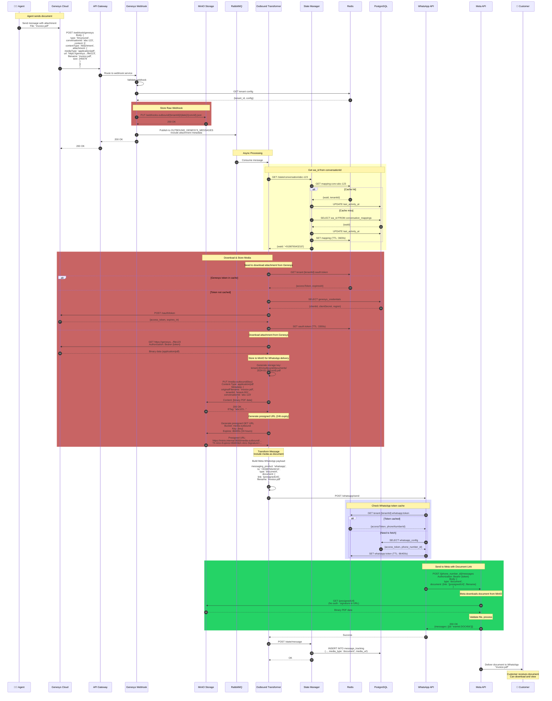
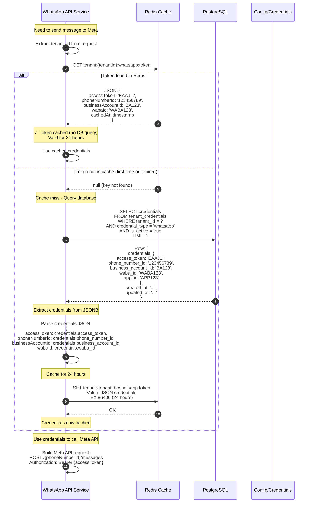
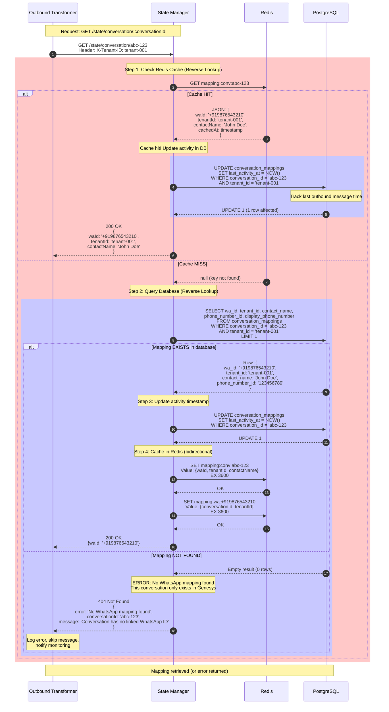
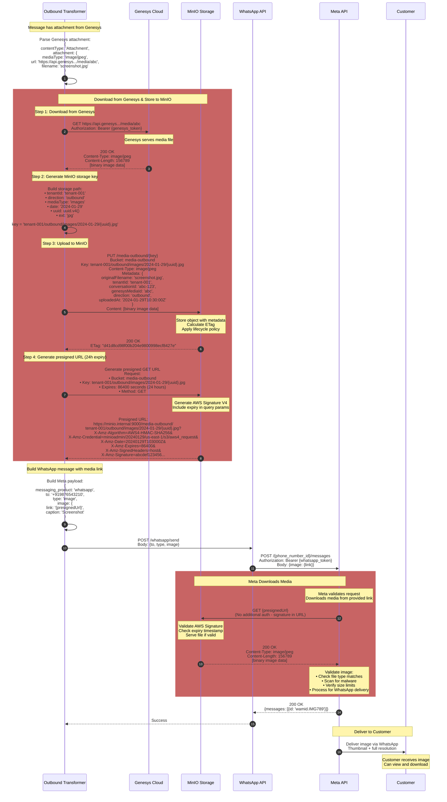
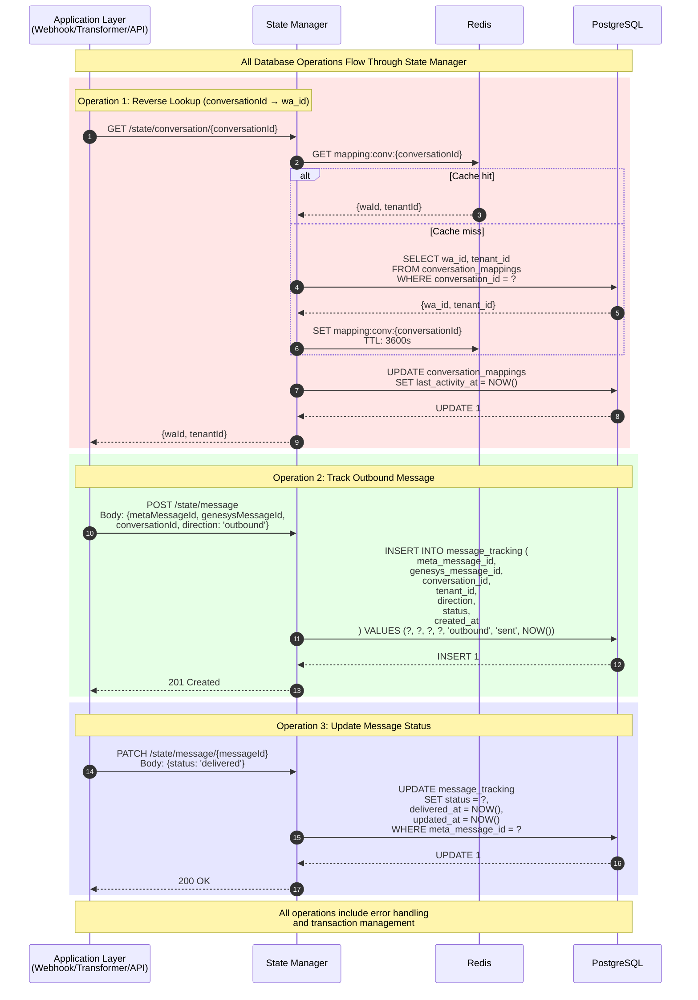

# Outbound Message Flow - Complete Sequence Diagram

This document contains detailed sequence diagrams for the outbound message flow from Genesys to WhatsApp, including all storage operations, caching strategies, and media handling.

## Complete Flow - Text Message

```mermaid
sequenceDiagram
    autonumber
    participant A as 👨‍💼 Agent
    participant GC as Genesys Cloud
    participant AG as API Gateway
    participant GW as Genesys Webhook
    participant MinIO as MinIO Storage
    participant RMQ as RabbitMQ
    participant OT as Outbound Transformer
    participant SM as State Manager
    participant R as Redis
    participant DB as PostgreSQL
    participant WA as WhatsApp API
    participant M as Meta API
    participant C as 👤 Customer

    %% Agent sends message
    Note over A,GC: Agent responds to customer
    A->>GC: Send message in Genesys Agent Desktop<br/>"We can help you with that"

    %% Genesys processes and sends webhook
    Note over GC: Genesys processes outbound message<br/>Triggers webhook to integration
    GC->>AG: POST /webhook/genesys<br/>Body: {<br/>  channel: {platform: 'Open', messageId, conversationId},<br/>  type: 'Text',<br/>  text: 'We can help you with that',<br/>  direction: 'Outbound'<br/>}

    %% API Gateway routes
    AG->>GW: Route to Genesys Webhook Service

    %% Webhook validation
    rect rgb(255, 240, 240)
        Note over GW: Webhook Validation
        GW->>GW: Validate webhook signature<br/>(if configured)

        GW->>R: GET tenant by integrationId<br/>Key: integration:{integrationId}

        alt Integration config in Redis
            R-->>GW: {tenant_id, status: 'active', config}
        else Not in cache
            GW->>DB: SELECT * FROM tenants<br/>WHERE genesys_integration_id = ?
            DB-->>GW: {tenant_id, config}
            GW->>R: SET integration:{integrationId}<br/>TTL: 3600s
        end
    end

    %% Store raw webhook to MinIO
    rect rgb(200, 100, 100)
        Note over GW,MinIO: Store Raw Webhook Payload
        GW->>MinIO: PUT /webhooks-outbound/<br/>{tenantId}/{yyyy-MM-dd}/{timestamp}-{convId}.json<br/>Content: Complete Genesys webhook payload
        MinIO-->>GW: 200 OK (Object stored)
    end

    %% Queue message
    GW->>RMQ: Publish message to queue<br/>Queue: OUTBOUND_GENESYS_MESSAGES<br/>Payload: {conversationId, messageId, type, text, tenantId}

    %% ACK back to Genesys
    GW-->>AG: 200 OK
    AG-->>GC: 200 OK (Webhook acknowledged)

    Note over RMQ,OT: Async Processing Begins

    %% Outbound Transformer consumes
    RMQ->>OT: Consume message from queue

    %% State Manager - Reverse Mapping (conversationId → wa_id)
    rect rgb(255, 255, 200)
        Note over OT,DB: Reverse Conversation Mapping<br/>(conversationId → wa_id)
        OT->>SM: GET /state/conversation/:conversationId<br/>Path: /state/conversation/abc-123

        Note over SM: Check Redis cache first (reverse lookup)
        SM->>R: GET mapping:conv:abc-123

        alt Mapping found in Redis cache
            R-->>SM: {waId: '+919876543210', tenantId: 'tenant-001'}
            Note over SM: Cache hit - Update activity in DB
            SM->>DB: UPDATE conversation_mappings<br/>SET last_activity_at = NOW()<br/>WHERE conversation_id = 'abc-123'
            DB-->>SM: 1 row updated
        else Mapping not in cache
            Note over SM: Cache miss - Query database
            SM->>DB: SELECT wa_id, tenant_id, contact_name<br/>FROM conversation_mappings<br/>WHERE conversation_id = 'abc-123'<br/>AND tenant_id = 'tenant-001'

            alt Mapping exists in database
                DB-->>SM: {wa_id: '+919876543210', tenant_id: 'tenant-001'}

                SM->>DB: UPDATE conversation_mappings<br/>SET last_activity_at = NOW()<br/>WHERE conversation_id = 'abc-123'
                DB-->>SM: 1 row updated

                Note over SM: Cache the mapping (bidirectional)
                SM->>R: SET mapping:conv:abc-123<br/>Value: {waId, tenantId}<br/>TTL: 3600s
                SM->>R: SET mapping:wa:+919876543210<br/>Value: {conversationId, tenantId}<br/>TTL: 3600s
            else No mapping exists
                Note over SM: ERROR: No WhatsApp mapping found
                DB-->>SM: Empty result (0 rows)
                SM-->>OT: 404 Not Found<br/>Error: No WhatsApp mapping for conversationId
                Note over OT: Log error and skip message<br/>Conversation exists only in Genesys
            end
        end

        SM-->>OT: 200 OK<br/>{waId: '+919876543210', tenantId: 'tenant-001'}
    end

    %% Transform message
    Note over OT: Transform Message Format<br/>Genesys Open Messaging → Meta WhatsApp

    OT->>OT: Build Meta WhatsApp payload:<br/>{<br/>  messaging_product: 'whatsapp',<br/>  recipient_type: 'individual',<br/>  to: '+919876543210',<br/>  type: 'text',<br/>  text: {<br/>    preview_url: false,<br/>    body: 'We can help you with that'<br/>  }<br/>}

    %% Send to WhatsApp API Service
    OT->>WA: POST /whatsapp/send<br/>Body: {to, type, text, tenantId}

    %% WhatsApp API - Token Management
    rect rgb(220, 220, 255)
        Note over WA,DB: WhatsApp Token Retrieval with Redis Caching

        Note over WA: Check Redis for cached WhatsApp token
        WA->>R: GET tenant:tenant-001:whatsapp:token

        alt Token found in Redis
            R-->>WA: {<br/>  accessToken: 'EAAJ...',<br/>  phoneNumberId: '123456789',<br/>  businessAccountId: 'BA123',<br/>  cachedAt: timestamp<br/>}
            Note over WA: ✓ Use cached token<br/>No DB query needed
        else Token not in cache
            Note over WA: Cache miss - Query database
            WA->>DB: SELECT whatsapp_config<br/>FROM tenant_credentials<br/>WHERE tenant_id = 'tenant-001'<br/>AND credential_type = 'whatsapp'<br/>AND is_active = true
            DB-->>WA: {<br/>  access_token: 'EAAJ...',<br/>  phone_number_id: '123456789',<br/>  business_account_id: 'BA123',<br/>  waba_id: 'WABA123'<br/>}

            Note over WA: Cache token (24 hour TTL)
            WA->>R: SET tenant:tenant-001:whatsapp:token<br/>Value: {accessToken, phoneNumberId, ...}<br/>TTL: 86400s (24 hours)
            R-->>WA: OK
        end
    end

    %% Send message to Meta WhatsApp API
    rect rgb(37, 211, 102)
        Note over WA,M: Send to Meta WhatsApp Business API
        WA->>M: POST https://graph.facebook.com/v18.0<br/>/{phone_number_id}/messages<br/>Authorization: Bearer EAAJ...<br/>Content-Type: application/json<br/>Body: {<br/>  messaging_product: 'whatsapp',<br/>  to: '+919876543210',<br/>  type: 'text',<br/>  text: {body: '...'}}<br/>}

        Note over M: Meta processes message<br/>Validates recipient<br/>Delivers to WhatsApp server
        M-->>WA: 200 OK<br/>{<br/>  messaging_product: 'whatsapp',<br/>  contacts: [{wa_id: '919876543210'}],<br/>  messages: [{id: 'wamid.XYZ123'}]<br/>}
    end

    WA-->>OT: 200 OK<br/>{<br/>  messageId: 'wamid.XYZ123',<br/>  status: 'sent'<br/>}

    %% Track message in database
    rect rgb(200, 255, 200)
        Note over OT,DB: Message Tracking & Audit
        OT->>SM: POST /state/message<br/>Body: {<br/>  metaMessageId: 'wamid.XYZ123',<br/>  genesysMessageId: 'gmsg-456',<br/>  conversationId: 'abc-123',<br/>  tenantId: 'tenant-001',<br/>  direction: 'outbound',<br/>  status: 'sent'<br/>}

        SM->>DB: INSERT INTO message_tracking (<br/>  meta_message_id, genesys_message_id,<br/>  conversation_id, tenant_id,<br/>  direction, status, created_at<br/>) VALUES (<br/>  'wamid.XYZ123', 'gmsg-456',<br/>  'abc-123', 'tenant-001',<br/>  'outbound', 'sent', NOW()<br/>)
        DB-->>SM: 1 row inserted

        SM-->>OT: 200 OK
    end

    %% Deliver to customer
    Note over M,C: Message Delivery
    M->>C: Deliver WhatsApp message<br/>"We can help you with that"

    Note over C: Customer receives message<br/>on WhatsApp app

    %% Status updates (async)
    rect rgb(230, 230, 230)
        Note over M,DB: Status Updates (Async)

        Note over M: Meta sends status webhook
        M-->>GW: POST /webhook/meta (status update)<br/>Body: {<br/>  statuses: [{<br/>    id: 'wamid.XYZ123',<br/>    status: 'delivered',<br/>    timestamp: '...'<br/>  }]<br/>}

        GW->>SM: PATCH /state/message/wamid.XYZ123<br/>Body: {status: 'delivered'}

        SM->>DB: UPDATE message_tracking<br/>SET status = 'delivered',<br/>    delivered_at = NOW()<br/>WHERE meta_message_id = 'wamid.XYZ123'
        DB-->>SM: 1 row updated

        SM-->>GW: 200 OK

        Note over M: Later, when customer reads
        M-->>GW: POST /webhook/meta (read receipt)<br/>Body: {statuses: [{status: 'read'}]}

        GW->>SM: PATCH /state/message/wamid.XYZ123<br/>Body: {status: 'read'}

        SM->>DB: UPDATE message_tracking<br/>SET status = 'read',<br/>    read_at = NOW()
        DB-->>SM: 1 row updated
    end
```

## Complete Flow - Message with Media (Image/Document)

## WhatsApp Token Caching - Detailed Flow

## State Manager Reverse Mapping - Detailed

## MinIO Media Storage - Outbound Detailed

## Database Operations Summary

## Performance Metrics - Timing Breakdown

```mermaid
gantt
    title Outbound Message Processing Timeline
    dateFormat  X
    axisFormat  %L ms

    section Webhook
    Receive & Validate          :0, 20
    Tenant Lookup (Redis)       :20, 50
    Store to MinIO              :50, 150
    Queue to RabbitMQ           :150, 200
    Return 200 OK               :200, 220

    section Async Processing
    RabbitMQ Delivery           :220, 270
    Reverse Mapping (Cache Hit) :270, 320
    DB Update (Activity)        :320, 400
    Transform Message           :400, 500

    section WhatsApp Delivery
    Token Check (Cache Hit)     :500, 550
    POST to Meta                :550, 1050
    Meta Processing             :1050, 1300

    section Total
    End-to-End Latency         :0, 1300
```

### Latency Breakdown

| Operation | Best Case | Worst Case | Notes |
|-----------|-----------|------------|-------|
| Webhook validation | 20ms | 100ms | Signature check + tenant lookup |
| MinIO storage | 100ms | 500ms | Object storage write |
| RabbitMQ publish | 20ms | 100ms | Queue write |
| **Webhook ACK** | **150ms** | **700ms** | **Total sync time** |
| Reverse mapping (cache hit) | 10ms | 50ms | Redis GET |
| Reverse mapping (cache miss) | 100ms | 500ms | PostgreSQL query |
| DB activity update | 50ms | 200ms | PostgreSQL UPDATE |
| Message transform | 10ms | 100ms | JSON transformation |
| WhatsApp token check (cache hit) | 10ms | 50ms | Redis GET |
| WhatsApp token check (cache miss) | 100ms | 300ms | PostgreSQL query |
| Meta API call | 200ms | 1000ms | Network + Meta processing |
| **Total (cache hit)** | **550ms** | **2000ms** | **End-to-end** |
| **Total (cache miss)** | **800ms** | **3000ms** | **With DB lookups** |

### Cache Hit Rates (Expected)

- **WhatsApp token cache:** 98%+ (tokens valid for 24 hours)
- **Reverse mapping cache:** 80%+ (active conversations)
- **Tenant config:** 99%+ (rarely changes)
- **Overall:** ~92% of requests hit Redis cache

## Key Differences from Inbound Flow

1. **Reverse Mapping:** conversationId → wa_id (instead of wa_id → conversationId)
2. **WhatsApp Token:** Long-lived (24h TTL) vs Genesys OAuth (1h TTL)
3. **Media Flow:** Download from Genesys → Store in MinIO → Send link to Meta
4. **Error Handling:** Missing mapping is critical (can't send without wa_id)
5. **Webhook Source:** Genesys Cloud instead of Meta WhatsApp
