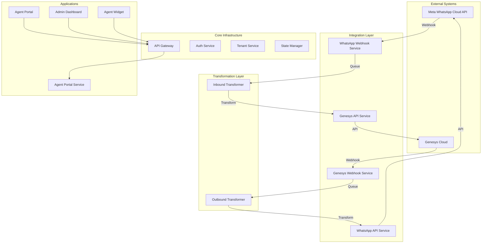

# System Architecture & Service Registry

## System Overview

The **WhatsApp-Genesys Integration Platform** is a multi-tenant SaaS middleware that bridges Meta's WhatsApp Business API with Genesys Cloud. It allows businesses to use Genesys Cloud as their primary contact center while seamlessly engaging customers on WhatsApp. The system uses a microservices architecture to ensure scalability, security, and tenant isolation.

## Architecture Diagram

---

## Microservices Breakdown

### 1. Core Infrastructure

#### **API Gateway** (Port: 3000)
The central entry point for all client-side applications and internal routing.
*   **Request Routing**: Routes incoming HTTP requests to their respective microservices (e.g., `/api/tenants` &rarr; Tenant Service).
*   **Rate Limiting**: specific limits on API usage to prevent abuse.
*   **CORS Management**: Handles Cross-Origin Resource Sharing headers for frontend applications.
*   **Health Aggregation**: Provides a unified health check status for the system.

#### **Tenant Service** (Port: 3007)
The central authority for multi-tenancy and configuration.
*   **Tenant Management**: Creates, updates, and retrieves tenant organization details.
*   **Credential Storage**: Securely encrypts and stores Genesys OAuth credentials and WhatsApp Access Tokens.
*   **WhatsApp Configuration**: Manages the link between a tenant and their WhatsApp Business Account (WABA ID, Phone Number ID).
*   **Context Resolution**: middleware to identify which tenant a request belongs to.

#### **Auth Service** (Port: 3004)
Manages authentication and security with Genesys Cloud.
*   **OAuth Grant Flow**: Implements the "Authorization Code" grant for logging in agents via Genesys.
*   **Client Credentials Flow**: Implements the "Client Credentials" grant for server-to-server API access.
*   **Token Management**: Caches OAuth access tokens in Redis to minimize external API calls.
*   **Token Refreshing**: Automatically renews expired tokens before they are used.

#### **State Manager** (Port: 3005)
The "brain" that tracks conversation context.
*   **Identity Mapping**: Maintains the persistent link between a WhatsApp User ID (`wa_id`) and a Genesys Conversation ID.
*   **Session Tracking**: Stores metadata about active conversations (start time, last message, channel).
*   **Message Status**: Tracks the delivery status of individual messages (Sent, Delivered, Read).
*   **Context Storage**: Holds temporary state data needed during message processing.

---

### 2. Integration Layer

#### **WhatsApp Webhook Service** (Port: 3009)
The recipient of all events from Meta.
*   **Signature Verification**: Validates `X-Hub-Signature-256` to ensure requests come from Meta.
*   **Tenant Identification**: uses the `phone_number_id` in the webhook to identify the target tenant.
*   **Event Ingestion**: Accepts text, media, and status update events.
*   **Queuing**: Immediately acknowledges the webhook (200 OK) and pushes the raw payload to the `inbound-messages` RabbitMQ queue.

#### **WhatsApp API Service** (Port: 3008)
The dedicated sender for Meta's Graph API.
*   **API Wrapper**: Provides a clean REST API for sending Text, Templates, Images, and Documents.
*   **Media Handling**: Proxies media downloads from WhatsApp (handling the retrieval of binary data).
*   **Credential Injection**: Fetches the correct tenant-specific Access Token before calling Meta.
*   **Error Normalization**: Converts Meta API errors into standard internal error formats.

#### **Genesys Webhook Service** (Port: 3011)
The recipient of events from Genesys Cloud.
*   **Event Listening**: Receives `agent.message` events (replies) and conversation lifecycle events.
*   **Event Validation**: Verifies the structure and origin of Genesys webhooks.
*   **Queuing**: Pushes valid outbound events to the `outbound-messages` RabbitMQ queue.

#### **Genesys API Service** (Port: 3010)
The dedicated interface for Genesys Cloud APIs.
*   **Inbound Injection**: Sends user messages into Genesys via the Open Messaging API.
*   **User Management**: Fetches organization users and roles.
*   **Conversation Controls**: Handles disconnecting conversations or sending typing indicators to agents.

---

### 3. Transformation Layer

#### **Inbound Transformer** (Port: 3002)
Converts WhatsApp messages into Genesys format.
*   **Queue Consumption**: Listens to `inbound-messages`.
*   **Format Transformation**: Maps WhatsApp JSON (Text, Media, Location) to Genesys Open Messaging JSON.
*   **Conversation Lifecycle**: checks State Manager to decide if this is a new conversation or a reply.
*   **Execution**: orchestration calling the State Manager and then the Genesys API Service.

#### **Outbound Transformer** (Port: 3003)
Converts Genesys agent replies into WhatsApp format.
*   **Queue Consumption**: Listens to `outbound-messages`.
*   **Format Transformation**: Maps Genesys text/template payloads to WhatsApp JSON.
*   **Template Parsing**: Handles variable substitution for WhatsApp Templates (e.g., `{{1}}`).
*   **Execution**: orchestration calling the State Manager and then the WhatsApp API Service.

---

### 4. Applications

#### **Agent Portal Service** (Port: 3015)
The backend for the Agent UI.
*   **Auto-Provisioning**: Automatically creates user accounts when they log in via Genesys.
*   **History Retrieval**: Fetches past conversation history from the database.
*   **Real-time Socket**: Runs a Socket.io server to push new message alerts to the frontend.
*   **Organization Sync**: Syncs user roles (Admin/Supervisor/Agent) from Genesys.

#### **Agent Portal** (Port: 3014)
The React-based frontend for agents.
*   **Workspace**: Displays active conversations and chat history.
*   **Auth UI**: Handles the Genesys Login flow.
*   **Composer**: UI for typing messages and selecting templates.

#### **Admin Dashboard** (Port: 3006)
The implementation and configuration console.
*   **Tenant Onboarding**: Wizard for creating new tenants.
*   **WhatsApp Setup**: Embedded signup flow for connecting WhatsApp numbers.
*   **Genesys Config**: Form for entering Genesys OAuth Client ID/Secret.

#### **Agent Widget** (Port: 3012)
An embeddable view for Genesys Cloud.
*   **Context View**: Shows customer details inside the Genesys interaction window.
*   **Quick Actions**: Allows sending templates directly from the Genesys UI.

---

## Data Storage and Security

### 1. Token & Secret Storage
Security is paramount in a multi-tenant environment. We separate the concerns of *Credential Management* (Long-term) and *Session Management* (Short-term).

| Artifact | Source | Storage Location | Encryption | Details |
|----------|--------|------------------|------------|---------|
| **Genesys Client Secret** | Genesys Admin | **PostgreSQL** (`tenant_credentials`) | **AES-256** | Stored permanently. Used to generate OAuth tokens. Access is restricted to `Tenant Service`. |
| **WhatsApp Access Token** | Meta Developer | **PostgreSQL** (`tenant_credentials`) | **AES-256** | System User Token. Used to authenticate with Meta Graph API. |
| **Genesys OAuth Token** | Genesys Auth | **Redis** (`genesys:token:{tenantId}`) | At Rest | Short-lived (24h) access tokens. Cached in Redis to reduce API calls. Refreshed automatically by `Auth Service`. |
| **Agent Session Token** | Agent Portal | **JWT** (Client-side) | Signed (HS256) | Stored in the Agent's browser (Local Storage). Verifies identity for Portal API requests. |

### 2. Message Persistence
Messages are essentially transient in the transformation pipelines but are persisted for history and state tracking.

*   **When**: Messages are stored during the **Transformation** phase.
    *   **Inbound**: The `Inbound Transformer` calls `State Manager` (POST `/state/message`) *after* queuing but *before* sending to Genesys.
    *   **Outbound**: The `Outbound Transformer` calls `State Manager` *before* sending to WhatsApp.
*   **Where**: **PostgreSQL** (`messages` table).
*   **Why**:
    *   To provide Conversation History in the Agent Portal.
    *   To track delivery status updates (Sent/Delivered/Read) from Meta.
    *   To allow resuming conversations if a service restarts.

---

## Detailed Message Flows

### 1. Inbound Message Flow (Customer to Agent)

### 1. Inbound Message Flow (Customer to Agent)

1.  **Customer Action**: A customer sends a message ("Hello") to the business's WhatsApp number.
2.  **Meta Delivery**: Meta's servers hit the `POST /webhook/whatsapp` endpoint of the **WhatsApp Webhook Service**.
3.  **Ingestion & Validation**:
    *   **WhatsApp Webhook Service** validates the HMAC signature.
    *   It looks up the `phone_number_id` in the Tenant Service cache.
    *   It publishes the raw message to the `inbound-messages` RabbitMQ queue and returns `200 OK` to Meta.
4.  **Context Resolution (State Manager)**:
    *   **Inbound Transformer** picks up the message and queries **State Manager** (`GET /state/mapping/:wa_id`).
    *   *Scenario A (New)*: No active conversation found. Transformer creates a new mapping by calling State Manager.
    *   *Scenario B (Existing)*: Active Genesys `conversationId` returned by State Manager.
5.  **Transformation**:
    *   **Inbound Transformer** converts the Meta JSON payload into Genesys Open Messaging format.
6.  **Persistence (State Manager)**:
    *   **Inbound Transformer** calls **State Manager** (`POST /state/message`) to store the message in PostgreSQL (`messages` table).
7.  **Delivery**:
    *   **Inbound Transformer** calls **Genesys API Service** (`POST /genesys/messages/inbound`).
    *   **Genesys API Service** uses the Tenant's OAuth token to push the message to Genesys Cloud.

### 2. Outbound Message Flow (Agent to Customer)

1.  **Agent Action**: An agent types a reply ("Hi there!") in Genesys Cloud and hits send.
2.  **Genesys Delivery**: Genesys hits the `POST /webhook/genesys/outbound` endpoint of the **Genesys Webhook Service**.
3.  **Ingestion & Validation**:
    *   **Genesys Webhook Service** validates the event, extracts `conversationId`, and queues it to `outbound-messages` (RabbitMQ).
4.  **Context Lookup (State Manager)**:
    *   **Outbound Transformer** consumes the message.
    *   It queries **State Manager** (`GET /state/conversation/:conversationId`) to retrieve the customer's `wa_id`.
5.  **Credential Resolution**:
    *   **Outbound Transformer** queries **Tenant Service** to fetch the Tenant's WABA ID and Access Token.
6.  **Transformation**:
    *   The transformer maps the Genesys text or template payload to the Meta WhatsApp JSON format.
7.  **Persistence (State Manager)**:
    *   **Outbound Transformer** calls **State Manager** (`POST /state/message`) to store the outbound message in the database.
8.  **Delivery**:
    *   **Outbound Transformer** calls **WhatsApp API Service** (`POST /whatsapp/send/text`).
    *   **WhatsApp API Service** makes the HTTP request to Meta's Graph API.
    *   **Meta** delivers the message to the customer's device.
